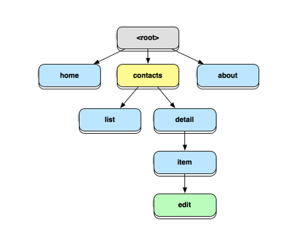

# Angular UI Router

Advanced routing for Angular applications.

<!-- slide-include ../../BANNER.md -->

**Recommended reading**

* [Angular](../angular/)

<!-- START doctoc generated TOC please keep comment here to allow auto update -->
<!-- DON'T EDIT THIS SECTION, INSTEAD RE-RUN doctoc TO UPDATE -->


- [What is UI Router?](#what-is-ui-router)
- [States](#states)
  - [Defining states](#defining-states)
  - [State definition objects](#state-definition-objects)
  - [Where does the template get inserted?](#where-does-the-template-get-inserted)
  - [Activating a state](#activating-a-state)
  - [State parameters](#state-parameters)
  - [The default state](#the-default-state)
- [TODO](#todo)

<!-- END doctoc generated TOC please keep comment here to allow auto update -->


## What is UI Router?

<!-- slide-front-matter class: center, middle, image-header -->

<p class='center'></p>

Angular has a built-in router, [ngRoute][angular-router], but it's not very flexible.
[Angular UI router][angular-ui-router] is a community-developed alternative which is much more popular (and powerful).


## States

UI router is basically a [state machine][state-machine].
Think about each **page** of an application as a **set of states**:

<!-- slide-column -->

* Only **one state can be active at one time**
* The user can **transition from one state to another**, to activate a different page or feature of the application

<!-- slide-column 60 -->

<p class='center'></p>


### Defining states

You define states in an **Angular config function** by injecting the `$stateProvider` and calling its `state` function with **state definition objects**:

```js
angular.module('starter').config(function($stateProvider) {
  `$stateProvider.state`('homePage', {
    url: '/',
    templateUrl: 'templates/home.html',
    controller: 'HomePageController',
    controllerAs: 'homePageCtrl'
  });

  `$stateProvider.state`('itemsPage', {
    url: '/items',
    templateUrl: 'templates/items.html',
    controller: 'ItemsPageController',
    controllerAs: 'itemsPageCtrl'
  });
});
```


### State definition objects

Each state usually has at least:

* A `name`: this is the unique name of the state in the state machine
* An `url`: this is the URL that will trigger the state machine to **move to this state** when the user visits it
* A `template` or `templateUrl`: the **view** to display when the app is in that state
* A `controller`: the **logic** for that state's view

```js
$stateProvider.state(`'homePage'`, {
  `url`: '/',
  `templateUrl`: 'templates/home.html',
  `controller`: 'HomePageController',
  `controllerAs`: 'homePageCtrl'
});
```

#### Using components

You can also encapsulate your page into an **Angular component** and give that to UI router instead of the separate template and controller:

```js
angular.module('starter')`.component('HomePageComponent'`, {
  templateUrl: 'templates/home.html',
  controller: function() {
    // ...
  }
});

angular.module('starter').config(function($stateProvider) {
  $stateProvider.state(`'homePage'`, {
    `url`: '/',
    `component`: 'HomePageComponent'
  });
});
```


### Where does the template get inserted?

When a state is activated, its template is inserted into the `ui-view` of its parent state's template.
If it's a top-level state, its parent template is `index.html`:

```html
<body ng-app='myApp'>
  <div `ui-view` />
</body>
```

In some other frameworks using Angular UI router, this is a different directive (e.g. `<ion-nav-view>` in Ionic).


### Activating a state

There are **3 ways** to activate a state:

* Navigate to the `url` associated with the state
* Click a link containing the `ui-sref` directive
* Navigate programmatically by calling `$state.go()`

#### The `ui-sref` directive

The `ui-sref` directive (`sref` meaning **state reference**) allows you to make links to states instead of links to URLs.

**Instead of `href`**, you add the `ui-sref` attribute to a link:

```html
<a ui-sref='itemsPage'>Items</a>
```

Note that it references the **state name** (`itemsPage`), not the state's URL (`/items`).
It's good practice to use `ui-sref` instead of `href` everywhere in your app if you're using UI router.

#### Navigating programmatically

Sometimes you need to trigger a state transition in code.
You can inject UI router's `$state` service and call its `go()` function:

```js
angular.module('myApp').controller('MyCtrl', function($state) {
  var myCtrl = this;
  myCtrl.goToItems = function() {
    `$state.go('items');`
  };
});
```

Similarly to `ui-sref`, it takes the **state name** as an argument, not the state's URL.


### State parameters

Part of the URL is often dynamic, such as an item ID.
When configuring your state with `$stateProvider`, you can define **URL parameters** in state URLs like this:

```js
$stateProvider.state('itemDetailsPage', {
    url: '/items/`:itemId`',
    templateUrl: 'templates/itemDetails.html',
    controller: function(`$stateParams`) {
      var itemId = `$stateParams.itemId`;
    },
    controllerAs: 'itemDetailsCtrl'
  });
```

Note that you can inject the special `$stateParams` object;
its key and values are the URL parameters names and values, respectively.

#### Using state parameters when navigating

You can specify the values of state parameters when navigating with `ui-sref` like this:

```html
<a ui-sref='itemDetailsPage`({ itemId: item.id })`'>{{ item.name }}</a>
```

Similarly with `$state.go()`:

```js
$state.go('itemDetailsPage', `{ itemId: item.id }`);
```


### The default state

When configuring your states, the `otherwise()` function of `$urlRouterProvider` allows you to navigate to default state when the URL does not match any defined state:

```js
$urlRouterProvider`.otherwise`(function($injector) {
  $injector.get('$state').go('itemsPage');
});
```


## TODO

* Resolve?
* Nested states
* Named views
* Transitions (blocking transitions)


[angular-router]: https://docs.angularjs.org/api/ngRoute
[angular-ui-router]: https://ui-router.github.io
[state-machine]: https://en.wikipedia.org/wiki/Finite-state_machine
