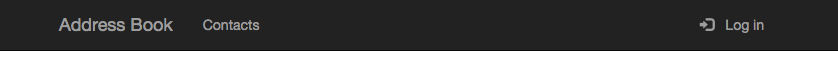
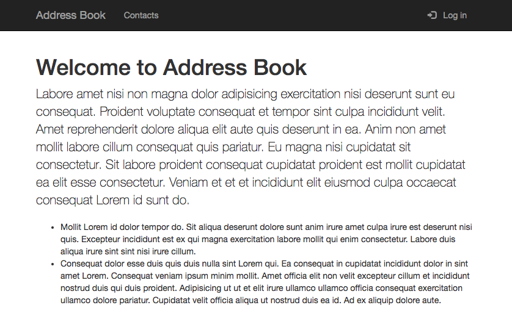
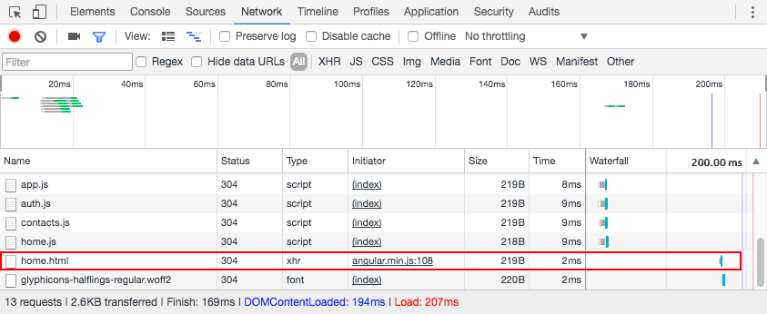
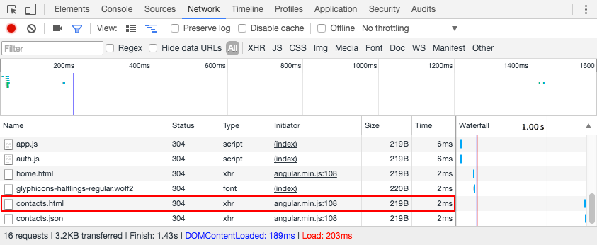

# Angular UI Router

State-based routing for Angular applications.

<!-- slide-include ../../BANNER.md -->

**You will need**

* [live-server][live-server]
* [Google Chrome][chrome] (recommended, any browser with developer tools will do)

**Recommended reading**

* [Angular](../angular/)

<!-- START doctoc generated TOC please keep comment here to allow auto update -->
<!-- DON'T EDIT THIS SECTION, INSTEAD RE-RUN doctoc TO UPDATE -->


- [What is UI Router?](#what-is-ui-router)
- [States](#states)
  - [Defining states](#defining-states)
  - [State definition objects](#state-definition-objects)
  - [Where does the template get inserted?](#where-does-the-template-get-inserted)
  - [Activating a state](#activating-a-state)
  - [State parameters](#state-parameters)
  - [The default state](#the-default-state)
- [TODO](#todo)

<!-- END doctoc generated TOC please keep comment here to allow auto update -->


## What is UI Router?

<!-- slide-front-matter class: center, middle, image-header -->

<p class='center'></p>

Angular has a built-in router, [ngRoute][angular-router], but it's not very flexible.
[Angular UI router][angular-ui-router] is a community-developed alternative which is much more popular (and powerful).


### Getting started

Clone or copy this repository:

https://github.com/MediaComem/comem-webdev-angular-ui-router-demo

You will use it to implement routing with Angular UI router in this tutorial.

If you serve the directory with [live-server][live-server],
you should see the following blank page with a navbar:

<p class='center'></p>

You will implement the following:

* A home page accessible by clicking "Address Book"
* A contacts page giving you access to the list of contacts and the details of each contact
* Access control: in the end, the contacts page should only be accessible when logged in


### Adding UI router to your Angular app

Angular UI router is a third-party library: it is not included out of the box in Angular.
Luckily, the starter project already includes it for you:

```html
<script type="text/javascript" src="assets/js/angular-ui-router.min.js"></script>
```

Angular UI router provides an **Angular module** called `ui.router`.
To use it, you need to add that module as a dependency when declaring your application module (in `js/app.js`):

```js
angular.module('AddressBook', [
  'angular-storage'`,`
  `'ui.router'`
]);
```

You now have access to Angular UI router's services.


## States

UI router is basically a [state machine][state-machine].
Think about each **page** of an application as a **set of states**:

<!-- slide-column -->

* Only **one state can be active at one time**
* The user can **transition from one state to another**, to activate a different page or feature of the application

<!-- slide-column 60 -->

<p class='center'></p>


### Defining states

You define states in an **Angular config function** by injecting the `$stateProvider` and calling its `state` function with a **state definition object**.

Let's define a state for the address book's home page:

```js
angular.module('AddressBook').config(function($stateProvider) {
* $stateProvider.state('home', {
*   url: '', // The root URL
*   templateUrl: '/templates/home.html',
*   controller: 'HomePageController',
*   controllerAs: 'homePageCtrl'
* });
});
```


### State definition objects

Each state usually has at least:

* A `name`: this is the unique name of the state in the state machine
* An `url`: this is the URL that will trigger the state machine to **move to this state** when the user visits it
* A `template` or `templateUrl`: the **view** to display when the app is in that state
* A `controller`: the **logic** for that state's view,
  with an optional `controllerAs` property for named controllers

```js
$stateProvider.state(`'home'`, {
  `url`: '', // The root URL
  `templateUrl`: '/templates/home.html',
  `controller`: 'HomePageController',
  `controllerAs`: 'homePageCtrl'
});
```

#### Using components

You can also encapsulate your page into an **Angular component** and give that to UI router instead of the separate template and controller:

```js
angular.module('AddressBook')`.component('HomePageComponent'`, {
  templateUrl: '/templates/home.html',
  controller: function() {
    // ...
  },
  controllerAs: 'homePageCtrl'
});

angular.module('AddressBook').config(function($stateProvider) {
  $stateProvider.state(`'home'`, {
    `url`: '',
    `component`: 'HomePageComponent'
  });
});
```


### Where does the template get inserted?

When a state is activated, its **template** is **inserted** into the `ui-view` of its **parent state's template**.
If it's a **top-level state** like the `home` state we just defined, its parent template is `index.html`.

The template (`templates/home.html`) and controller (`js/home.js`) have already been prepared for you,
so the new state is ready to display.

<!-- slide-column -->

Add a `<div>` tag with the `ui-view` directive to `index.html`:

```html
<main class="container">
  `<div ui-view />`
</main>
```

In some other frameworks using Angular UI router, the directive may have a different name (e.g. `<ion-nav-view>` in Ionic).

<!-- slide-column 60 -->



#### Automatic template loading

If you check what's happening on the network with your browser's developer tools,
you will see that Angular automatically makes an AJAX request to load the template when the state is activated:




### Adding new states

You can call `$stateProvider.state()` as many times as you want to define all your app's states.

Let's add the contacts page.
Again, there is a template (`/templates/contacts.html`) and controller (`ContactsPageController` in `js/contacts.js`) already defined for you.
Just add the state definition with a **different name and URL**:

```js
angular.module('AddressBook').config(function($stateProvider) {
  // ...

* $stateProvider.state('contacts', {
*   url: '/contacts',
*   templateUrl: '/templates/contacts.html',
*   controller: 'ContactsPageController',
*   controllerAs: 'contactsPageCtrl'
* });
});
```

#### Checking the new state

Navigate to [http://127.0.0.1:8080/#!/contacts](http://127.0.0.1:8080/#!/contacts) to see this new page.

<p class='center'></p>

By default, Angular UI router looks for the state URL in the **fragment** (the part of the URL that's after the `#` character),
and it uses a prefix (`!` by default) before the actual path.

When you access the app, Angular will load the `index.html` page (since there is no actual path),
then Angular UI router will read the fragment to **determine the state**,
load the appropriate template and insert it into the `ui-view`.
Routing is done entirely on the **client side**.


## HTML 5 mode

Using the hash fragment is the default because it's easy to use **without any server-side configuration**:
it's always been possible to change the URL fragment client-side without reloading the page
(you can do it with anchor tags, for example).

Since HTML 5, browsers support the [History API][history-api], which lets you **change the URL path without reloading the page**.
You will see an example of this later.

To configure Angular UI router to use HTML 5 mode, inject Angular's `$locationProvider` service and call its `html5Mode()` method.
You can do this in the existing configuration function, since it also concerns routing:

```js
angular.module('AddressBook')
  .config(function(`$locationProvider`, $stateProvider) {

  // ...

  `$locationProvider.html5Mode(true);`
});
```


### HTML 5 mode updates

When in HTML 5 mode, you must also add a `<base>` tag in the `<head>` of `index.html`.
This specifies the base URL for all relative URLs in your app:

```html
<!DOCTYPE html>
<html lang="en">
  <head>
*   <base href="/">
    <!-- ... -->
```

In HTML 5 mode, Angular UI router considers the root URL to be `/` instead of the empty string,
so you must update the `home` state's URL:

```js
$stateProvider.state('home', {
  `url: '/',` // The root URL
  templateUrl: '/templates/home.html',
  controller: 'HomePageController',
  controllerAs: 'homePageCtrl'
});
```

With this configuration, you should be able to access the home page at the root path,
and the contacts page at `/contacts`, but the contacts page doesn't work any more.
**Why?**


### Server-side configuration

With Angular UI router, routing is done on the **client side**.
The server should always serve the **index page**, then your Angular app will handle routing and display the correct template.

When you visit `/contacts`, **live-server** will simply try to display the contents of the `contacts` directory, which does not exist.
When using HTML 5 mode with Angular UI router, you must **configure your server to serve the index page** for all URL paths which correspond to pages in your app.
Basically, the server should not care about routing: the Angular client app will.

Luckily, you can do that with **live-server**, simply launch it with the `--entry-file=index.html` option.
This will tell it to serve `index.html` if the URL path does not correspond to a file:

```bash
live-server --entry-file=index.html
```

You should now be able to access the contacts page again at `/contacts`.

With Apache or nginx, you would also need to configure some sort of **URL rewrite** for Angular UI router to work in HTML 5 mode.


## Linking to other states

To add links to these states, you can simply use standard tags.
Update the navbar links in `index.html`:

```html
<a class="navbar-brand" `href="/"`>Address Book</a>
<ul class="nav navbar-nav">
    <li><a `href="/contacts"`>Contacts</a></li>
</ul>
```

You can now use these links to navigate in your application.


### Client-side routing and single-page applications

Note that client-side routing is one of the fundamental features of **single-page applications**.
If you visit the home page, then look at what's happening on the network when clicking on the Contacts link,
you will see that **the page is not reloaded**, only the new `contacts.html` template is loaded with an AJAX request:

<p class='center'></p>

Angular UI router intercepts the transition to a new URL path, and since that path corresponds to a state,
it will load the appropriate template and simply insert it into the `ui-view`, without anything else changing in the page.


### Linking to state names with `ui-sref`

When you defined the two states for this app, you specified both a **name and a URL**.
You've already seen that you can navigate to a state by its URL.

You can also **navigate to a state by its name**.
This is considered good practice when using Angular UI router:
since you can define a complex state hierarchy and since state URLs don't have to match their name,
seeing the state name instead of its URL can make it clearer to which state you are navigating.

Simply **replace** the `href` attribute with `ui-sref` (sref meaning **state reference**).
The value of the attribute should be the **name of the state** you want to navigate to:

```html
<a class="navbar-brand" `ui-sref="home"`>Address Book</a>
<ul class="nav navbar-nav">
    <li><a `ui-sref="contacts"`>Contacts</a></li>
</ul>
```


## Nested states

You've seen how to define **a state for each page** in your app,
but that's not all Angular UI router allows you to do.

A state can also correspond only to **a specific section of one page**.

If you look at the `templates/contacts.html` file,
you will see that there's a section meant to display the details of each contact:

```html
<section class="col-sm-8">
  <!-- TODO: display contact details here -->
</section>
```

We want this section to be updated every time the user clicks on a contact in the list on the left.


### State parameters

The template (`/templates/contact-details.html`) and controller (`ContactDetailsController` in `js/contacts.js`) have already been defined for you.
Let's add the state:

```js
$stateProvider.state('contacts.details', {
  url: '/:id',
  controller: 'ContactDetailsController',
  controllerAs: 'contactDetailsCtrl',
  templateUrl: '/templates/contact-details.html'
});
```

Note two things of interest:

* The state is named `contacts.details`, so it's a **child of the `contacts` state**,
  and its URL is **relative to the parent state's URL**: the full URL path to that state is therefore `/contacts/:id`
* The state's URL contains a **parameter** named `:id` which is a **variable** part of the URL path:
  this means that when you visit `/contacts/abc` or `/contacts/42`,
  you will end up in the `contacts.details` state, and the value of the `:id` parameter will be `abc` and `42` respectively


### Navigating to a state with parameters

We want to navigate to this state when the user clicks on one of the links in the list on the left.
Edit `templates/contacts.html` to replace the `href="#"` on the link by a `ui-sref` attribute pointing to the `contacts.details` state:

```html
<li ng-repeat="contact in contactsPageCtrl.contacts | orderBy: 'lastName'">
  <a `ui-sref="contacts.details({ id: contact.id })"`>...</a>
</li>
```

As you can see, you can specify the value of **state parameters** when using `ui-sref`.
Simply "call" the state name as if it were a function, and pass a key/value JavaScript object where the keys are the **parameter names**.

You should already be able to click these links and see the URL change in your browser's address bar.
But nothing is happening (the view is not updating).
**Why?**


### Adding a `ui-view` in the parent state's template

Since `contacts.details` is a **child of the `contacts` state**,
Angular UI router will not look for the `ui-view` directive of `index.html`.
Instead, it will look for a `ui-view` directive in the **parent state's template**,
meaning `templates/contacts.html` in this case.

Update that file to add another `ui-view` directive:

```html
<section class="col-sm-8">
  <div ui-view />
</section>
```

Now you should see the contact details template displayed on the right (but it will remain empty for now).
If you look at the code of `ContactDetailsController` in `js/contacts.js`,
you will find a piece of code that attempts to load a contact.
However, it does not have access to the contact ID yet:

```js
var id = null; // TODO: get contact ID from state parameter
ContactsService.getContact(id).then(function(contact) {
  contactDetailsCtrl.contact = contact;
});
```


### Accessing state parameter with `$stateParams`

Since `ContactDetailsController` is the controller for the `contact.details` state,
it automatically has access to the state's parameters through the special `$stateParams` object.

This object is simply a **key/value map of the state's parameters** provided by Angular UI router when the state is active.
You can **inject** it into the controller:

```js
.controller('ContactDetailsController', function(ContactsService, `$stateParams`) {
  var contactDetailsCtrl = this;

  var id = `$stateParams.id`;
  ContactsService.getContact(id).then(function(contact) {
    contactDetailsCtrl.contact = contact;
  });
});
```

Note that you should always inject `$stateParams` in the **state's controller**.
It makes little sense to inject it into a service or some other kind of Angular element.


## Highlighting menu items corresponding to states

You probably want the Contacts link in the menu to be highlighted when you are in the `contacts` or `contacts.details` states.

Following Bootstrap's documentation, you need to add the `active` class to the `<li>` tag in the navbar to highlight it.
You want this class to be here when in the `contacts` or `contacts.details` states, but not when in the `home` state.

This is trivial to do with the `ui-sref-active` directive:

```html
<ul class="nav navbar-nav">
  <li `ui-sref-active="active"`><a ui-sref="contacts">Contacts</a></li>
</ul>
```

The value passed to the `ui-sref-active` directive is a class (or space-separated list of classes) to apply to the element
when the state of the corresponding `ui-sref` is active.

It will look for a `ui-sref` directive on the same tag or anywhere inside it.
It will also consider the state active if one of its child states is active (e.g. `contacts.details` in this case).


## Restricting access to pages

You might have noticed that the app has a login/logout button implemented.
This functionality is implemented in `js/auth.js` and the `NavController` is applied to the navbar in `index.html` to make it work.

Let's say that we want to prevent the user from navigating to the `contacts` or `contacts.details` states if not logged in, a classic authentication use case.


### Attaching custom data to states

You can attach any data to states through the `data` object.
Let's add an `authRequired` property to the two states we want to protect:

```js
$stateProvider.state('contacts', {
  url: '/contacts',
  templateUrl: '/templates/contacts.html',
  controller: 'ContactsPageController',
  controllerAs: 'contactsPageCtrl'`,`
* data: {
*   authRequired: true
* }
});

$stateProvider.state('contacts.details', {
  url: '/:id',
  controller: 'ContactDetailsController',
  controllerAs: 'contactDetailsCtrl',
  templateUrl: '/templates/contact-details.html'`,`
* data: {
*   authRequired: true
* }
});
```

Of course, you won't add it to the `home` state, since it should remain accessible even when not logged in.


### Angular events

Angular scopes (e.g. the `$scope` object you can inject in controllers and the top-level `$rootScope` object) have a built-in **event system**.
You can trigger events and listen to them.

You can try this code in the `HomePageController` in `home.js` to see it in action:

```js
.controller('HomePageController', function(`$scope`) {
  // ...

* // Listen to an event
* $scope.$on('my-event', function(event, arg1, arg2, arg3) {
*   console.log('my-event triggered with: ' + arg1 + ', ' + arg2 + ', ' + arg3);
* });

* // Send an event up the scope hierarchy
* $scope.$emit('my-event', 'a', 'few', 'strings');
* // Send a event down the scope hierarchy
* $scope.$broadcast('my-event', { any: 'kind of data' }, true, 42);
});
```

In this example, we're triggering the events in the same controller where we're listening to them,
which is not very useful, but you can of course trigger the events from elsewhere.


### The `$stateChangeStart` event

Angular UI router triggers a number of [events][angular-ui-router-events] when state transitions are occurring:

* `$stateChangeStart` is triggered **before transitioning to a state**
* `$stateChangeSuccess` is triggered **after successfully transitioning to a state**
* `$stateChangeError` is triggered if an error occurs while transitioning to a state
* `$stateNotFound` is triggered when trying to transition to a state that is not defined

The `$stateChangeStart` event is of particular interest to us for restricting access to a page,
because it allows us to **cancel a state transition** if we want.

#### Listening to `$stateChangeStart`

Let's add a run function to `app.js` to listen to the `$stateChangeStart` event as soon as the app starts.
You can use Angular's top-level `$rootScope` (it corresponds to the DOM element where the `ng-app` directive is):

```js
angular.module('AddressBook').run(function($rootScope) {
  $rootScope.$on('$stateChangeStart', function(event, toState, toParams) {
    console.log('Transitioning to ' + toState.name);
  });
});
```

The `toState` object is the **state definition object** of the transition's target state,
so you can retrieve its name and other properties.

This will log a message in the console every time you are transitioning to a state (including when you first load the page).


### Blocking a state transition

We want to block state transitions to protected states.
To do this, you must:

* Check the `data.authRequired` property we added earlier, to know if the state is protected or not
* Block the transition if authentication is required but the user is not logged

```js
$rootScope.$on('$stateChangeStart', function(event, toState) {

* var authRequired = false;
* if (toState.data) {
*   authRequired = toState.data.authRequired;
* }

  console.log('Transitioning to ' + toState.name);
});
```


### Activating a state

There are **3 ways** to activate a state:

* Navigate to the `url` associated with the state
* Click a link containing the `ui-sref` directive
* Navigate programmatically by calling `$state.go()`

#### The `ui-sref` directive

The `ui-sref` directive (`sref` meaning **state reference**) allows you to make links to states instead of links to URLs.

**Instead of `href`**, you add the `ui-sref` attribute to a link:

```html
<a ui-sref='itemsPage'>Items</a>
```

Note that it references the **state name** (`itemsPage`), not the state's URL (`/items`).
It's good practice to use `ui-sref` instead of `href` everywhere in your app if you're using UI router.

#### Navigating programmatically

Sometimes you need to trigger a state transition in code.
You can inject UI router's `$state` service and call its `go()` function:

```js
angular.module('myApp').controller('MyCtrl', function($state) {
  var myCtrl = this;
  myCtrl.goToItems = function() {
    `$state.go('items');`
  };
});
```

Similarly to `ui-sref`, it takes the **state name** as an argument, not the state's URL.


### State parameters

Part of the URL is often dynamic, such as an item ID.
When configuring your state with `$stateProvider`, you can define **URL parameters** in state URLs like this:

```js
$stateProvider.state('itemDetailsPage', {
    url: '/items/`:itemId`',
    templateUrl: 'templates/itemDetails.html',
    controller: function(`$stateParams`) {
      var itemId = `$stateParams.itemId`;
    },
    controllerAs: 'itemDetailsCtrl'
  });
```

Note that you can inject the special `$stateParams` object;
its key and values are the URL parameters names and values, respectively.

#### Using state parameters when navigating

You can specify the values of state parameters when navigating with `ui-sref` like this:

```html
<a ui-sref='itemDetailsPage`({ itemId: item.id })`'>{{ item.name }}</a>
```

Similarly with `$state.go()`:

```js
$state.go('itemDetailsPage', `{ itemId: item.id }`);
```


### The default state

When configuring your states, the `otherwise()` function of `$urlRouterProvider` allows you to navigate to default state when the URL does not match any defined state:

```js
$urlRouterProvider`.otherwise`(function($injector) {
  $injector.get('$state').go('itemsPage');
});
```


[angular-router]: https://docs.angularjs.org/api/ngRoute
[angular-ui-router]: https://ui-router.github.io
[angular-ui-router-events]: https://ui-router.github.io/ng1/docs/0.3.1/index.html#/api/ui.router.state.$state
[chrome]: https://www.google.com/chrome/
[history-api]: https://developer.mozilla.org/en-US/docs/Web/API/History_API
[live-server]: https://github.com/tapio/live-server
[state-machine]: https://en.wikipedia.org/wiki/Finite-state_machine
