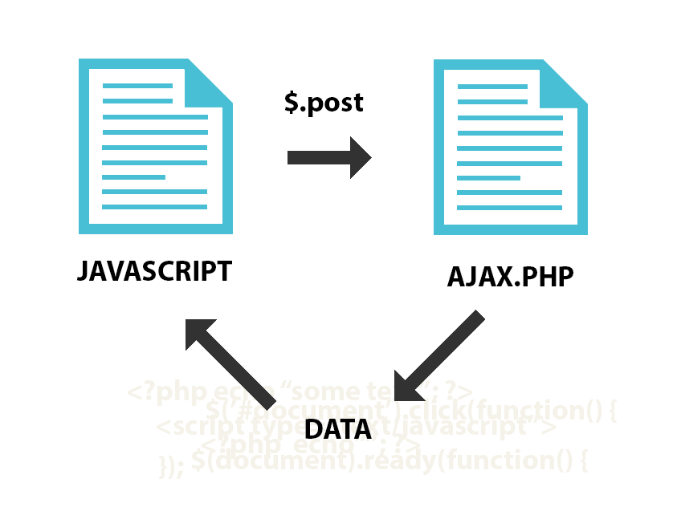
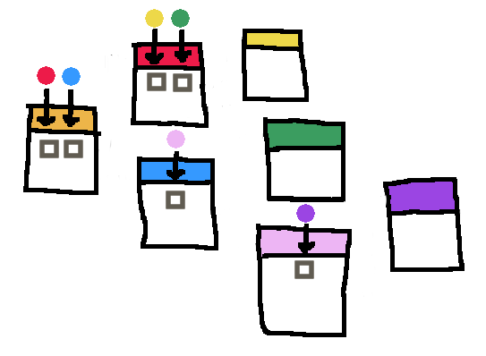
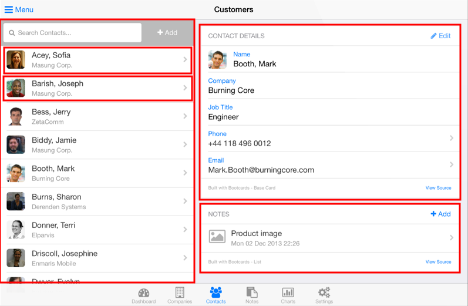

# Angular

Get started with and understand the basics of [Angular][angular], the JavaScript front-end web application framework.

This is a 

<!-- slide-include ../../BANNER.md -->

**You will need**

* [Google Chrome][chrome] (recommended, any browser with developer tools will do)

**Recommended reading**

* [JavaScript][js]
* [JavaScript closures][js-closures]
* [TypeScript][ts-subject]

<!-- START doctoc generated TOC please keep comment here to allow auto update -->
<!-- DON'T EDIT THIS SECTION, INSTEAD RE-RUN doctoc TO UPDATE -->


- [What is Angular?](#what-is-angular)
  - [Traditional Model-View-Controller (MVC) architecture](#traditional-model-view-controller-mvc-architecture)
  - [DOM manipulation and AJAX requests](#dom-manipulation-and-ajax-requests)
  - [Single-page applications](#single-page-applications)
  - [Dynamic HTML with Angular](#dynamic-html-with-angular)
  - [Evolution of Angular](#evolution-of-angular)
- [Getting started](#getting-started)
  - [Starter template](#starter-template)
  - [Overview](#overview)
  - [Modules](#modules)
  - [Controllers](#controllers)
  - [Services](#services)
  - [Filters](#filters)
  - [Directives](#directives)
  - [Components](#components)
  - [Application configuration and runtime](#application-configuration-and-runtime)
- [Scope hierarchy](#scope-hierarchy)
  - [Scopes and components](#scopes-and-components)
- [Forms](#forms)
  - [HTML validations](#html-validations)
  - [Binding to form state](#binding-to-form-state)
- [The `$http` service](#the-http-service)
  - [How to make requests](#how-to-make-requests)
  - [How to parse a response](#how-to-parse-a-response)
- [Best practices](#best-practices)
  - [File structure](#file-structure)
  - [Multiple controllers on one page](#multiple-controllers-on-one-page)
  - [Dependency injection and minification](#dependency-injection-and-minification)
- [Resources](#resources)

<!-- END doctoc generated TOC please keep comment here to allow auto update -->


## What is Angular?

<!-- slide-front-matter class: center, middle, image-header -->

<p class='center'></p>

> "Angular is a complete **JavaScript front-end web application framework** created by Google to address many of the challenges of developing **rich single-page applications**."


### Traditional Model-View-Controller (MVC) architecture

In traditional MVC frameworks,
the application's **Controllers** receive the user's requests when navigating from page to page in the browser,
and respond by generating HTML **Views** from the **Model**.


### DOM manipulation and AJAX requests

<!-- slide-column -->

Serving dynamic HTML from the server works, but each user action requires that a **complete page be loaded** from the server.

To improve user experience:

* [AJAX][ajax] was developed in 1999 to retrieve data from the server asynchronously in the background
* [jQuery][jquery] was released in 2006 to simplify DOM manipulation and AJAX requests

<!-- slide-column 40 -->



<!-- slide-container -->

This allows you to load data from the server in the background and **dynamically update the page** without reloading.

Initially, these technologies were used to **enrich** existing HTML pages that were still built and served by a traditional MVC framework.


### Single-page applications

<!-- slide-column -->

A single-page application (SPA) is a web application that **fits on a single web page** but provides a user experience similar to that of a **desktop application**:

* All content is retrieved with a **single page load or loaded dynamically**
* The page **does not reload** (location hash or [HTML 5 History API][html-history-api] to navigate between logical pages)
* Dynamic **communication with the web server** behind the scenes

<!-- slide-column -->


### Dynamic HTML with Angular

> "AngularJS is what HTML would have been, had it been designed for building web-apps."

HTML is great for displaying static documents, but is not so good at describing the **dynamic views** needed for **rich, interactive applications**.

With Angular, you can:
  * **Automatically bind data** to HTML elements
  * **Extend the HTML vocabulary** with new elements and attributes
  * **Isolate** your application logic from how the data is displayed


### Evolution of Angular

Angular is one of the most popular client-side frameworks, and it is still evolving.
Starting with version 2 of the framework (released in June 2016) you can take advantage of:

* [TypeScript][ts]: a superset of JavaScript with optional typing and the latest ECMAScript features
* [Web components][web-components]: a way to create reusable user interface widgets


## Getting started

<!-- slide-front-matter class: center, middle -->


### Starter template

You can clone the following project for the exercises in this tutorial:

[COMEM+ Angular Starter Project][angular-starter]

You should keep your [developer console][chrome-dev] open throughout this tutorial to detect errors in your code.


### Overview

<!-- slide-column -->

**Angular elements**

* Modules
* Components
* Directives
* Services
* HTTP
* Pipes

<!-- slide-column -->

**Angular concepts**

* Interpolation
* Data binding
* Dependency injection
* Form validation


### Modules

An Angular application is a **module**.
You can find one in `src/app/app.module.ts` in the starter project:

```ts
import { BrowserModule } from '@angular/platform-browser';
import { NgModule } from '@angular/core';

import { AppComponent } from './app.component';

`@NgModule`({
  declarations: [
    AppComponent
  ],
  imports: [
    BrowserModule
  ],
  providers: [],
  bootstrap: [AppComponent]
})
export class `AppModule` { }
```

A module is a way to help organize related things (components, services, etc) together.

#### Basic module definition

Take a look at the [`@NgModule`][angular-docs-ng-module] annotation:

```ts
@NgModule({
  `declarations`: [
    AppComponent
  ],
  `imports`: [
    BrowserModule
  ],
  `providers`: [],
  `bootstrap`: [AppComponent]
})
```

* The **declarations** array is a list of components (also directives and pipes) which belong to this module.
* The **imports** array is a list of other modules whose exported components should be available in this module.
  It allows you to express a dependency on another module.
* The **providers** array is a list of service providers (more about that later).
* **bootstrap** is the root component that Angular creates and inserts into `index.html`


### Components

Components are the most basic **building block** of an UI in an Angular application.
An Angular application is a tree of Angular components.

You will find a component in `src/app/app.component.ts` in the starter project:

```ts
import { Component } from '@angular/core';

`@Component`({
  selector: 'app-root',
  templateUrl: './app.component.html',
  styleUrls: ['./app.component.css']
})
export `class AppComponent` {
  title: string;

  constructor() {
    this.title = 'app';
  }
}
```

A component is any [JavaScript class][js-classes] annotated with the [`@Component`][angular-docs-component] decorator.

Let's dig into that line by line.

#### Component selector

The `selector` property of the `@Component` decorator indicates what tag you should put in your HTML to instantiate the component:

```ts
@Component({
  `selector: 'app-root'`,
  templateUrl: './app.component.html',
  styleUrls: ['./app.component.css']
})
```

Open `src/index.html` in the starter project.
You will find the `<app-root>` tag:

```html
<body>
  `<app-root></app-root>`
&lt;/body&gt;
```

#### Component template

The `templateUrl` property of the `@Component` decorator tells Angular which HTML file to use to display the component:

```ts
@Component({
  selector: 'app-root',
  `templateUrl: './app.component.html'`,
  styleUrls: ['./app.component.css']
})
```

For very simple components, you can also use `template` instead of `templateUrl` to use an **inline template**:

```ts
@Component({
  selector: 'app-root',
  `template: '<h1>Welcome to {{ title }}!</h1>'`,
  styleUrls: ['./app.component.css']
})
```

#### Component styles

Similarly, the `styleUrls` property is a list of CSS files to apply to the component:

```ts
@Component({
  selector: 'app-root',
  templateUrl: './app.component.html',
  `styleUrls: ['./app.component.css']`
})
```

It's also possible to use **inline styles** for very simple components:

```ts
@Component({
  selector: 'app-root',
  templateUrl: './app.component.html',
  `styles: [ 'h1 { font-weight: normal;  }' ]`
})
```

Styles in Angular are **modular**.
They apply only *within the template of that component*.

Read the [Component Styles][angular-component-styles] documentation to learn more.

#### Data binding

You can display data by **binding** parts of an HTML template to properties of a component.

```ts
export class AppComponent {
  `title: string;`

  constructor() {
    this.title = 'app';
  }
}
```

Enclosing a component's property name in double curly braces in the template is called **interpolation**:

```html
<h1>
  Welcome to `{{ title }}`!
</h1>
```

#### Interpolation with functions

Interpolation is not limited to simple properties.
You can also use a component's **methods** in the template.

Add the following method to the component (`src/app/app.component.ts`):

```ts
export class AppComponent {
  // ...

* hello(name: string): string {
*   return 'Hello ' + name + '!';
* }
}
```

Now use that function in the template (`src/app/app.component.html`):

```html
<p>
  `{{ hello("World") }}`
</p>
```


### User input

One of the things you will need to do is **react to user input** (e.g. through forms).
Let's make our greeting **dynamic** by adding an input field to customize the name.
Make the following changes to the component:

```ts
export class AppComponent {
  title: string;
  `greeting: string;`

  constructor() {
    this.title = 'app';
    `this.greeting = '';`
  }
  // ...
}
```

Now interpolate that new property into the function in the template:

```html
<p>
  {{ `hello(greeting)` }}
</p>
```

#### `ngModel`

Add an input field to the template above the greeting:

```html
*<p>
* <input type='text' placeholder='Who are you?' [(ngModel)]='greeting' />
*</p>
<p>
  {{ `hello(greeting)` }}
</p>
```

`[(ngModel)]` is Angular's **two-way data binding** syntax.
It binds the `greeting` property to the HTML input field.

You will most likely get this error:

```
Uncaught Error: Template parse errors:
Can't bind to 'ngModel' since it isn't a known property of 'input'.
```

This is because `[(ngModel)]` belongs to the optional `FormsModule`, which you have to *opt in* to using.

#### `FormsModule`

To **import** the module into your application, you must add it to the `imports` array of your own module in `src/app/app.module.ts`:

```ts
*import { FormsModule } from '@angular/forms';
// Other imports...

@NgModule({
  declarations: [
    AppComponent
  ],
  imports: [
    BrowserModule,
    `FormsModule`
  ],
  providers: [],
  bootstrap: [AppComponent]
})
export class AppModule { }
```

Once you've done that, the field should display correctly.

#### Two-way data binding

<!-- slide-column -->

Traditional templating systems bind data **in only one direction**.

The developer has to write code that constantly syncs the view with the model and vice versa.


<!-- slide-column -->

With Angular changes are **immediately reflected** in both view and model.

Also note that our **component** is **isolated from and unaware of the view**:
it does not care about DOM manipulation or rendering concerns.


### Directives

A **directive** is a class with a `@Directive` decorator.

The **component** that we've seen before is a *directive-with-a-template*
A `@Component` decorator is actually a `@Directive` decorator extended with template-oriented features.

Two other kinds of directives exist: **structural** and **attribute** directives.

#### Structural directives

Structural directives are responsible for HTML layout.
They shape or reshape the **DOM's structure**, typically by **adding, removing, or manipulating elements**.

Let's add the [`ngIf`][angular-docs-ng-if] directive to our template as an example:

```html
<p `*ngIf='greeting'`>
  {{ hello(greeting) }}
</p>
```

As you can see, the entire paragraph is now removed from the DOM as long as the `greeting` property is blank (e.g. `undefined` or an empty string).
It is added back as soon as `greeting` has a value.

Read the [documentation][angular-structural-directives] to learn more about structural directives.
Many more such directives are provided by Angular out of the box, like [`ngFor`][angular-docs-ng-for] (which we'll use later) and [`ngSwitch`][angular-docs-ng-switch].

#### Attribute directives

An **attribute** directive changes the **appearance or behavior of a DOM element**.

Create a `src/app/highlight.directive.ts` file with the following contents:

```ts
import { Directive } from '@angular/core';

`@Directive`({
  selector: '[appHighlight]'
})
export `class HighlightDirective` {
  constructor() {
    console.log('the highlight directive was used');
  }
}
```

Similarly to a component, a directive is a JavaScript class, this time annotated with the [`@Directive`][angular-docs-directive] decorator.

The selector, `[appHighlight]` is an [attribute selector][css-attribute-selector].
Also note that it is good practice to prefix the selector with your application name ("app" for this example) to avoid **naming collisions** with other directives.

##### Using an attribute directive

To use your new attribute directive, you must **declare** it in your module's `declarations` array in `src/app/app.module.ts`:

```ts
*import { HighlightDirective } from './highlight.directive';
// Other imports...

@NgModule({
  declarations: [
    AppComponent,
    `HighlightDirective`
  ],
  // ...
})
export class AppModule { }
```

Now all you need to do is add the attribute to an element in `src/app/app.component.html`.
Let's add it to the greeting.

```html
<h1 `appHighlight`>
  Welcome to {{ title }}!
</h1>
```

You should see the directive being used in the console after entering some text in the input field.

##### Modifying the DOM

Now add an `ElementRef` argument to the directive's constructor:

```ts
import { Directive, `ElementRef` } from '@angular/core';

@Directive({
  selector: '[appHighlight]'
})
export class HighlightDirective {
  constructor(`el: ElementRef`) {
    `el.nativeElement.style.backgroundColor = 'yellow';`
  }
}
```

Doing this **injects** a reference to the host DOM element, the element to which you applied the `appHighlight` attribute.

`ElementRef` grants direct access to the host DOM element through its `nativeElement` property.
In this example we set the background color to yellow.

#### Common directives

These common directives are provided by Angular out of the box:

* [`ngClass`][angular-docs-ng-class] - Adds and removes **CSS classes** on an HTML element.
* [`ngFor`][angular-docs-ng-for] - Instantiates a template **once per item** from an iterable.
* [`ngIf`][angular-docs-ng-if] - **Conditionally includes** a template based on the value of an expression.
* [`ngPlural`][angular-docs-ng-plural] - Adds/removes DOM sub-trees based on a numeric value. (Tailored for **pluralization**.)
* [`ngStyle`][angular-docs-ng-style] - Update an HTML element's **styles**.
* [`ngSwitch`][angular-docs-ng-switch] - Adds/removes DOM sub-trees when the nest match expressions matches the **switch** expression.


### Models

Let's make our application funny by adding some jokes.

It's good practice to create **classes** for your **business models**.
Let's start with a very simple one.

Angular CLI comes with scaffolding tools to help you create files.
You can generate a model class with the following command:

```bash
$> ng generate class models/joke
```

This will create a `src/app/models/joke.ts` file.
Open it and add a `text` attribute to our new `Joke` class:

```ts
export class Joke {
  `text: string;`
}
```

#### Using models

Let's add some jokes to our component:

```ts
// Other imports...
`import { Joke } from './models/joke';`

@Component({
  selector: 'app-root',
  templateUrl: './app.component.html',
  styleUrls: ['./app.component.css']
})
export class AppComponent {
  title: string;
  greeting: string;
  `jokes: Joke[];`

  constructor() {
    this.title = 'app';
    this.greeting = '';
*   this.jokes = [
*     { text: 'Knock knock' },
*     { text: 'The cake is a lie' }
*   ];
  }
  // ...
}
```

#### Using `ngFor`

Now that we have some jokes, let's display them.
We want a `<ul>` list, with a `<li>` item for each joke.
That's a job for the `ngFor` directive.

Add this at the bottom of the component's template:

```html
<ul>
  <li *ngFor='let joke of jokes'>{{ joke.text }}</li>
</ul>
```

The directive handles repeating the `<li>` element for us.
No need to write it multiple times, or to manually build and concatenate DOM elements in the component's TypeScript code.

#### Using `ngPlural`

While we're at it, let's also add a header above the list:

```html
<h2>
  {{ jokes.length }} jokes
</h2>
```

You might notice that we'll have a minor problem when there is only one joke.
It will say "1 jokes" instead of "1 joke".

The [`ngPlural`][angular-docs-ng-plural] directive comes to the rescue:

```html
<h2 [ngPlural]='jokes.length'>
  {{ jokes.length }}
  <ng-template ngPluralCase='=1'>joke</ng-template>
  <ng-template ngPluralCase='other'>jokes</ng-template>
</h2>
```


### Services

Let's do something more interesting: fetch some jokes on the internet.

To do it "The Angular Way", we'll encapsulate that functionality into a **service**.

Why?
**Components** should not try to do too much;
they should focus on **presenting data** and **delegate data access** to specialized classes.
**Services** are here to fill that role.

This helps your components remain as simple as possible while services handle your business logic.

Let's use Angular CLI to generate a joke service:

```bash
$> ng generate service --spec false services/joke
```

(The `--spec false` option disables the generation of an test file for the service.
We will not cover [automated tests][angular-testing] in this tutorial, but you should definitely check it out.)

#### The joke service

The `src/app/services/joke.service.ts` file has been generated:

```ts
import { Injectable } from '@angular/core';

`@Injectable`()
export `class JokeService` {
  constructor() { }
}
```

Once again, a service is simply a JavaScript class, annotated with the [`@Injectable`][angular-docs-injectable] decorator.
More about that later.

For now, simply add a method which returns a joke:

```ts
`import { Joke } from '../models/joke';`

@Injectable()
export class JokeService {
  constructor() { }

* getJoke(): Joke {
*   return { text: 'Knock knock' };
* }
}
```

#### Providing the joke service

To use the service, you must **provide** it in your module's `providers` array in `src/app/app.module.ts`:

```ts
// Other imports...
`import { JokeService } from './services/joke.service';`

@NgModule({
  // ...
  providers: [
    `JokeService`
  ],
  // ...
})
export class AppModule { }
```

#### Injecting the joke service

Once you've done that, you can **inject** it into your component.
You just have to add a **constructor parameter property**.
While you're at it, also add a **method to add a joke**:

```ts
export class AppComponent {
  // ...
  constructor(`private jokeService: JokeService`) {
    // ...
  }

* addJoke() {
*   this.jokes.push(this.jokeService.getJoke());
* }
  // ...
}
```

And use that button in the template:

```html
<p>
  <button type='button' (click)='addJoke()'>Add joke</button>
</p>
```

The `(click)` attribute is Angular's syntax to listen to the `click` event on a DOM element and trigger something when it occurs.

#### Why does it work?

Our component now uses the service.
But why does it work?
All you did was add a parameter property to the constructor:

```ts
constructor(`private jokeService: JokeService`) {
  // ...
}
```

As a reminder, in TypeScript this is equivalent to:

```ts
export class AppComponent {
  `jokeService: JokeService;`

  constructor(`jokeService: JokeService`) {
    `this.jokeService = jokeService;`
  }
}
```

You **never instantiated the service with `new`**, so where is the instance coming from?

#### Dependency injection

Angular relies on [dependency injection][di] to plug components, services and other elements together.

* After creating your service, you **provided** it in the application **module**.
* This makes it possible for Angular's **injector** to know that your service exists and to create instances of it.
* By adding the parameter to the component's constructor, you **asked Angular to inject** an instance of the service at runtime.

Dependency injection is a form of [inversion of control][ioc],
meaning that parts of your code **receive** the flow of control instead of driving it like in classic procedural programming.

The general goal is to:

* **Decouple** the execution of a task from implementation.
* **Focus** a component on the task it is designed for.
* **Free components from assumptions** about how other systems do what they do and instead rely on **contracts**.
* **Prevent side effects** when **replacing** a component.

#### Why dependency injection?

<!-- slide-column -->

**Strong coupling**

```js
function Car() {
  this.engine = new Engine(24);
}
function Engine(gasLead) {
  this.gas = new Gas(gasLead);
}
function Gas(lead) {
  this.lead = lead;
}
```


<!-- slide-column -->

**Loose coupling** (with an *injector*)

```js
function Car(engine) {
  this.engine = engine;
}
function Engine(gas) {
  this.gas = gas;
}
function Gas(lead) {
  this.lead = lead;
}
```



#### The $http service

Angular provides several useful services out of the box.
The `$http` service can make AJAX requests for you:

```js
angular.module('starter').factory('HelloService', function(`$http`) {

  var service = {};

  // ...

* service.retrieveJoke = function() {
*   return $http.get('https://api.icndb.com/jokes/random').then(function(res) {
*     return res.data.value.joke;
*   });
* };

  return service;
});
```

#### Making HTTP requests through a service

It's good practice to make HTTP requests in a service rather than in a controller directly.
That way your controller remains **as simple as possible** and only manages the view:

```js
angular.module('starter').controller('HelloController', function(HelloService) {

  var helloCtrl = this;
  helloCtrl.name = 'World';
  helloCtrl.double = HelloService.double;

* HelloService.retrieveJoke().then(function(joke) {
*   helloCtrl.joke = joke;
* });
});
```

You can now display the joke in the HTML template:

```html
<div ng-controller='HelloController as helloCtrl'>
  <p>Hello {{ helloCtrl.name }}!</p>
  <p>Two times two equals {{ helloCtrl.double(2) }}</p>
* <p>Did you hear? {{ helloCtrl.joke }}</p>
</div>
```

#### Using `service()`

Services can also be defined with Angular's `service()` function instead of `factory()`.
They **both create services**; the only difference is how your **factory function** is invoked to create the service.

When using `factory()`, Angular will simply call your factory function to create the service:

```js
function MyServiceFactory() {
  var service = {};      // Create the service yourself
  service.foo = 'bar';   // Attach stuff to it
  return service;        // Return it
}

// Angular will execute "MyServiceFactory()" to create the service
angular.module('starter').factory('MyService', MyServiceFactory);
```

When using `service()`, Angular calls your factory function as a **constructor**:

```js
function MyServiceFactory() {
  this.foo = 'bar'; // Attach stuff to "this", which will be the service
}

// Angular will execute "new MyServiceFactory()" to create the service
angular.module('starter').service('MyService', MyServiceFactory);
```


### Filters

Filters are simple functions that format a value for display to the user.

To create a filter, you must use `filter()` and pass a factory function (where you can inject dependencies if you need them).
This function **must return the filter function** that will be called with the value:

```js
angular.module('starter').filter('hello', function() {
* return function(input) {
*   return 'Hello ' + input + '!';
* };
});
```

You apply a filter by "piping" a value into it.
Let's modify the first paragraph of our previous template a bit:

```html
<p>{{ `helloCtrl.name | hello` }}</p>
```

#### Built-in filters

Angular has a number of useful [built-in filters][angular-built-in-filters]:

Filter    | Purpose
:---      | :---
`filter`    | Filter an array
`currency`  | Format a number as currency
`number`    | Format a number as text (e.g. with thousands separator)
`date`      | Format date a string with a custom format
`json`      | Converts a JavaScript object into a JSON string
`lowercase` | Converts a string to lower case
`uppercase` | Converts a string to upper case
`limitTo`   | Select a subset from an array
`orderBy`   | Order an array's elements

#### A few filter examples

Several filters can be "piped" together:

```html
<p>{{ helloCtrl.name | uppercase | hello }}</p>
```

Let's try the `date` filter.
Create a date in your controller first:

```js
angular.module('starter').controller('HelloController', function(HelloService) {
  var helloCtrl = this;
  // ...
  `helloCtrl.now = new Date();`
});
```

Then filter it in the view:

```html
<p>It's {{ `helloCtrl.now | date: 'HH:mm:ss'` }}</p>
```


### Components

Components are a **special kind of directive** with simpler configuration and which is suitable for a **component-based application structure**.
They're a first step towards making applications with [web components][a-guide-to-web-components], an approach which has been taken further in Angular 2.

A component is basically:

* A **reusable view** (an HTML template)
* Some **logic** attached to this template (a controller)
* Clearly defined **inputs** and **outputs**

For this example, we'll create a `<person>` component to display a person.

#### Component HTML template

Let's say we want to reuse the bit of template we wrote to display a person,
because we know we're going to display people at multiple places in our app:

```html
{{ personCtrl.person.firstName }} {{ personCtrl.person.lastName }}
```

`personCtrl` will be our component's controller.
We will define it later.

Save this content to a `person.html` file next to `index.html`.
Angular will make an AJAX request to load it dynamically when we define our component.

#### Component definition

Call Angular's `component()` function to define a component.
The second argument is a **component definition object** with various properties that configure your component:

```js
angular.module('starter').component('person', `{`
* templateUrl: 'person.html',
* bindings: {
*   person: '<'
* },
* controller: function() {
*   var personCtrl = this;
* },
* controllerAs: 'personCtrl'
`}`);
```

* `templateUrl` tells Angular what **HTML template** to use
  (it can be a relative or absolute URL)
* `bindings` defines the component's **inputs** and **outputs**
* `controller` is the component's **controller** that will be applied to the template
  (just like if we used `ng-controller`)
* `controllerAs` is the **name of the controller** in the template
  (just like if we used `as personCtrl` in `ng-controller`)

#### Using a component

Now we can use our new component in the main view.
Update the list to use your new component:

```html
<p>
  <ul>
    <li ng-repeat='person in helloCtrl.people'>
      `<person person='person'></person>`
    </li>
  </ul>
</p>
```

It's good practice to structure your application into **reusable components**.

#### Component inputs

Components should only control **their own view and data**.
You can define the behavior of inputs with the values in the `bindings` object:

Binding | Description
:---    | :---
`<`     | Input with one-way binding: changes to the value will not be reflected in the parent (although if it's an object or array, changes to its contents will be reflected)
`=`     | Input with two-way binding (changes to the value will be reflected in the parent)
`@`     | String input (when the input is simply a string that doesn't change, i.e. not a variable)

When writing components, it's good practice to use `<` and `@` instead of `=`,
to make it clearer who controls what data.
Here's an example of the difference between using `<` and `@`:

```html
<!-- Input with '<': takes a variable -->
<hello name='person.name'></hello>

<!-- Input with '@': takes a string -->
<hello name='John Doe'></hello>
```

#### Component outputs

Outputs allow your component to **communicate with the parent component** (or view).
Let's modify our `person.html` template and add a button to say hello to each person:

```html
{{ personCtrl.person.firstName }} {{ personCtrl.person.lastName }}
*<button type='button' ng-click='personCtrl.sayHello()'>Say hello</button>
```

Add the `sayHello` function to the component's controller.
Just log the name for now and make sure it works:

```js
angular.module('starter').component('person', {
  templateUrl: 'person.html',
  bindings: {
    person: '<'
  },
  controller: function() {
    var personCtrl = this;
*   personCtrl.sayHello = function() {
*     console.log(personCtrl.person);
*   };
  },
  controllerAs: 'personCtrl'
});
```

#### Output callbacks

Component outputs allow you to define **callbacks to component events**.

You define an output by adding a `&` binding.
This kind of binding is a **function** that is added to the scope and **which you can call**:

```js
angular.module('starter').component('person', {
  templateUrl: 'person.html',
  bindings: {
    person: '<',
*   onSayHello: '&'
  },
  controller: function() {
    var personCtrl = this;
    personCtrl.sayHello = function() {
*     personCtrl.onSayHello({ personToSalute: personCtrl.person });
    };
  },
  controllerAs: 'personCtrl'
});
```

#### Using a component output

The **parent component** (or view) can plug a **callback function** into our new component output:

```html
<person
  person='person'
  `on-say-hello='helloCtrl.sayHelloToPerson(personToSalute)'`>
</person>
```

We can use the property names of the object passed to the output as variables in the parent
(the `personToSalute` variable name is defined by the component when it uses the output).

Define the `sayHelloToPerson` function in `HelloController` to react to the output:

```js
angular.module('starter').controller('HelloController', function(HelloService) {
  var helloCtrl = this;
  // ...
* helloCtrl.sayHelloToPerson = function(person) {
*   helloCtrl.name = person.firstName;
* };
});
```


## Forms

Angular provides **validation** services for forms and controls.
These validations are performed **client-side** for a better user experience: the user gets **instant feedback**.

However, keep in mind that although this provides a good user experience, it can easily be circumvented and thus **cannot be trusted**.
**Server-side validation is still necessary** for a secure application.


### HTML validations

HTML 5 has built-in validation attributes to define validations on your form inputs (e.g. `<input>`, `<textarea>`, etc):

Attribute   | Description
:---        | :---
`min`       | Minimum value for a number
`max`       | Maximum value for a number
`minlength` | Minimum length for a string
`maxlength` | Maximum length for a string
`pattern`   | Regular expression for a string
`required`  | Required field

You simply add them to the HTML tag to ask the **browser** to validate user input:

```html
<input type='text' `required minlength=2` />
```

Read the [documentation][html-input] to learn more.

#### Using `novalidate`

In Angular, you don't want the browser to perform the validations as it's not flexible.
By adding the `novalidate` attribute to your form, it will **disable browser validation**:

```html
<form `novalidate`>
  <!-- ... -->
</form>
```

Angular **will validate** your inputs for you instead of the browser.
This enables **more complex validations and interaction**.
Another advantage is that Angular **polyfills** HTML 5 validations in older browsers that don't support them.


### Binding to form state

Any form in an Angular application is an instance of [FormController][angular-form-controller].
Any input with the `ng-model` directive is an instance of [NgModelController][angular-ng-model-controller].
By adding a `name` attribute to these elements, you can **bind form state to the scope**:

```html
<form `name='userForm'` ng-submit='submit()' novalidate>
  <input type='text' ng-model='user.name' `name='name'` `required` />
  <div ng-if='`userForm.name.$error.required`'>Tell us your name.</div>
</form>
```

In this example, adding `name='userForm'` to the form **puts the `userForm` variable in the scope**:
this is the `FormController` instance.

Adding `name='name'` to the form field **puts the `userForm.name` variable in the scope**:
this is the `NgModelController` instance.

#### Form and `ng-model` controllers

Form and `ng-model` controllers have the following useful properties:

Ctrl       | Property     | Description
:---       | :---         | :---
Form       | `$pristine`  | True if the user has not interacted with the form
Form       | `$dirty`     | True if the user has interacted with the form
Form       | `$valid`     | True if all inputs are valid
Form       | `$invalid`   | True if at least one input is invalid
Form       | `$pending`   | True if an asynchronous validation is pending
Form       | `$submitted` | True if the form has been submitted (even if invalid)
`ng-model` | `$error`     | An object with all failing validations as keys
`ng-model` | `$untouched` | True if the input has not lost focus yet
`ng-model` | `$touched`   | True if the input has lost focus
`ng-model` | `$pristine`  | True if the user has not interacted with the input
`ng-model` | `$dirty`     | True if the user has interacted with the input
`ng-model` | `$valid`     | True if the input has no errors
`ng-model` | `$invalid`   | True if there is at least one error for the input

#### Complete validation example

```html
<form `name='userForm'` ng-submit='submit()' novalidate>
  <label>
    Name:
    <input type='text' ng-model='user.name' `name='name'` required minlength=2 />
  </label>
  <div ng-if='`userForm.name.$dirty`'>
    <div ng-if='`userForm.name.$error.required`'>Tell us your name.</div>
    <div ng-if='`userForm.name.$error.minlength`'>Your name is too short.</div>
  </div>

  <label>
    E-mail:
    <input type='email' ng-model='user.email' `name='email'` required />
  </label>
  <div ng-if='`userForm.email.$dirty`'>
    <span ng-if='`userForm.email.$error.required`'>Tell us your e-mail.</span>
    <span ng-if='`userForm.email.$error.email`'>This is not a valid e-mail.</span>
  </div>

  <input type='submit' ng-disabled='`userForm.$invalid`' value='Save' />
</form>
```

See it in action [here][angular-codepen-form-validation].
Read the [documentation][angular-forms] to learn more.

#### Custom synchronous validators

AngularJS provides basic implementation for most common HTML 5 validations,
but sometimes you need to add your own.
You can do that by defining a **validation directive**:

```js
var INTEGER_REGEXP = /^-?\d+$/;
app.directive('integer', function() {
  return {
    `require: 'ngModel',` // Gives access to the ng-model controller
    link: function(scope, element, attrs, `ngModelCtrl`) {
      `ngModelCtrl.$validators.integer` = function(modelValue, viewValue) {
        if (ngModelCtrl.$isEmpty(modelValue)) {
          return true; // Consider an empty value to be valid
        }

        // Return true if the string value is an integer
        `return INTEGER_REGEXP.test(viewValue);`
      };
    }
  };
});
```

Using it is as simple as applying the directive as an attribute:

```html
<input type='number' ng-model='size' name='size' min='0' max='10' `integer` />
```


## The `$http` service

<!-- slide-front-matter class: center, middle -->

The `$http` service is a core AngularJS service that facilitates communication with remote HTTP servers.


### How to make requests

Here's a typical HTTP `POST` request to authenticate a user:

```http
POST /authenticate HTTP/1.1
Authorization: Bearer letmein
Content-Type: application/json

{ "name": "jdoe", "password": "test" }
```

Here's how you would make that request with Angular:

```js
$http({
  method: 'POST',
  headers: {
    Authorization: 'Bearer letmein',
    Content-Type: 'application/json'
  },
  data: {
    name: 'jdoe',
    password: 'test'
  }
});
```

#### Query parameters

Here's an HTTP `GET` request with query parameters:

```http
GET /movies?director=abc&include=foo&include=bar&page=2&pageSize=30
```

You can put the query parameters in the URL yourself:

```js
var director = 'abc';
var page = 2;
var pageSize = 30;
var includes = [ 'foo', 'bar' ];

var url = '/movies';
url = url + '?director=' + director;
url = url + '&page=' + page + '&pageSize=' + pageSize;

for (var i = 0; i < includes.length; i++) {
  url = url + '&include=' + includes[i];
}

$http({
  url: url
});

// GET /movies?director=abc&include=foo&include=bar&page=2&pageSize=30
```

#### Using the `params` object

Or you can use the `params` object which does it for you:

```js
var director = 'abc';
var page = 2;
var pageSize = 30;
var includes = [ 'foo', 'bar' ];

$http({
  url: '/movies,
* params: {
*   director: director,
*   page: page,
*   pageSize: pageSize,
*   include: includes
* }
});

// GET /movies?director=abc&include=foo&include=bar&page=2&pageSize=30
```


### How to parse a response

Here's a typical HTTP response:

```http
HTTP/1.1 201 Created
Content-Type: application/json
Location: /users/abc

{
  "id": "abc",
  "name": "jdoe"
}
```

Here's how to extract all the data from that response:

```js
$http(options).then(function(res) {
  // Get the status code
  console.log(res`.status`); // 201
  console.log(res`.statusText`); // 'Created'
  // Get the headers
  console.log(res`.headers`('Content-Type')); // 'application/json'
  console.log(res`.headers`('Location')); // '/users/abc'
  // Get the response body
  console.log(res`.data`); // { id: 'abc', name: 'jdoe' }
  console.log(res`.data`.name); // 'jdoe'
});
```


## Best practices

<!-- slide-front-matter class: center, middle, image-header -->


### File structure

There are several possible file structures:

<!-- slide-column -->

**By element type**

```txt
index.html
*controllers
  hello-controller.js
  other-controller.js
*services
  hello-service.js
*components
  person-component.js
  person-component.html
```

<!-- slide-column -->

**By feature**

```txt
index.html
*hello
  hello-controller.js
  hello-service.js
*other
  other-controller.js
*person-component
  person-component.js
  person-component.html
```

<!-- slide-container -->

There is no *right or wrong* solution here.

Just **don't put everything in one file**.


### Multiple controllers on one page

When you have a complex page with multiple areas that each have their specific logic,
it's good practice to **isolate each part into a component**:

<p class='center'></p>


## Resources

**Documentation**

* [Angular developer guide][angular-guide]
  * [Angular Forms][angular-forms]
* [Angular API reference][angular-api]
  * [Angular Components][angular-components]
  * [Angular Directives][angular-directives] ([built-in][angular-directives-list])
  * [Angular input][angular-input]
* [HTML input tag][html-input]

**Further reading**

* [A guide to web components][a-guide-to-web-components]
* [Angular 2 components][angular-2-series-components]
* [JavaScript promises][js-promises]
* [Promises in Angular][angular-promises]


[a-guide-to-web-components]: https://css-tricks.com/modular-future-web-components/
[ajax]: https://developer.mozilla.org/en-US/docs/AJAX/Getting_Started
[angular]: https://angular.io
[angularjs]: https://angularjs.org/
[angular-api]: https://docs.angularjs.org/api
[angular-built-in-filters]: https://docs.angularjs.org/api/ng/filter
[angular-codepen]: http://codepen.io/AlphaHydrae/pen/LxoRze?editors=1010#0
[angular-codepen-form-validation]: http://codepen.io/AlphaHydrae/pen/EWZOOR?editors=1011
[angular-codepen-scope-hierarchy]: http://codepen.io/AlphaHydrae/pen/ryjaXN?editors=1010#0
[angular-codepen-scope-components]: http://codepen.io/AlphaHydrae/pen/LWxVzj?editors=1010#0
[angular-component-styles]: https://angular.io/guide/component-styles
[angular-components]: https://docs.angularjs.org/guide/component
[angular-directives]: https://docs.angularjs.org/guide/directive
[angular-directives-list]: https://docs.angularjs.org/api/ng/directive
[angular-docs-component]: https://angular.io/api/core/Component
[angular-docs-directive]: https://angular.io/api/core/Directive
[angular-docs-injectable]: https://angular.io/api/core/Injectable
[angular-docs-ng-class]: https://angular.io/api/common/NgClass
[angular-docs-ng-for]: https://angular.io/api/common/NgForOf
[angular-docs-ng-if]: https://angular.io/api/common/NgIf
[angular-docs-ng-module]: https://angular.io/api/core/NgModule
[angular-docs-ng-plural]: https://angular.io/api/common/NgPlural
[angular-docs-ng-style]: https://angular.io/api/common/NgStyle
[angular-docs-ng-switch]: https://angular.io/api/common/NgSwitch
[angular-element]: https://docs.angularjs.org/api/ng/function/angular.element
[angular-form-controller]: https://docs.angularjs.org/api/ng/type/form.FormController
[angular-forms]: https://docs.angularjs.org/guide/forms
[angular-guide]: https://docs.angularjs.org/guide
[angular-input]: https://docs.angularjs.org/api/ng/directive/input
[angular-ng-model-controller]: https://docs.angularjs.org/api/ng/type/ngModel.NgModelController
[angular-promises]: ../angular-promises/
[angular-starter]: https://github.com/MediaComem/comem-angular-starter#readme
[angular-structural-directives]: https://angular.io/guide/structural-directives
[angular-testing]: https://angular.io/guide/testing
[angular-2-series-components]: http://blog.ionic.io/angular-2-series-components/
[chrome]: https://www.google.com/chrome/
[chrome-dev]: https://developers.google.com/web/tools/chrome-devtools/console/
[css-attribute-selector]: https://developer.mozilla.org/en-US/docs/Web/CSS/Attribute_selectors
[di]: https://en.wikipedia.org/wiki/Dependency_injection
[html-history-api]: https://developer.mozilla.org/en-US/docs/Web/API/History_API
[html-input]: https://www.w3schools.com/tags/tag_input.asp
[jquery]: http://jquery.com
[js]: ../js/
[js-classes]: https://developer.mozilla.org/en-US/docs/Web/JavaScript/Reference/Classes
[js-closures]: ../js-closures/
[js-promises]: ../js-promises/
[ioc]: https://en.wikipedia.org/wiki/Inversion_of_control
[minification]: https://en.wikipedia.org/wiki/Minification_(programming)
[ts]: https://www.typescriptlang.org
[ts-subject]: ../ts
[web-components]: https://developer.mozilla.org/en-US/docs/Web/Web_Components
