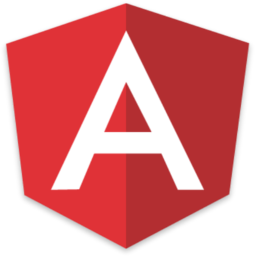

# Angular

<!-- START doctoc -->
<!-- END doctoc -->


## What is Angular?

<!-- slide-front-matter class: center, middle, image-header -->

<p class='center'></p>

> "Angular is a complete **JavaScript front-end web application framework** created by Google to address many of the challenges of developing **rich single-page applications**."


### Traditional Model-View-Controller (MVC) architecture

In traditional MVC frameworks,
the application's **Controllers** receive the user's requests when navigating from page to page in the browser,
and respond by generating HTML **Views** from the **Model**.


### DOM manipulation and AJAX requests

TODO: jQuery for simple apps


### Single-page applications

<!-- slide-column -->

A single-page application (SPA) is a web application that **fits on a single web page** but provides a user experience similar to that of a **desktop application**.

* All content is retrieved with a **single page load or loaded dynamically**
* The page **does not reload** (location hash or HTML5 History API to navigate between logical pages)
* Dynamic **communication with the web server** behind the scenes

<!-- slide-column -->


### Dynamic HTML

> "AngularJS is what HTML would have been, had it been designed for building web-apps."

HTML is great for displaying static documents, but is not so good at describing the **dynamic views** needed for **rich, interactive applications**.

With Angular, you can:
  * **Automatically bind data** to HTML elements
  * **Extend the HTML vocabulary** with new elements and attributes
  * **Isolate** your application logic from how the data is displayed


### Angular 2

TODO: evolution of Angular (TypeScript)


## Getting started

<!-- slide-front-matter class: center, middle -->


### Starter template

This tutorial assumes that you have a web page running with Angular included.
If you don't, you can save the following HTML to a file and open it in your browser:

```html
<!DOCTYPE html>
<html lang='en'>
  <head>
    <meta charset='utf-8'>
    <title>Angular demo</title>
    <script
src='https://ajax.googleapis.com/ajax/libs/angularjs/1.6.1/angular.min.js'>
    </script>
  </head>
  <body>
    <!-- Page content -->
  </body>
</html>
```


### Overview

<!-- slide-column -->

**Angular elements**

* Modules
* Controllers
* Scope
* Components (directives)
* Filters
* Services
* Constants
* Config functions
* Run functions

<!-- slide-column -->

**Angular concepts**

* Interpolation
* Data binding
* Two-way binding
* Dependency injection
* Form validation


### Modules

To make an Angular application, you have to create a **module**:

```js
// Create an angular module
angular.module('starter', []);
```

The two arguments of `angular.module()` are:

* A name (in this case: the name of your application)
* A list of dependencies (leave it blank for now)

To plug your Angular application into a web page, use the `ng-app` attribute.
It's customary to put it on the `<body>` tag:

```html
*<body ng-app='starter'>
  <!-- Page content -->
</body>
```


### Controllers

A controller is a function which **controls part of an HTML template**:

```js
angular.module('starter').controller(`'HelloController'`, function($scope) {
  $scope.name = 'World';
});
```

You can apply your controller to the HTML tags you want to control with the `ng-controller` attribute:

```html
<body>
  <div `ng-controller='HelloController'`>
    <p>Hello {{ name }}!</p>
  </div>
</body>
```

Let's dig into that line by line.

#### Creating a controller

Note that we call `angular.module()` again, but this time **only with the name**.
Instead of creating a new module, this returns the **existing module** with that name:

```js
`angular.module('starter')`.controller('HelloController', function($scope) {
  $scope.name = 'World';
});
```

Then, we define a controller named `HelloController`:

```js
angular.module('starter')`.controller('HelloController'`, function($scope) {
  $scope.name = 'World';
});
```

That controller is simply a **function**:

```js
angular.module('starter').controller('HelloController', `function($scope) {`
* $scope.name = 'World';
`}`);
```

#### The scope

The `$scope` object is the **view model**, i.e. the model that will be presented by the view:

```js
angular.module('starter').controller('HelloController', function(`$scope`) {
  `$scope.name` = 'World';
});
```

Properties you attach to the scope can be interpolated into HTML templates with double curly braces:

```html
<body>
  <div ng-controller='HelloController'>
    <p>Hello `{{ name }}`!</p>
  </div>
</body>
```

#### Named controllers

You can also access the scope by using **named controllers**.
Instead of using the `$scope` explicitly, you use `this`:

```js
angular.module('starter').controller('HelloController', function() {
  `this.name` = 'World';
});
```

In the template, use `MyController as myName` in the `ng-controller` attribute.
This assigns a name to the controller, which you can then use in interpolation:

```html
<body>
  <div ng-controller='HelloController `as ctrl`'>
    <p>Hello {{ `ctrl.name` }}!</p>
  </div>
</body>
```


## TODO

* Angular gotchas (dom manipulation in controllers, injection syntaxes for minification)


## Resources

* [Angular][angular]


[angular]: https://angular.io/
[angular-codepen]: http://codepen.io/AlphaHydrae/pen/LxoRze?editors=1010#0
[html-history-api]: https://developer.mozilla.org/en-US/docs/Web/API/History_API
