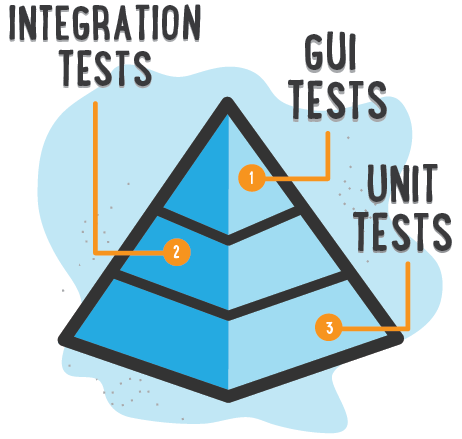

# Automated Testing

Learn about the various kinds of automated tests and write some in JavaScript and PHP.

<!-- slide-include ../../BANNER.md -->

**You will need**

* A Unix CLI
* A code editor (like [Visual Studio Code][vscode])
* [Node.js][node] 10+ and [PHP][php] installed,
  and a basic knowledge of these languages

**Recommended reading**

* [Continuous Software Development](../continuous/)

<!-- START doctoc -->
<!-- END doctoc -->

## What is automated testing?

<!-- slide-front-matter class: center, middle -->

### Manual testing

When writing or modifying software, especially large software,
you must regularly **test** it to make sure it works.
**Manual testing** is basically testing the software yourself,
whether it's a desktop or mobile application, or a website.
You'll browse through the pages or screens, fill and submit forms, trigger actions, etc.

In a large company, this might be handled by specialized [Quality Assurance (QA)][qa] engineers.
Whether you or a QA engineer is doing it, manual testing has certain disadvantages:

* It is **time-consuming**.
  Testing a large software application manually can take hours or even days.
  You might skip some tests to save time, allowing bugs to stay hidden.
* It is **boring** and **repetitive**.
  This makes it more likely that you will make a mistake while testing and miss a bug.

### Automated testing

Running functions, making HTTP calls or clicking on specific buttons does not have to be done by a human being.
A program can do it just as well.

[Test automation][automated-tests] is the use of special **testing software**:

* The test software is **separate from the software being tested**.
* It **executes tests automatically** instead of manually.
* It compares **actual outcomes** (what actually happens)
  versus **expected** outcomes (what you expected to happen when writing the test).

Note that **automated tests are not a replacement for automated tests**.
They are complementary in that they can be used to accelerate or automate tests
that can be run by a machine instead of a human.

### Test frameworks

There are many test frameworks written in various languages.
These are all **test runners**, i.e. they can be used to write and execute tests:

Frameworks                                                                             | Tests written in
:---                                                                                   | :---
[Mocha][mocha], [Jasmine][jasmine], [Jest][jest], [SuperTest][supertest], [Tape][tape] | [JavaScript][js]
[JUnit][junit], [JMeter][jmeter], [Robotium][robotium]                                 | [Java][java]
[PHPUnit][phpunit]                                                                     | [PHP][php]
[RSpec][rspec], [test-unit][ruby-test-unit]                                            | [Ruby][ruby]
[doctest][doctest], [unittest][python-unittest]                                        | [Python][python]
[Apium][appium], [Cucumber][cucumber], [Selenium WebDriver][selenium-webdriver]        | *Various languages*

#### Which test framework should I use?

It depends on what kind of test you want to write.

If you want to test an individual PHP function, for example,
you must use a test framework written in the same language,
such as [PHPUnit][phpunit].

However, if you want to test an API or drive a mobile application or website,
it does not matter in which language the test framework is written,
as long as it can make the required HTTP calls or click on the correct buttons.

For example:

* [SuperTest][supertest] is a JavaScript tool to test APIs.
  It could be used to test an API implemented in PHP with Laravel,
  or with any other language or framework.
* [Selenium WebDriver][selenium-webdriver] is a tool to automate browser tests.
  It can test any web application or site, regardless of the language or framework used to implement
  that application or site.

### Types of automated tests

There are various types of automated tests,
and some of these types overlap.
Not everybody agrees how they should be called:

<!-- slide-column -->

<!-- slide-column -->

<!-- slide-column -->

### Yet another classification

This is how we will separate the 3 main types of tests in this guide:

Type                                     | What is tested                           | Properties
:---                                     | :---                                     | :---
[Unit tests][unit-testing]               | Things in isolation                      | Fastest, easiest to maintain
[Integration tests][integration-testing] | Things together                          |
End-to-end tests                         | Whole system from the user's perspective | Slower, harder to maintain

There are also other specialized types of tests which we will not focus on,
like [performance tests][performance-testing], which can be used
to test the response time or scalability of software or infrastructure.

## References

* https://smartbear.com/learn/automated-testing/
* http://www.continuousagile.com/unblock/test_types.html
* https://learn.techbeacon.com/units/3-types-automated-tests
* https://www.softwaretestinghelp.com/automation-testing-tutorial-2/
* https://www.atlassian.com/continuous-delivery/software-testing/types-of-software-testing
* https://edwardthienhoang.wordpress.com/2014/10/29/i-dont-write-unit-tests-because-the-excuses/

## TODO

* assertions
* test runners

* unit tests
* mocking

* integration tests

* API tests
* e2e/ui/gui tests

* performance tests
* acceptance tests

* bdd
* tdd

* write test in php
* write test in JavaScript

* mocking?
* write integration test in JavaScript
* unit vs integration test

* write e2e test in JavaScript

[acceptance-testing]: https://en.wikipedia.org/wiki/Acceptance_testing
[api-testing]: https://en.wikipedia.org/wiki/API_testing
[appium]: https://appium.io
[automated-tests]: https://en.wikipedia.org/wiki/Test_automation
[cucumber]: https://cucumber.io/
[doctest]: https://pythontesting.net/framework/doctest/doctest-introduction/
[gui-testing]: https://en.wikipedia.org/wiki/Graphical_user_interface_testing
[integration-testing]: https://en.wikipedia.org/wiki/Integration_testing
[jasmine]: https://jasmine.github.io
[java]: https://www.java.com
[jest]: https://jestjs.io
[jmeter]: https://jmeter.apache.org/
[js]: https://en.wikipedia.org/wiki/JavaScript
[junit]: https://junit.org
[mocha]: https://mochajs.org
[node]: https://nodejs.org
[performance-testing]: https://en.wikipedia.org/wiki/Software_performance_testing
[php]: http://php.net
[phpunit]: https://phpunit.de
[python]: https://www.python.org
[python-unittest]: https://docs.python.org/3/library/unittest.html
[qa]: https://en.wikipedia.org/wiki/Quality_assurance
[robotium]: https://github.com/RobotiumTech/robotium
[rspec]: http://rspec.info
[ruby]: https://www.ruby-lang.org
[ruby-test-unit]: https://test-unit.github.io
[selenium-webdriver]: https://www.seleniumhq.org/projects/webdriver/
[supertest]: https://github.com/visionmedia/supertest
[system-testing]: https://en.wikipedia.org/wiki/System_testing
[tape]: https://github.com/substack/tape
[unit-testing]: https://en.wikipedia.org/wiki/Unit_testing
[vscode]: https://code.visualstudio.com
