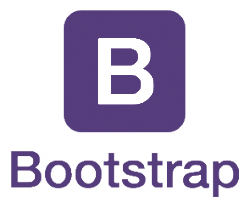
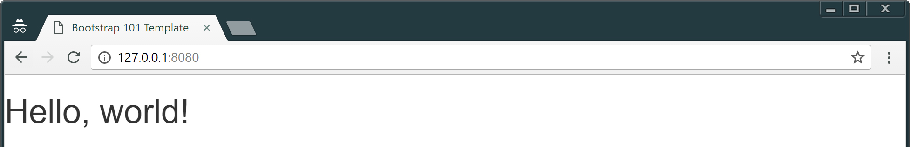

# Bootstrap

<!-- slide-include ../../BANNER.md -->

Introduction to [Bootstrap][bootstrap], a HTML/CSS framework, useful to quickly build HTML templates and views.

Requirements:

* [Google Chrome][chrome] (recommended, any browser with developer tools will do)
* [Sublime Text][sublime] (recommended, any text editor will do... **except Notepad**)

<!-- START doctoc -->
<!-- END doctoc-->

## What is Bootstrap?

<!-- slide-front-matter class: center, middle, image-header -->

<p class='center'></p>

> "Bootstrap is the **most popular** HTML, CSS, and JS framework for developing **responsive**, mobile first projects on the web."

## Why Bootstrap?

Bootstrap is a **framework**.

This means it's a set of **pre-defined** "elements", here HTML components and CSS classes, that developers can use to spare them the time and effort of writing these elements from scratch.

Thus, using Bootstrap (or any other HTML/CSS framework) gives you:

* **Speed of development**:
  * Everything is already there for you
* **Consistency**:
  * All your pages will look the same
* **Responsivness**:
  * Bootstrap behave well on desktop, tablet or smartphone
* **Customizable**:
  * Every components can be modified to suit your needs
* **Support**:
  * Bootstrap is heavily used, tested and documented

## Use Bootstrap

Bootstrap is, basically, **one big CSS file**, and as such, **must be included** in your project for you to use it.

You have two main ways to do that, the first one being using a **CDN**.

CDN, that stands for **C**ontent **D**elivering **N**etwork, allows you **to reference files** useful for your project using **URLs** that points to them.

This way, each time a page with a CDN URL is requested by a user, the file is **retrieved through Internet** and stored in the user's computer memory.

To include Bootstrap with a CDN, add this line at the bottom of your `<head>` tag in your `index.html` file:

```html
<link rel="stylesheet" href="https://maxcdn.bootstrapcdn.com/bootstrap/3.3.7/css/bootstrap.min.css" integrity="sha384-BVYiiSIFeK1dGmJRAkycuHAHRg32OmUcww7on3RYdg4Va+PmSTsz/K68vbdEjh4u" crossorigin="anonymous">
```
> This will include in your site the 3.3.7 version of the minified CSS file

### Download locally

You can also **download the files locally** and reference them in your `index.html` file.

1. Download a `.zip` containing all Bootstrap files [here][dl-bootstrap]
2. Unzip the file somewhere on your filesystem
3. Once unzipped, you should have the following structure:

```sh
bootstrap-3.3.7-dist/
  ├─ css/
  │   └─ [some files]
  ├─ font/
  │   └─ [some files]
  └─ js/
      └─ [some files]
```

Copy the complete `css` directory and place it at the root of your project directory, then add this line at the bottom of your `<head>` tag in your `index.html` file

```html
<head>
  ...
  <link href="css/bootstrap.min.css" rel="stylesheet">
</head>
```
### How do I know it's working?

To be sure that Bootstrap is correctly included in your project, just open your `index.html` in a browser.

With a simple "Hello World" example, your page **without Bootstrap** could look like this:

<p class='center'></p>

The same page, but **with Bootstrap correctly included** should look like this:

<p class='center'></p>

> Notice how the font has changed? That's a **good** sign.

## What does it do?

We already said that Bootstrap is a bunch of CSS styles already written for you.

Thos styles could be devided in three categories:

* **Tag styles**: overwrite the default style for some HTML tags
* **New classes**: new CSS classes (obivously) that can be used in a s

## Resources

* [Coffee][coffee]
* [RTFM][rtfm]

[sublime]: https://en.wikipedia.org/wiki/Coffee
[git]: ../git/
[chrome]: https://www.google.com/chrome/
[rtfm]: https://en.wikipedia.org/wiki/RTFM
[bootstrap]: http://getbootstrap.com/
[dl-bootstrap]: https://github.com/twbs/bootstrap/releases/download/v3.3.7/bootstrap-3.3.7-dist.zip
