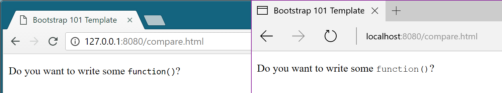
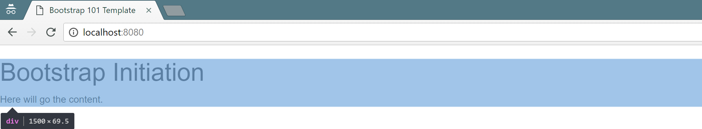
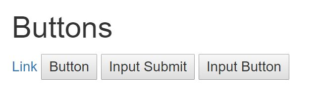
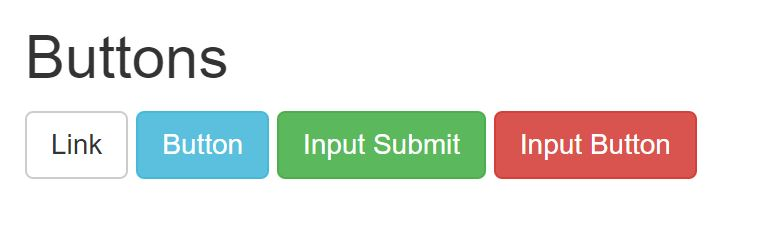
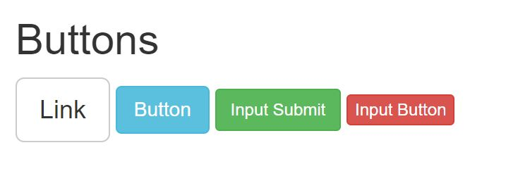
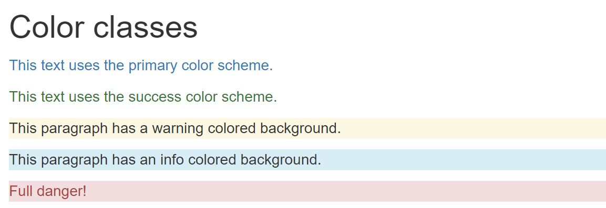

# Bootstrap

<!-- slide-include ../../BANNER.md -->

Introduction to [Bootstrap][bootstrap], a HTML/CSS framework, useful to quickly build HTML templates and views.

Requirements:

* [Google Chrome][chrome] (recommended, any browser with developer tools will do)
* [Sublime Text][sublime] (recommended, any text editor will do... **except Notepad**)

<!-- START doctoc generated TOC please keep comment here to allow auto update -->
<!-- DON'T EDIT THIS SECTION, INSTEAD RE-RUN doctoc TO UPDATE -->


- [What is Bootstrap?](#what-is-bootstrap)
- [Why Bootstrap?](#why-bootstrap)
- [Use Bootstrap](#use-bootstrap)
  - [Download locally](#download-locally)
  - [How do I know it's working?](#how-do-i-know-its-working)
- [What does it do?](#what-does-it-do)
- [Tag styles](#tag-styles)
  - [Examples](#examples)
  - [Why put styles on tag?](#why-put-styles-on-tag)
  - [Normalization](#normalization)
- [New classes](#new-classes)
  - [Container](#container)
  - [Tables](#tables)
  - [Buttons](#buttons)
- [Resources](#resources)

<!-- END doctoc generated TOC please keep comment here to allow auto update -->

## What is Bootstrap?

<!-- slide-front-matter class: center, middle, image-header -->

<p class='center'></p>

> "Bootstrap is the **most popular** HTML, CSS, and JS framework for developing **responsive**, mobile first projects on the web."

## Why Bootstrap?

Bootstrap is a **framework**.

This means it's a set of **pre-defined** "elements", here HTML components and CSS classes, that developers can use to spare them the time and effort of writing these elements from scratch.

Thus, using Bootstrap (or any other HTML/CSS framework) gives you:

* **Speed of development**:
  * Everything is already there for you
* **Consistency**:
  * All your pages will look the same
* **Responsivness**:
  * Bootstrap behave well on desktop, tablet or smartphone
* **Customizable**:
  * Every components can be modified to suit your needs
* **Support**:
  * Bootstrap is heavily used, tested and documented

## Use Bootstrap

Bootstrap is, basically, **one big CSS file**, and as such, **must be included** in your project for you to use it.

You have two main ways to do that, the first one being using a **CDN**.

CDN, that stands for **C**ontent **D**elivering **N**etwork, allows you **to reference files** useful for your project using **URLs** that points to them.

This way, each time a page with a CDN URL is requested by a user, the file is **retrieved through Internet** and stored in the user's computer memory.

To include Bootstrap with a CDN, add this `<link>` tag at the bottom of your `<head>` tag in your `index.html` file:

```html
<head>
  ...
  <link rel="stylesheet" href="https://maxcdn.bootstrapcdn.com/bootstrap/3.3.7/css/bootstrap.min.css" integrity="sha384-BVYiiSIFeK1dGmJRAkycuHAHRg32OmUcww7on3RYdg4Va+PmSTsz/K68vbdEjh4u" crossorigin="anonymous">
</head>
```
> This will include in your site the 3.3.7 version of the minified CSS file

### Download locally

You can also **download the files locally** and reference them in your `index.html` file.

1. Download a `.zip` containing all Bootstrap files [here][dl-bootstrap]
2. Unzip the file somewhere on your filesystem
3. Once unzipped, you should have the following structure:

```sh
bootstrap-3.3.7-dist/
  ├─ css/
  │   └─ [some files]
  ├─ font/
  │   └─ [some files]
  └─ js/
      └─ [some files]
```

Copy the complete `css` directory and place it at the root of your project directory, then add this `<link>` tag at the bottom of your `<head>` tag in your `index.html` file

```html
<head>
  ...
  <link href="css/bootstrap.min.css" rel="stylesheet">
</head>
```
### How do I know it's working?

To be sure that Bootstrap is correctly included in your project, just open your `index.html` in a browser.

With a simple "Hello World" example, your page **without Bootstrap** could look like this:

<p class='center'></p>

The same page, but **with Bootstrap correctly included** should look like this:

<p class='center'></p>

> Notice how the font has changed? That's a **good** sign.

## What does it do?

We already said that Bootstrap is a bunch of CSS styles already written for you.

Those styles could be divided in three categories:

* **Element styles**: overwrite the default style for some HTML elements
* **New classes**: new CSS classes (obivously) that can be used when needed
* **Components**: a set of classes that needs to be used with a **strictly defined** HTML structure.

This slide-deck will present you this three categories, and how to use some interesting styles in each one.

## Bootstrap documentation

Everything that is presented in this slide-deck can also be found in **the very well done Bootstrap documentation**, along with lot of **examples** and **information**.

We highly recommend that you check it out.

[Bootstrap Documentation][bootstrap-css]

<!-- slide-front-matter class: center, middle -->

### The `aria` attribute

When browswing the Bootstrap documentation, you'll inevitably found some examples with that:

```html
<button type="button" class="close" `aria-label`="Close">
  <span `aria-hidden`="true">&times;</span>
</button>
```

All these `aria-` attribute are used only for **accessibility**: they are interpreted by screen-reader or software that help disabled people browsing the Web.

**They don't alter in any ways neither the design of the page nor the behavior of its elements.**

> You can delete them **without any hesitation**, if you don't want to use them.

## Element styles

<!-- slide-front-matter class: center, middle -->

### Which elements?

Bootstrap comes with CSS styles that are applied to **HTML elements**, without **adding classes** to said elements.

Some of the elements that are impacted are:

* `<h1>` to `<h6>`
* `<small>` (an element that display smaller text)
* `<mark>` (an element that highlights its content)
* `<abbr>` (an element to explain an abbreviation)
* `<code>` (an element that define its content as code)

> More information in the [Bootstrap documentation][bootstrap-css]

### Examples

To see for yourself how Bootstrap stylizes those elements, let's **add some of them** in your project.

Open the `index.html` file and **replace** the content between the `body` tags with this:

```html
<h1>This is a h1 Title <small>with small text inside</small></h1>
<h2>This is a h2 Title</h2>
<p>This is a paragraph <small>with small text inside</small></p>
<p><mark>Some highlight text.</mark></p>
<p>Here is an <abbr title="abbreviation">abbr</abbr> tag.</p>
<p>Do you want to write some <code>function()</code>?</p>
```

To **compare** the same elements without Bootstrap, create a new file called `compare.html`, and **copy-paste all the content** of `index.html` inside it.

Now, in the `compare.html` file, **remove** the line with the `<link>` that **includes** Bootstrap, and save it.

Finally, open both `index.html` and `compare.html` in your browser.

> What differences do you see?

### Why put styles on element?

As you can see, HTML elements already **have** default styles, even without CSS.

But these styles are **browser dependant**, i.e. your page could be rendered differently on **Chrome**, **Firefox**, **Edge** and/or **Safari**.

See, for example, the rendering of an `<abbr>` tag on **Chrome** VS **Firefox**...

<p class='center'></p>

...or that of a `<code>` tag on **Chrome** VS **Edge**

<p class='center'></p>

### Normalization

To avoid this rendering problem, developers use a technique called **CSS Normalization**.

Normalizing the CSS means creating styles for **HTML element** to **cancel** default styles that are **not consistent among browsers**.

Bootstrap uses the [Normalize.css][normalize] library, that do just that.

By using a normalizer and adding its own style for basic HTML elements, Bootstrap ensures that your page will be **consistently rendered** on each browser.

## New classes

<!-- slide-front-matter class: center, middle -->

### Start again

Bootstrap also comes with a **ton of new classes** that can be applied to HTML elements.

Some of these classes need to be applied to **specific elements**, while others can be applied to **almost any element**.

To try this, let's start anew with our `index.html` file.

Delete everything that's between your `<body>` tag and add:

```html
<div>
  <h1>Bootstrap Initiation</h1>
  <div>Here will go the content.</div>
</div>
```

### Container

Containers represents the `<div>`s that **structure** your content.

Right now, this content is **fully aligned to the left** of the screen, almost touching the edge. It's ugly and not very readable.

You can change that by adding a `.container-fluid` class to a `<div>`.

```html
<div `class='container-fluid'`>
  <h1>Bootstrap Initiation</h1>
  <div>Here will go the content.</div>
</div>
```
> The content will have a padding of `15px` from both edges, and your container will be as wide as possible.

#### `.container`

If you want your container to be more centered, use the `.container` instead.

```html
<div `class='container'`>
  <h1>Bootstrap Initiation</h1>
  <div>Here will go the content.</div>
</div>
```
> Your container is now more centered on the screen.

<!-- slide-notes -->

The `.container` class is designed so that your `<div>` will always be, at maximum, the width of a **1024x768** screen resolution, but with a padding of `15px`.

#### Illustration

<p class='center'></p>

<p class='center'></p>

<p class='center'></p>

### Tables

<!-- slide-column -->

Manually styling tables in CSS can be quite painful and time consuming.

Bootstrap provides you with the `.table` class, that must be added to a `<table>` tag.

Replace this line...

```html
<div>Here will go the content.</div>
```
...by the following snippet:

<!-- slide-column -->

```html
<table `class="table"`>
  <thead>
    <th>#</th>
    <th>First name</th>
    <th>Last name</th>
    <th>Starship</th>
  </thead>
  <tbody>
    <tr>
      <td>1</td>
      <td>Jean-Luc</td>
      <td>Picard</td>
      <td>Enterprise D</td>
    </tr>
    <tr>
      <td>2</td>
      <td>Benjamin</td>
      <td>Sisko</td>
      <td>Defiant</td>
    </tr>
    <tr>
      <td>3</td>
      <td>Kathryn</td>
      <td>Janeway</td>
      <td>Voyager</td>
    </tr>
  </tbody>
</table>
```
#### More table classes

> These classes **must be** used in addition of the `.table` class.

To add **stripes**, add the `.table-striped` class to your `<table>`:

```html
<table `class`="table `table-striped`">
```
To add **border**, add the `.table-bordered` class to your `<table>`:

```html
<table `class`="table `table-bordered`">
```
To add a **hover effect** to table rows, add the `.table-hover` class:

```html
<table `class`="table `table-hover`">
```
> You can use more than one additional class to your `<table>`.

For example, if you'd want to have a table that has **all the preceding styles** at the same time, you could use:

```html
<table `class="table table-bordered table-striped table-hover"`>
```

### Buttons

Bootstrap adds many new classes regarding buttons, that allows you to create a wide variety of possible usage.

Let's add some buttons to the `index.html` page. Add the following snippet after the `</table>` tag:

```html
<h2>Buttons</h2>
<div>
  <a href="#">Link</a>
  <button>Button</button>
  <input type="submit" value="Input Submit">
  <input type="button" value="Input Button">
</div>
```
> Right now, this should give you this:

<p class="shadow"></p>

> It's doesn't look like much. Let's remedy that.

#### The `.btn` class

To properly use any of the button styles, you **must** add the special class `.btn` to the element you want to sylize.

> You can add a button style to any `<a>`, `<button>` or `<input>` elements.

```html
<a href="#" `class='btn'`>Link</a>
<button `class='btn'`>Button</button>
<input type="submit" value="Input Submit" `class='btn'`>
<input type="button" value="Input Button" `class='btn'`>
```
The result should be:

<p class="shadow"></p>

As you can see, the `.btn` class doesn't add very much.

In fact, the `.btn` class is used to add to the element all the styles that are **common** among the button styles.

> Each of the additionnal button class will add the styles that are specific to the style.

#### Additionnal classes

Bootstrap defines **seven button styles**, each with its own class to add to an element **that already have** the `.btn` class:

| Style   | CSS class      | Result |
| :------ | :------------- | :----- |
| Default | `.btn-default` | <button class="btn btn-default">Click me!</button> |
| Primary | `.btn-primary` | <button class="btn btn-primary">Click me!</button> |
| Success | `.btn-success` | <button class="btn btn-success">Click me!</button> |
| Info    | `.btn-info`    | <button class="btn btn-info">Click me!</button> |
| Warning | `.btn-warning` | <button class="btn btn-warning">Click me!</button> |
| Danger  | `.btn-danger`  | <button class="btn btn-danger">Click me!</button> |
| Link    | `.btn-link`    | <button class="btn btn-link">Click me!</button> |

#### Try it!

Add a:

* `.btn-default` class to the `<a>` element
* `.btn-info` class to the `<button>` element
* `.btn-success` class to the `<input type="submit">` element
* `.btn-danger` class to the `<input type="button">` element

----

The result should look like this:

<p class="shadow"></p>

#### Size control

You can also change the overall size of your button, using three additionnal classes.

Add the `.btn-lg` class to the `<a>` element to see it **larger**:
```html
<a href="#" `class`="btn btn-default `btn-lg`">Link</a>
```

Add the `.btn-sm` class to the `<input type="submit">` element to see it **a bit smaller**:
```html
<input type="submit" value='Input Submit' `class`="btn btn-success `btn-sm`">
```

Add the `.btn-xs` class to the `<input type="button">` element to see it **extra smaller**:
```html
<input type="button" value='Input Button' `class`="btn btn-danger `btn-xs`">
```

<p class="shadow"></p>

### Icons

Bootstrap uses the Glyphicons font, that provides you with over 250 icons to use in your design.

The list of available icons can be found here: [Bootstrap Glyphicons][bootstrap-glyphicons]

To use these icons, just add an empty `<span>` element with the class for the icon you want.

For example, to add three buttons for alignement control, write:

```html
<h2>Icons</h2>
<div>
  <button class="btn btn-default">
*   <span class="glyphicon glyphicon-align-left"></span>
  </button>
  <button class="btn btn-default">
*   <span class="glyphicon glyphicon-align-center"></span>
  </button>
  <button class="btn btn-default">
*   <span class="glyphicon glyphicon-align-right"></span>
  </button>
</div>
```

> Never put anything between the `<span>` tags, and always use the `.glyphicon` classes on `<span>` elements only.

### Forms

Creating forms in HTML is a big part of constructing website or webapplication, and this is yet another subject that Bootstrap can handle for you.

Add these lines at the end of your `index.html` page, right before the closing `</div>` tag:

```html
<h2>Forms</h2>
<form>
  <input type="submit" class="btn btn-success">
</form>
```
> We'll build more in this `<form>` element in the following slides.

#### `.form-control`

Add the `.form-control` class to an `<input>` element to make it **full-width and stlyized**.

> This class can be added to any type of input.

Let's add an text input that's to receive the **username** of an hypothetic sign up form.

Add these lines at the beginning of the `<form>` element:

```html
<label for="username">Username</label>
<input type="text" id="username" `class="form-control"`>
```
> The input is correctly displayed, but there's a spacing problem with the following button.

#### `.form-group`

To resolve any spacing problem that could be present in your form, be sure to wrap your form element in a `<div>` with the `.form-group` class.

> Do this with the preceding **username** input.

Let's complete our form by adding a password input that's to receive the **password** of our new user.

Add these lines before the `<input type="submit">`:

```html
*<div class="form-group">
  <label for="password">Password</label>
  <input type="password" id="password" class="form-control">
*</div>
```

#### `.form-inline`

By default, all elements with a `.form-control` class will be as wide as possible, and will be presented in a stack, that is on element in top of another.

If you'd rather prefer to have you form displayed inline, juste add the `.form-inline` class to your top `<form>` element.

```html
<form `class="form-inline"`>
  <div class="form-group">
    <label for="username">Username</label>
    <input type="text" id="username" class="form-control">
  </div>
  <div class="form-group">
    <label for="password">Password</label>
    <input type="password" id="password" class="form-control">
  </div>
  <input type="submit" class="btn btn-success">
</form>
```
> The `<label>` are optional. You could delete them and use the `placeholder` attribute  on `<input>` instead.
```html
<div class="form-group">
  <input type="password" id="..." class="..." `placeholder="Password"`>
</div>
```

### Color classes

Remember the button styles (*Primary*, *Success*, *Info*, *Warning* and *Danger*)?

You can use these same color style to almost any element in your page, wether it be on the text or on the background.

> Using this classes with other pre-defined Bootstrap classes could cancel their effects.

```html
<h2>Color classes</h2>
<p `class="text-primary"`>This text uses the primary color scheme.</p>
<p `class="text-success"`>This text uses the success color scheme.</p>
<p `class="bg-warning"`>This paragraph has a warning colored background.</p>
<p `class="bg-info"`>This paragraph has an info colored background.</p>
<p `class="bg-danger text-danger"`>Full danger!</p>
```

<p class='shadow'></p>

## Components

<!-- slide-front-matter class: center, middle -->

### What are those?


## Resources

* [Bootstrap CSS Documentation][bootstrap-css]
* [Normalize CSS][normalize]

[sublime]: https://en.wikipedia.org/wiki/Coffee
[bootstrap-css]: http://getbootstrap.com/css/
[chrome]: https://www.google.com/chrome/
[rtfm]: https://en.wikipedia.org/wiki/RTFM
[bootstrap]: http://getbootstrap.com/
[dl-bootstrap]: https://github.com/twbs/bootstrap/releases/download/v3.3.7/bootstrap-3.3.7-dist.zip
[normalize]: https://necolas.github.io/normalize.css/
[bootstrap-glyphicons]: http://getbootstrap.com/components/#glyphicons-glyphs
