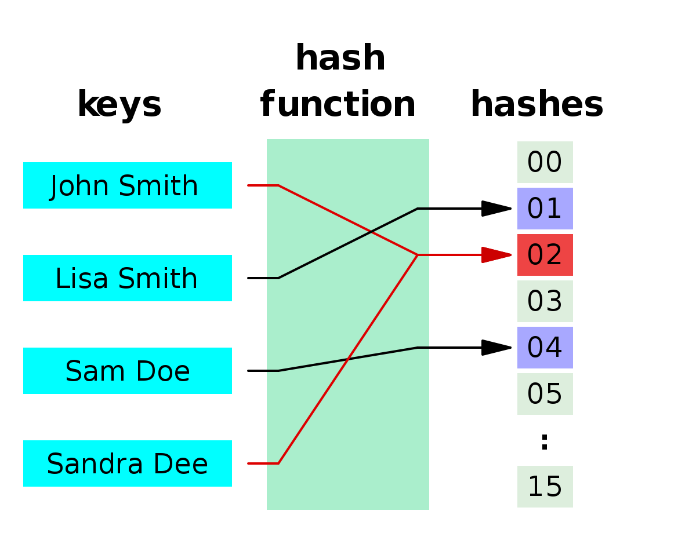
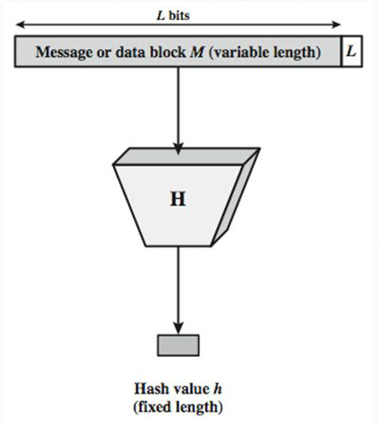
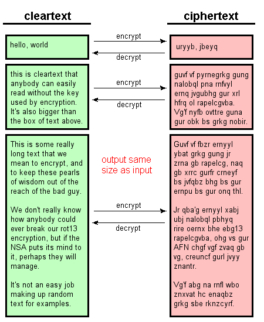
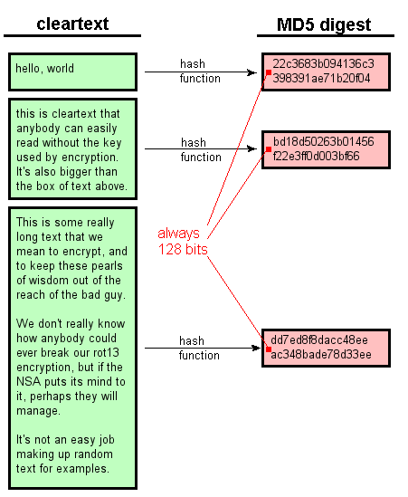
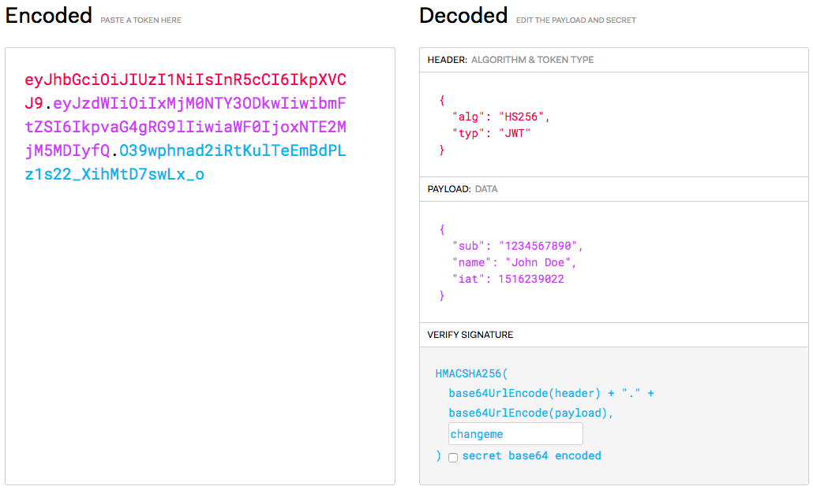

# Express Authentication

Learn how to set up authentication with [JSON Web Tokens][jwt] an [Express][express] application.

<!-- slide-include ../../BANNER.md -->

**You will need**

* A running [Express][express] application with [Mongoose][mongoose] plugged in

**Recommended reading**

* [Express](../express/)
* [Mongoose](../mongoose/)

<!-- START doctoc -->
<!-- END doctoc -->


## Security concepts

Process        | Description
:---           | :---
Identification | Occurs when a user claims to have a specific identity, for example by supplying a **username**.
Authentication | The process of **proving an identity** by supplying appropriate credentials, such as a **password**, an **authentication token**, or by using a **public key** with asymmetric cryptography.
Authorization  | The process of **verifying that you have access to something**, such as a specific resource. For example, a user may have the right to edit their own posts in a social application, but not the posts of another user.

In this presentation, we'll focus on setting up **authentication**
with [bcrypt][bcrypt] and [JSON Web Tokens][jwt].


## Storing passwords securely

It's a bad idea to store your users' passwords in clear.
If your database is compromised, not only will your application be compromised,
but others may be as well if users have used the same passwords elsewhere.

A better way is to use a [cryptographic hash function][hash].

### What is a hash function?

<!-- slide-column -->

A [hash function][hash-function] maps **data of arbitrary size** to **data of a fixed size**.
The value returned by a hash function is called a hash value, a **digest**, or simply a hash.



<!-- slide-column -->



### Encryption vs. hashing

<!-- slide-column -->

<p class='center'><strong>Encryption</strong></p>



<!-- slide-column -->

<p class='center'><strong>Hashing</strong></p>



### Cryptographic hash functions

<!-- slide-column -->

A [cryptographic hash function][hash] is a [hash function][hash-non-crypto] that has the following properties:

* The same message always results in the same hash (**deterministic**).
* **Computing** the hash value of any message **is quick**.

<!-- slide-column 60 -->


<!-- slide-container -->

* It is infeasible to generate a message from its hash value except by trying all possible messages (**one-way**).
* A small change to a message should change the hash value so extensively that the new hash value appears uncorrelated with the old hash value.
* It is infeasible to find two different messages with the same hash value (collisions).


## bcrypt

<!-- slide-front-matter class: center, middle -->

An adaptive password hashing function.

### Using bcrypt to hash a password

The npm `bcrypt` package provides an implementation of bcrypt.
Simply use its `hash` function to generate a bcrypt hash from a password.

```js
const bcrypt = require('bcrypt');

const plainPassword = 'changeme';
const saltRounds = 10;

bcrypt.hash(plainPassword, saltRounds, function(err, hashedPassword) {
  // Store the hashed password in your database.
});
```

> Creating a password hash is a costly operation, especially if the cost factor of the bcrypt algorithm is high (more than 10).
> Do not use the synchronous methods provided by the `bcrypt` package (e.g. `hashSync`),
> as they will block execution of your application until they are done.

#### Using bcrypt with Express and Mongoose

Here's an example of how to use bcrypt in an Express application using Mongoose for database access.

```js
const bcrypt = require('bcrypt');
const User = require('../models/user');

router.post('/', function(req, res, next) {

  const plainPassword = req.body.password;
  const saltRounds = 10;

* bcrypt.hash(plainPassword, saltRounds, function(err, hashedPassword) {
    if (err) {
      return next(err);
    }

    const newUser = new User(req.body);
    `newUser.password = hashedPassword;`
    newUser.save(function(err, savedUser) {
      if (err) {
        return next(err);
      }

      res.send(savedUser);
    });
* });
});
```

#### Hiding the password hash from API responses

You don't want your API users to view the password hash.
Here's one way to hide it with Mongoose:

```js
const userSchema = new Schema({
  // ...
  password: {
    type: String,
    required: true
  }
});

*userSchema.set('toJSON', {
*  transform: transformJsonUser
*});

function transformJsonUser(doc, json, options) {
* // Remove the hashed password from the generated JSON.
* delete json.password;
  return json;
}
```

### Using bcrypt to verify a password

The `compare` function takes the following arguments:

* The **plain password** to check.
* The **hashed password** from your database.

The asynchronous callback will be called with **a boolean indicating whether the password matches**.

```js
`bcrypt.compare(plainPassword, hashedPassword`, function(err, `valid`) {
  // Handle error and password validity...
});
```

#### Verifying a password with Express and Mongoose

Here's a password verification example for a hypothetical login route in an Express application using Mongoose:

```js
const bcrypt = require('bcrypt');
const User = require('../models/user');

router.post('/login', function(req, res, next) {
  `User.findOne`({ name: req.body.name }).exec(function(err, user) {
    if (err) {
      return next(err);
    } else if (!user) {
      return res.sendStatus(401);
    }

    `bcrypt.compare(req.body.password, user.password`, function(err, valid) {
      if (err) {
        return next(err);
      } else if (!valid) {
        return res.sendStatus(401);
      }

      // Login is valid...
      res.send(\`Welcome ${user.name}!`);
    });
  })
});
```


## Authentication tokens

<!-- slide-front-matter class: center, middle -->

### What is an authentication token?

An authentication token allows a user to authenticate to a server without sending his or her credentials at every request.

It is an alternative to cookies, with the following advantages:

* Tokens are **stateless**. A token contains all the information it needs for authentication,
  freeing your server from managing sessions.
* Tokens can be **generated from anywhere**,
  allowing you the option to handle the signing and verification of tokens on different servers.
* **Fine-grained access control**.
  The token payload can contain specific user roles and permissions.

### JSON Web Token (JWT)

A JSON Web Token is a special format for authentication tokens:

<p class='center'></p>

#### What's in a JWT?

A JWT contains:

* A header indicating the **hashing algorithm** and other JWT configuration properties.
* A **payload** containing the **authentication claims**, i.e. who is the authenticated user.
* A **signature** which is a [HMAC][hmac] of the previous 2 parts of the token, based on a **secret** known only by the server.

Since the signature is tied to the contents of the token, and HMAC uses cryptographic hash functions which are not reversible:

* An attacker cannot create a valid JWT token unless he knows the secret.
* Nor can he modify an existing token while keeping the signature valid.

#### JWT claims

The properties of the payload should be [**registered claims**][jwt-claims].
These are some of the most common claims (all are optional):

Claim | Description
:---  | :---
`iss` | Issuer
`sub` | Subject (e.g. the ID of the authenticated user)
`aud` | Audience
`exp` | Expiration time (UNIX timestamp)
`nbf` | Not before
`iat` | Issued at

For example, a very simple token might only contain `sub` to indicate the authenticated user, and `exp` for an expiration date.

> New claims should either be registered, or use a collision-resistant name such as a URL, e.g. `https://my-api.com/jwt/claims/custom`.

#### JWT best practices

* **Keep it secret. Keep it safe.**
  The signing key should be treated like any other credentials and revealed only to services that absolutely need it.
  It should not be put under version control.
* **Do not add sensitive data to the payload.**
  Tokens are signed to protect against manipulation and are easily decoded.
  Add the bare minimum number of claims to the payload for best performance and security.
* **Give tokens an expiration.**
  Technically, once a token is signed, it is valid forever, unless the signing key is changed or expiration explicitly set.
  This could pose potential issues so have a strategy for expiring and/or revoking tokens.
* **Embrace HTTPS.**
  Do not send tokens over non-HTTPS connections as those requests can be intercepted and tokens compromised.

### The `jsonwebtoken` package

Generating a JWT is trivial with the `jsonwebtoken` npm package:

```js
const jwt = require('jsonwebtoken');

// Retrieve the secret key from your configuration.
const secretKey = process.env.SECRET_KEY || 'changeme';

// Create and sign a token.
*jwt.sign({ sub: 'userId42' }, secretKey, function(err, token) {
* // Use the signed token...
*});
```

Verifying it is just as easy:

```js
const jwt = require('jsonwebtoken');

// Retrieve the secret key from your configuration.
const secretKey = process.env.SECRET_KEY || 'changeme';

// Create and sign a token.
*jwt.verify(token, secretKey, function(err, payload) {
* // Use the signed token...
*});
```


## References

* [Token-based authentication made easy](https://auth0.com/learn/token-based-authentication-made-easy/)
* [JWT introduction](https://jwt.io/introduction/)
* [We’re under attack! 23+ Node.js security best practices](https://medium.com/@nodepractices/were-under-attack-23-node-js-security-best-practices-e33c146cb87d)


[bcrypt]: https://en.wikipedia.org/wiki/Bcrypt
[express]: https://expressjs.com
[hash]: https://en.wikipedia.org/wiki/Cryptographic_hash_function
[hash-function]: https://en.wikipedia.org/wiki/Hash_function
[hash-non-crypto]: https://en.wikipedia.org/wiki/Hash_function
[hmac]: https://en.wikipedia.org/wiki/HMAC
[jwt]: https://jwt.io
[jwt-claims]: https://www.iana.org/assignments/jwt/jwt.xhtml
[mongoose]: https://mongoosejs.com
[salt]: https://en.wikipedia.org/wiki/Salt_(cryptography)
