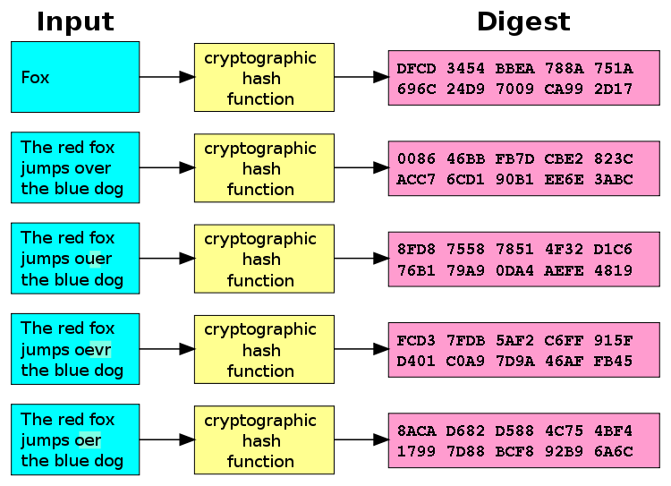

# Express Authentication

Learn how to set up authentication with [JSON Web Tokens][jwt] an [Express][express] application.

<!-- slide-include ../../BANNER.md -->

**You will need**

* A running [Express][express] application with [Mongoose][mongoose] plugged in

**Recommended reading**

* [Express](../express/)
* [Mongoose](../mongoose/)

<!-- START doctoc -->
<!-- END doctoc -->

## Security concepts

Process        | Description
:---           | :---
Identification | Occurs when a user claims to have a specific identity, for example by supplying a **username**.
Authentication | The process of **proving an identity** by supplying appropriate credentials, such as a **password**, an **authentication token**, or by using a **public key** with asymmetric cryptography.
Authorization  | The process of **verifying that you have access to something**, such as a specific resource. For example, a user may have the right to edit their own posts in a social application, but not the posts of another user.

In this presentation, we'll focus on setting up **authentication**
with [bcrypt][bcrypt] and [JSON Web Tokens][jwt].

## Storing passwords securely

It's a bad idea to store your users' passwords in clear.
If your database is compromised, not only will your application be compromised,
but others may be as well if users have used the same passwords elsewhere.

A better way is to use a [cryptographic hash function][hash].

### What is a hash function?

<!-- slide-column -->

A [hash function][hash-function] maps **data of arbitrary size** to **data of a fixed size**.
The value returned by a hash function is called a hash value, a **digest**, or simply a hash.

<!-- slide-column -->

### Encryption vs. hashing

<!-- slide-column -->

<strong>Encryption</strong>

<!-- slide-column -->

<strong>Hashing</strong>

### Cryptographic hash functions

<!-- slide-column -->

A [cryptographic hash function][hash] is a [hash function][hash-non-crypto] that has the following properties:

* The same message always results in the same hash (**deterministic**).
* **Computing** the hash value of any message **is quick**.

<!-- slide-column 60 -->

<!-- slide-container -->

* It is infeasible to generate a message from its hash value except by trying all possible messages (**one-way**).
* A small change to a message should change the hash value so extensively that the new hash value appears uncorrelated with the old hash value.
* It is infeasible to find two different messages with the same hash value (collisions).

## References

* [We’re under attack! 23+ Node.js security best practices](https://medium.com/@nodepractices/were-under-attack-23-node-js-security-best-practices-e33c146cb87d)

[bcrypt]: https://en.wikipedia.org/wiki/Bcrypt
[express]: https://expressjs.com
[hash]: https://en.wikipedia.org/wiki/Cryptographic_hash_function
[hash-function]: https://en.wikipedia.org/wiki/Hash_function
[hash-non-crypto]: https://en.wikipedia.org/wiki/Hash_function
[jwt]: https://jwt.io
[mongoose]: https://mongoosejs.com
[salt]: https://en.wikipedia.org/wiki/Salt_(cryptography)
