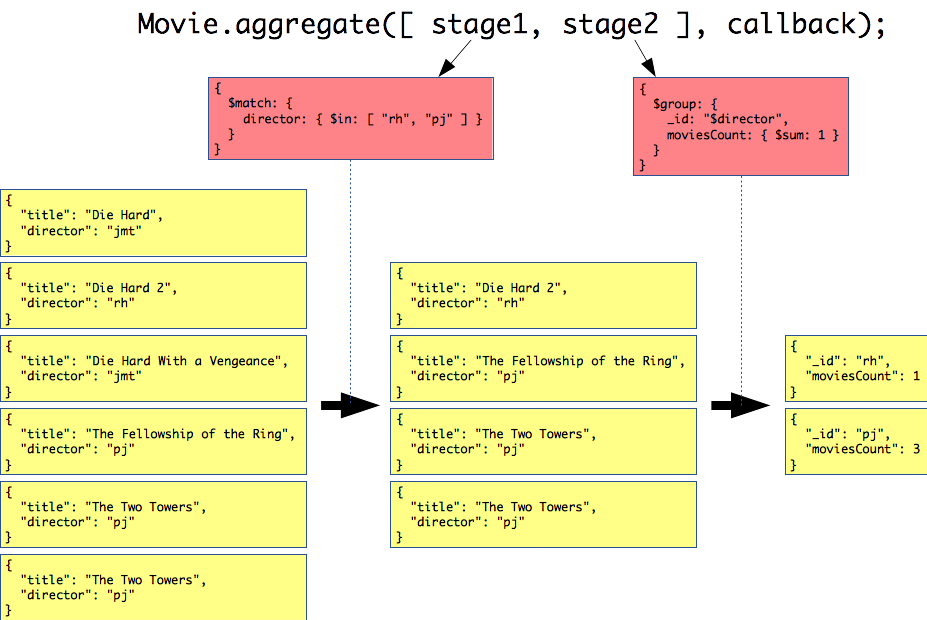

# Using Mongoose with Express

Learn how to implement advanced RESTful API operations in [Express][express] with [Mongoose][mongoose] (a [MongoDB][mongodb] Object-Document Mapper).

<!-- slide-include ../../BANNER.md -->

**You will need**

* A running [MongoDB][mongodb] database
* A running [Express][express] application with [Mongoose][mongoose] plugged in

**Recommended reading**

* [RESTful APIs](../rest/)
* [Express](../express/)
* [Mongoose](../mongoose/)


## Demonstration RESTful API

The examples in this tutorial are taken from a RESTful API developed to demonstrate how to implement REST concepts.

You will find the [source code][demo] of this API and its [documentation][demo-doc] on GitHub.
The API is also deployed on [Heroku][heroku] (follow the instructions in the documentation to try it).

You should read about the [resources][demo-res] that you can manipulate with this API before moving on.


## Filtering

<!-- slide-front-matter class: center, middle -->

<p class='center'></p>

How do I get only the right stuff?


### Limiting collections

Often when clients make requests on a RESTful API's **collection** resource,
they don't need the whole thing; they need **only the items they are interested in** for the current view.

For example, you might want to display:

* The list of movies directed by someone
* The list of movies with a rating greater than or equal to 8
* The list of movies directed by either of your two favorite directors


### Simple filters

Express gives you access to **URL query parameters** in `req.query`,
and Mongoose offers a chainable **query builder**; they're very easy to plug together:

```js
// GET /api/movies
router.get('/', function(req, res, next) {
  let `query` = Movie.find();

  // Filter movies by director
  if (ObjectId.isValid(req.query.director)) {
    `query = query.where('director').equals(req.query.director)`;
  }
  // Limit movies to only those with a good enough rating
  if (!isNaN(req.query.ratedAtLeast)) {
    `query = query.where('rating').gte(req.query.ratedAtLeast)`;
  }

  // Execute the query
  `query.exec`(function(err, movies) {
    if (err) {
      return next(err);
    }
    res.send(movies);
  });
});
```


### Dynamic filters

What about our director filter?
Can we make it work for **multiple directors** as well?
Yes we can:

```js
// GET /api/movies
router.get('/', function(req, res, next) {
  let `query` = Movie.find();

  // Filter movies by director
  if (`Array.isArray(req.query.director)`) {
    // Find all movies directed by any of the specified directors
    const directors = req.query.director.filter(ObjectId.isValid);
    `query = query.where('director').in(directors)`;
  } else if (ObjectId.isValid(req.query.director)) {
    // Find all movies directed by a specific person
    `query = query.where('director').equals(req.query.director)`;
  }

  // ...
});
```


## Pagination

<!-- slide-front-matter class: center, middle -->

<p class='center'></p>

How do I get a reasonable amount of stuff?


### Paginating collections

Some collections are just **too large to send** to the client in their entirety.
The following examples will demonstrate two ways implement **pagination**
to retrieve only one "page" of a collection at a time.

To implement pagination:

* The client must tell the server **which elements** of the collection it wants
* The server must give the client enough information to be able to **access the other elements**


### Sending a page of the collection

In principle, pagination is a **specialized filter**, so we'll use **URL query parameters** to let the client tell the server which elements of the collection it wants.
Implementing a `page` and `pageSize` parameters with Express and Mongoose is quite straightforward:

```js
router.get('/', function(req, res, next) {
  let query = Movie.find();

  // Parse the "page" param (default to 1 if invalid)
  let page = parseInt(`req.query.page`, 10);
  if (isNaN(page) || page < 1) {
    page = 1;
  }

  // Parse the "pageSize" param (default to 100 if invalid)
  let pageSize = parseInt(`req.query.pageSize`, 10);
  if (isNaN(pageSize) || pageSize < 0 || pageSize > 100) {
    pageSize = 100;
  }

  // Apply skip and limit to select the correct page of elements
  query = query`.skip((page - 1) * pageSize).limit(pageSize)`;

  // ...
});
```


### What about the rest?

The client can now get only a specific page, but it still doesn't know **how many other elements** there are.
Retrieving the entire collection to count the total of elements would be defeat the purpose of pagination,
so the server needs to **tell the client**.

There are many ways of doing that.
Here are a few:

* Using the `Link` header
* Using custom headers
* Using a JSON *envelope* or *wrapper*

#### Retrieving the total number of elements

In all these cases, you will need to know **how many elements there are in total**,
either to give that information to the client or determine what links to build:

```js
router.get('/', function(req, res, next) {
  `Movie.find().count(function(err, total) {`
    if (err) {
      return next(err);
    }

    let query = Movie.find();

    // Apply pagination here (code from previous example)...

    // Send response (including total/links) here...
  `})`;
});
```


### The `Link` header (solution 1)

There have been many ways developers have implemented pagination over the years.
It's only recently that a [standard header][link-header-rfc] has been defined and started becoming popular.

The `Link` header allows the server to **tell the client where to find other pages** of the collection,
**without the client having to build new URLs**.

It essentially allows the server to tell the client where to find:

* The first page
* The previous page
* The next page
* The last page
* *(Other variants if necessary)*

#### What's in the header?

Consider the following request where the client requests the second page of 50 elements in a collection:

```http
GET /api/movies?`page=2`&`pageSize=50` HTTP/1.1
```

In the response, in addition to the 50 movies on that page, the server can send a `Link` header with references to **the URLs of other pages** in the collection:

```http
HTTP/1.1 200 OK
Content-Type: application/json; charset=utf-8
Link: <https://example.com/api/movies?`page=1`&pageSize=50>; rel="`first prev`",
      <https://example.com/api/movies?`page=3`&pageSize=50>; rel="`next`",
      <https://example.com/api/movies?`page=5`&pageSize=50>; rel="`last`"

[
  ...
]
```

*(**Note**: the `Link` header is shown on 3 lines here for readability, but it would be on 1 line in the actual HTTP response.)*

#### What's the link format?

Multiple links in the `Link` header are comma-separated.
Each link looks like this:

```txt
<https://example.com/api/movies?page=1&pageSize=50>; rel="first prev"
```

It contains:

* The **target URL** between `<>`
* One or more **parameters** preceded by `;`:
  * The `rel` (or "relation") parameter is mandatory, as it indicates **what kind of link it is**

There is a [registry of official relation types][link-header-rels] (such as `first`, `prev`, `next` and `last`).

<!-- slide-notes -->

You can use your own custom relations but instead of single words, they should be URIs:

```txt
<.../movies?page=3&pageSize=50>; rel="https://example.com/my-rels/plus2"
```

#### How to send these links

Other developers have already gone through the trouble of **formatting these headers** correctly for you.
Use the [format-link-header][format-link-header] npm package:

```js
const formatLinkHeader = require('format-link-headers');
`const links = {};`

function buildLinkUrl(url, page, pageSize) {
  return url + '?page=' + page + '&pageSize=' + pageSize;
}

// Add "first" and "prev" links unless it's the first page
if (page > 1) {
  `links.first` = { rel: 'first', url: buildLinkUrl(1, pageSize) };
  `links.prev` = { rel: 'prev', url: buildLinkUrl(page - 1, pageSize) };
}

// Add "next" and "last" links unless it's the last page
if (page < maxPage) {
  `links.next` = { rel: 'next', url: buildLinkUrl(page + 1, pageSize) };
  `links.last` = { rel: 'last', url: buildLinkUrl(maxPage, pageSize) };
}

if (Object.keys(links).length >= 1) {
  `res.set('Link', formatLinkHeader(links));`
}
```


### Custom headers (solution 2)

The `Link` header has the advantage of being a standard,
but it's hard to build a **pager** from it:

<p class='center'></p>

The server would need to send pre-built **links for each page**, which is not very flexible and consumes bandwidth.

HTTP does not forbid you from using non-standard headers,
so you could decide to use these **custom headers** (for example) to send the client the additional information it needs:

* A `Pagination-Page` header to tell the client which page it has requested
* A `Pagination-PageSize` header to tell the client what is the current page size
* A `Pagination-Total` header to tell the client how many elements there are in the collection

#### Custom headers in the response

Consider the following request where the client requests the second page of 50 elements in a collection:

```http
GET /api/movies?`page=2`&`pageSize=50` HTTP/1.1
```

In the response, in addition to the 50 movies on that page, the server can send the custom pagination headers:

```http
HTTP/1.1 200 OK
Content-Type: application/json; charset=utf-8
*Pagination-Page: 2
*Pagination-PageSize: 50
*Pagination-Total: 231

[
  ...
]
```

#### Implementing custom pagination headers

To implement this solution, you simply have to set the headers before sending the response:

```js
router.get('/', function(req, res, next) {
  Movie.find().count(function(err, `total`) {
    if (err) { return next(err); };
    let query = Movie.find();

    // Parse the "page" param (default to 1 if invalid)
    let `page` = parseInt(req.query.page, 10);
    if (isNaN(page) || page < 1) { /* ... */ }

    // Parse the "pageSize" param (default to 100 if invalid)
    let `pageSize` = parseInt(req.query.pageSize, 10);
    if (isNaN(pageSize) || pageSize < 0 || pageSize > 100) { /* ... */ }

    // Apply skip and limit to select the correct page of elements
    query = query.skip((page - 1) * pageSize).limit(pageSize);

    `res.set('Pagination-Page', page);`
    `res.set('Pagination-PageSize', pageSize);`
    `res.set('Pagination-Total', total);`

    // ...
  });
});
```


### JSON envelope (solution 3)

In some rare circumstances, there is a proxy between client and server that **strips non-standard headers** from all requests.
In this case, you would have to send the pagination information in the **response body** instead of headers.

Instead of using a **JSON array** as the response body,
you would use a **JSON object** that contains additional metadata as well as the array of elements:

```http
HTTP/1.1 200 OK
Content-Type: application/json; charset=utf-8

{
  `"page": 2`,
  `"pageSize": 50`,
  `"total": 231`,
  `"data": [`
    ...
  `]`
}
```

#### Links in the JSON envelope

You can also use **link relations** in a JSON envelope (like with the `Link` header) if you prefer that solution:

```http
HTTP/1.1 200 OK
Content-Type: application/json; charset=utf-8

{
  `"data": [`
    ...
  `]`,
* "links": [
*   "first": "https://example.com/api/movies?page=1&pageSize=50",
*   "prev": "https://example.com/api/movies?page=1&pageSize=50",
*   "next": "https://example.com/api/movies?page=3&pageSize=50",
*   "last": "https://example.com/api/movies?page=5&pageSize=50"
* ]
}
```

#### Implementing a JSON envelope

Instead of setting headers, you simply have to build and pass your envelope to `res.send()`:

```js
router.get('/', function(req, res, next) {
  Movie.find().count(function(err, `total`) {
    if (err) { return next(err); };
    let query = Movie.find();

    // Parse query parameters and apply pagination here...

    query.exec(function(err, movies) {
      if (err) { return next(err); }

      // Send JSON envelope with data
*     res.send({
*       page: page,
*       pageSize: pageSize,
*       total: total,
*       data: movies
*     });
    });
  });
});
```


## Aggregation

<!-- slide-front-matter class: center, middle -->

<p class='center'></p>


### Aggregation example

Let's say that when we retrieve **People** from the API, we also want to know **how many movies they have directed**.

In SQL, assuming People and Movies are in **different tables**, you would use a **JOIN** and a **GROUP BY** to get that information:

```sql
SELECT people.*, SUM(movies.id) AS directed_movies_count
  FROM `people INNER JOIN movies` ON (people.id = movies.director_id)
  `GROUP BY` people.id;
```

#### No join in MongoDB

However, there is **no JOIN** in MongoDB.

If your related documents (People and Movies) are stored in two **separate collections** (as is the case in the demonstration RESTful API),
there is **no way to retrieve that information in ONE query**.

<p class='center'></p>

But what you can do is:

* Find the People you need (using `Person.find()`)
* Count how many movies they have directed in one query using [MongoDB aggregations][mongodb-aggregation]


### Aggregation pipeline

The preferred MongoDB aggregation method is the [aggregation pipeline][mongodb-aggregation-pipeline]:
documents go through a multi-stage pipeline where **each stage transforms the collection of documents** into **aggregated results**.

Mongoose models have an `aggregate()` function you can call with an **array of stages** to apply:

```js
Movie.`aggregate`([ stage1, stage2, stage3 ]);
```

Each **stage** is an object with an [aggregation pipeline operator][mongodb-aggregation-pipeline-operators]:

```js
{
  `$match`: {
    director: { $in: [ 'abc', 'def', 'ghi' ] }
  }
}
```

### Aggregation pipeline example

Let's say you have retrieved a list of Person documents from the database,
and you want to know how many Movies they have directed:

```js
const people = [ /* List of Person documents from the database */ ];

// Get the documents' IDs
const personIds = people.map(person => person._id);

Movie.`aggregate`([
  {
    `$match`: { // Select movies directed by the people we are interested in
      director: { $in: personIds }
    }
  },
  {
    `$group`: { // Group the documents by director ID
      _id: '$director',
      moviesCount: { // Count the number of movies for that ID
        $sum: 1
      }
    }
  }
], function(err, results) {
  // Use the results...
});
```

#### How does it work?

<p class='center'></p>

#### Adding the aggregation results to the response

That's all well and good, but you still have two separate sets of data:

* The People you have retrieved with the **first query**
* The aggregated number of Movies you have retrieved with the **aggregation query**

If you just do `res.send(people)`, you will get this:

```json
[
  { "name": "Renny Harlin" },
  { "name": "Peter Jackson" }
]
```

What you want is this:

```json
[
  { "name": "Renny Harlin", "moviesCount": 1 },
  { "name": "Peter Jackson", "moviesCount": 3 }
]
```

#### Combining the results

Here's how you can **combine** the array of People documents and the array of aggregated Movie counts:

```js
const people = [ /* List of Person documents from the database */ ];
const results = [ /* Aggregation results */ ];

// Convert the Person documents to JSON
const peopleJson = people.map(person => person.toJSON());

// For each result...
results.forEach(function(result) {
  // Get the director ID (that was used to $group)...
  const resultId = result._id.toString();
  // Find the corresponding person...
  const correspondingPerson = peopleJson.find(person => person.id == resultId);
  // And attach the new property
  personJson.directedMoviesCount = result.moviesCount;
});

// Send the enriched response
res.send(peopleJson);
```

### Aggregation pipeline operators

There are many operators you can use in pipeline aggregation stages.
They are all described in [the documentation][mongodb-aggregation-pipeline-operators].
Here are some of the most useful:

Operator   | Description
:---       | :---
`$group`   | Groups documents by a specified identifier expression and applies the accumulator expression(s), if specified, to each group
`$limit`   | Passes the first *n* documents unmodified to the pipeline
`$match`   | Filters documents to allow only matching documents to pass unmodified into the next pipeline stage
`$project` | Reshapes each document, such as by adding new fields or removing existing fields
`$skip`    | Skips the first *n* documents
`$sort`    | Reorders the documents by a specified sort key


## Resources

* [MongoDB aggregation][mongodb-aggregation]


[demo]: https://github.com/MediaComem/comem-webdev-express-rest-demo
[demo-doc]: https://mediacomem.github.io/comem-webdev-express-rest-demo/
[demo-res]: https://github.com/MediaComem/comem-webdev-express-rest-demo#resources
[express]: https://expressjs.com
[format-link-header]: https://www.npmjs.com/package/format-link-header
[heroku]: https://www.heroku.com
[link-header-rels]: http://www.iana.org/assignments/link-relations/link-relations.xhtml
[link-header-rfc]: https://tools.ietf.org/html/rfc5988
[mongodb]: https://www.mongodb.com
[mongodb-aggregation]: https://docs.mongodb.com/manual/aggregation/
[mongodb-aggregation-pipeline]: https://docs.mongodb.com/manual/core/aggregation-pipeline/
[mongodb-aggregation-pipeline-operators]: https://docs.mongodb.com/manual/reference/operator/aggregation/
[mongoose]: http://mongoosejs.com
