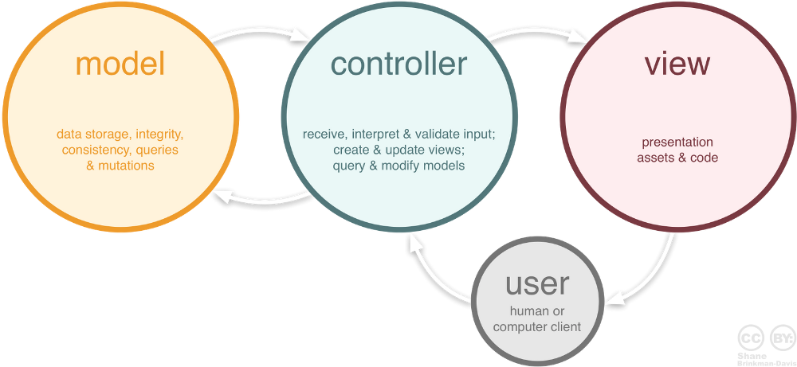

# express

<!-- START doctoc -->
<!-- END doctoc -->

## What is express?

Fast, unopinionated, minimalist web framework for Node.js

## Express: core functionality

* Implementation of the Model View Controller (MVC) pattern
* Routing
  * Mapping between HTTP request attributes (URL, method, etc.) and controllers (handlers)
* Middleware
  * Interception and possibly transformation of HTTP requests and responses during their processing.
* Template engines
  * Rendering of views with pluggable template engines.

## Install express

```bash
$> npm install -g express-generator
```

TODO: Generation example

## Express uses a Movel-View-Controller (MVC) structure



## Express file structure

* Controller (controllers)
* Model (model)
* View (views)
* Configuration (config)
* Client-side assets (public)
* bower.json?
* Gruntfile.js?
* package.json

## Express entry point (app.js)

TODO: app.js code

* Dependencies
* npm packages
* local modules
* start the server
* async callback

## package.json

TODO: package.json

* How to start it (npm start script)
* Dependencies
  * express
  * middleware
  * others
* Development tools

## Express middleware

* Incoming HTTP requests can be processed by multiple components, organized in a pipeline
* The components can inspect and even modify the incoming HTTP requests and HTTP responses (think about security, compression, etc.).
* Express.js calls these components "middleware" functions
* Middleware can be chained. They can intercept requests at different levels (all requests, requests under a certain path, requests handled by a specific router, etc.)
* Built-in middleware components are available (in separate npm modules).
* We will use the express.static middleware to serve static content (e.g. HTML)

https://expressjs.com/en/guide/using-middleware.html

* Application-level vs. routing-level middleware vs. error-handling middleware

### Express configuration

TODO: check what the express generator generates

* third-party middleware packages
* use the middleware one after the other; each can modify the request, send a response, or pass the request along to the next middleware

### Adding your own middleware

* after standard middleware
* before error handling

## Express routing

* Routing consists in finding some piece of code (a function) to execute when an HTTP request has been issued.
* We will see later (in a few weeks) that routing can happen on the client side. Today, we are looking at routing on the server side.
* Routing is part of the typical Model-View-Controller (MVC) pattern implemented by web frameworks (not only in JavaScript, but also in other languages). 
* Routing consists in finding the right controller when a request comes in. 
* The controller will then get a model and delegate the rendering of a view to a template engine.

### The home page

* Express router
* Add the router as middleware (filtered by path)
* Define a route: `GET /`

### Routing

https://expressjs.com/en/guide/routing.html

* Route methods (GET, POST, PUT)
* Route paths (`/`, `/home`, `/students`)
* Request and response objects

### Router

* For large applications, it is better to split the controllers in multiple, isolated components. You should use multiple routers for that purpose.
* express.Router() creates a new router. (no need for r = new Router())

https://expressjs.com/en/4x/api.html#router

## Resources

http://expressjs.com/en/4x/api.html
