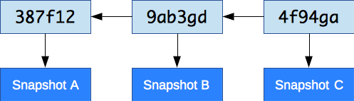
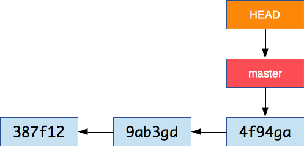
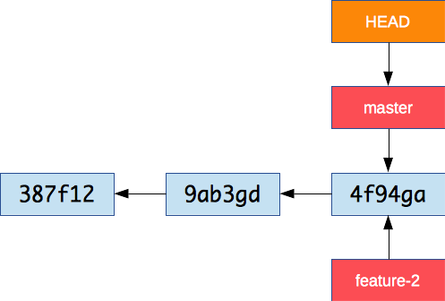
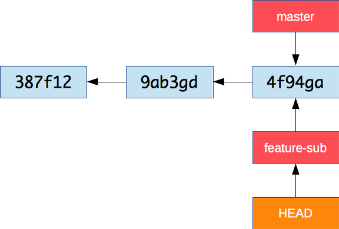

# Git Branching

<!-- START doctoc generated TOC please keep comment here to allow auto update -->
<!-- DON'T EDIT THIS SECTION, INSTEAD RE-RUN doctoc TO UPDATE -->


- [Branches](#branches)

<!-- END doctoc generated TOC please keep comment here to allow auto update -->


## What is branching?

> Branching means you diverge from the main line of development and continue to do work without messing with that main line.

<p class='center'></p>

Git has a very powerful branching model:

* Git branches are incredibly **lightweight**.
* Branching operations are nearly **instantaneous**.
* Switching between branches is generally just as **fast**.

Git encourages workflows that branch and merge often.


## Working with branches

Remember that Git stores data as a series of snapshots.



Each **commit** contains a pointer to the snapshot of the content you staged, the author's user name and e-mail,
and also a pointer to the previous commit.


### What is a branch?

A branch is simply a lightweight, movable pointer to a commit.



The default branch is **master**.
The special **HEAD** pointer indicates the current branch.

As you start making commits, the current branch pointer **automatically moves** forward to your latest commit.

#### Showing branches on the command line

The `git log` command can show you a representation of the commit graph and its branches:

```bash
$> git log --oneline --decorate --graph --all
 * 98ac768 (HEAD -> master) First version
```

In fact, this command is so useful you should make an alias:

```bash
$> git config --global alias.graph "log --oneline --graph --decorate --all"

$> git graph
 * 98ac768 (HEAD -> master) First version
```

You can also use `git branch` (but you won't see the commits):

```bash
$> git branch
 * master
```


### Creating a new branch

It's very fast and simple to create a new branch:

```bash
$> git branch feature-2
```



There is now a new pointer to the current commit.
Note that **HEAD** didn't move – we are still on the **master** branch.


### Switching branches

Now let's switch branches:

```bash
$> git checkout feature-2
Switched to branch 'feature-2'
```



This moves `HEAD` to point to the `feature-2` branch.
