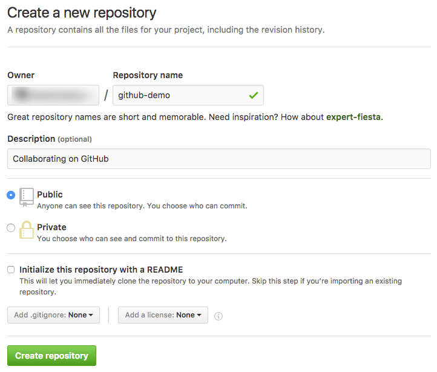

# Collaborating with Git

Requirements:

* [Git][git]
* A [GitHub][github] account
* A Unix shell (Git Bash is installed with Git on Windows)

<!-- START doctoc generated TOC please keep comment here to allow auto update -->
<!-- DON'T EDIT THIS SECTION, INSTEAD RE-RUN doctoc TO UPDATE -->


- [Group work](#group-work)
- [Distributed version control system](#distributed-version-control-system)
  - [What is a remote?](#what-is-a-remote)
  - [Centralized workflow](#centralized-workflow)
  - [Working with GitHub](#working-with-github)
- [Collaborating on GitHub](#collaborating-on-github)
  - [A: create a repository on GitHub](#a-create-a-repository-on-github)
  - [A: add B as a collaborator](#a-add-b-as-a-collaborator)
  - [A: add a remote to your local repository](#a-add-a-remote-to-your-local-repository)
  - [A: push your commits to the shared repository](#a-push-your-commits-to-the-shared-repository)
  - [A: remote branches](#a-remote-branches)
  - [B: clone the shared repository](#b-clone-the-shared-repository)
  - [B: remote branches](#b-remote-branches)
  - [B: make local changes](#b-make-local-changes)
  - [B: check the state of branches](#b-check-the-state-of-branches)
  - [A: check the state of branches](#a-check-the-state-of-branches)
  - [Cloning a Git repository](#cloning-a-git-repository)
- [TODO](#todo)

<!-- END doctoc generated TOC please keep comment here to allow auto update -->

## Group work

This tutorial is meant to be performed by a group of two.
Throughout the rest of the document, the members of the group will be referred to as **Person A** and **Person B**.

The tutorial assumes that you have followed the [previous Git tutorial][git-tutorial] and have kept your calculator repository.


## Distributed version control system

<!-- slide-front-matter class: center, middle -->

Working with remote repositories


### What is a remote?

A **remote repository** is a version of your project that is hosted on the Internet or network somewhere.
You can have **several of them**.

Collaborating with others involves **pushing** and **pulling** data to and from these remote repositories when you need to share work.

TODO: multiple remotes diagram (local network, internet, etc)


### Centralized workflow

There are [many ways][distributed-workflows] to work with Git as a team.
Here we will use a simple **centralized workflow**:

<p class='center'></p>

In this workflow:

* A "shared" central repository hosted on GitHub
* Each developer has a repository on their local machine
  * Each developer will add the shared repository as a **remote**


### Working with GitHub

> "[GitHub][github] is a web-based Git repository and Internet hosting service.
  It offers all of the **distributed version control** and **source code management (SCM)** functionality of **Git**
  as well other features like access control, bug tracking, feature requests, task management, and wikis for every project."

<p class='center'></p>

#### Create a free GitHub account

Both group members should register on GitHub:

<p class='center'></p>


## Collaborating on GitHub

<!-- slide-front-matter class: center, middle -->


### A: create a repository on GitHub

**Person A** should create a repository from the GitHub menu:

<!-- slide-column 20 -->


<!-- slide-column 80 -->




### A: add B as a collaborator

TODO: add B as a collaborator


### A: add a remote to your local repository

**Person A** should copy the SSH URL of the GitHub repository:


Then move into their local repository and add it as a remote:

```bash
$> cd /path/to/projects/comem-webdev-git-branching-ex

$> git remote add origin git@github.com:PersonA/github-demo.git
```

It's a convention to name the default remote **origin**.

You can check what remotes are available with `git remote`:

```bash
$> git remote -v
origin  git@github.com:PersonA/github-demo.git (fetch)
origin  git@github.com:PersonA/github-demo.git (push)
```


### A: push your commits to the shared repository

It's time for **Person A** to put the code in the shared GitHub repository.
This is done using the `git push` command:

```bash
$> git push origin master
Counting objects: 35, done.
Delta compression using up to 8 threads.
Compressing objects: 100% (33/33), done.
Writing objects: 100% (35/35), 4.16 KiB | 0 bytes/s, done.
Total 35 (delta 14), reused 11 (delta 2)
remote: Resolving deltas: 100% (14/14), done.
To github.com:PersonA/github-demo.git
 * [new branch]      master -> master
```

The command `git push [remote] [branch]` tells Git to push the commit pointed to by `[branch]` to the remote named `[remote]`.


### A: remote branches

<!-- slide-column 60 -->


<!-- slide-column 40 -->

The commit objects and file snapshots have been **pushed** (or uploaded) to the GitHub repository.

This includes not only the commit pointed to by master, but also the **entire history** of the repository up to that commit.

<!-- slide-container -->

Note the **origin/master** branch that has appeared in your local repository.
This is a **remote-tracking branch**.
It tells you where the **master** branch points to on the **origin** remote (the GitHub repository in this case).


### B: clone the shared repository

**Person B** can now get a copy of the shared GitHub repository on their machine.
This is done using the `git clone` command:

```bash
$> git clone git@github.com:PersonA/github-demo.git
Cloning into 'github-demo'...
remote: Counting objects: 35, done.
remote: Compressing objects: 100% (21/21), done.
remote: Total 35 (delta 14), reused 35 (delta 14), pack-reused 0
Receiving objects: 100% (35/35), 4.16 KiB | 0 bytes/s, done.
Resolving deltas: 100% (14/14), done.

$> cd github-demo
```

The `git clone [url]` command copies the repository to your machine.


### B: remote branches

<!-- slide-column 60 -->


<!-- slide-column 40 -->

The entire history of the project is **pulled** (or downloaded) from the GitHub repository.

Git will also automatically checkout the **master** branch in the working directory so you have something to work from.

<!-- slide-container -->

Again, Git has created a **remote-tracking branch** in Person B's repository,
so that you can know what the current state of the remote is.


### B: make local changes

**Person B** thinks that the project's files are too complicated. Let's simplify:

```bash
$> mv addition.js add.js
$> mv subtraction.js sub.js
$> git add --all
$> git commit -m "Shorter filenames"
```


### B: check the state of branches

<!-- slide-column 60 -->


<!-- slide-column 40 -->

This is now the state of the shared repository and **Person B**'s local repository.

There is a new commit in **Person B**'s repository that is not in the shared GitHub repository.

<!-- slide-container -->

Push it to update the shared repository:

```bash
$> git push origin master
```


### A: check the state of branches

<!-- slide-column 60 -->


<!-- slide-column 40 -->

This is now the state from **Person A**'s perspective.

Notice that the new commit is in the shared repository (on GitHub)
but that the remote-tracking branch origin/master **is not up-to-date** in **Person A**'s repository.

<!-- slide-container -->

Git does not automatically sync repositories.
So **as far as Person A knows** looking at information from their local repository,
the master branch still points to `4f94ga` in the shared repository.


### Cloning a Git repository

You can get a Git repository either by cloning an existing one or creating a new one and importing a project's files into it.
Let's start by getting an existing repository – the repository for this course:

```bash
$> git clone https://github.com/MediaComem/comem-webdev.git
remote: Counting objects: 155, done.
remote: Compressing objects: 100% (99/99), done.
remote: Total 155 (delta 51), reused 142 (delta 38), pack-reused 0
Receiving objects: 100% (155/155), 656.15 KiB | 520.00 KiB/s, done.
Resolving deltas: 100% (51/51), done.
```

It will create a directory named `comem-webdev`, initialize a `.git` repository inside it, pull down all the data for that repository, and check out a working copy of the latest version.

If you wish to clone the repository into another directory name, you can specify that as the next command line option:

```bash
$> git clone https://github.com/MediaComem/comem-webdev.git awesome-stuff
```

Note that Git will perform a **full copy** of all data that the server has: every version of every file for the history of the project is pulled down by default.


## TODO

* ssh reminder


[distributed-workflows]: https://git-scm.com/book/en/v2/Distributed-Git-Distributed-Workflows
[git]: https://git-scm.com
[git-tutorial]: ../git/
[github]: https://github.com
