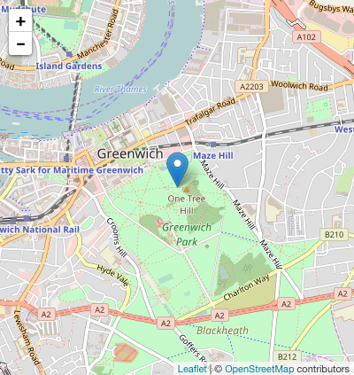
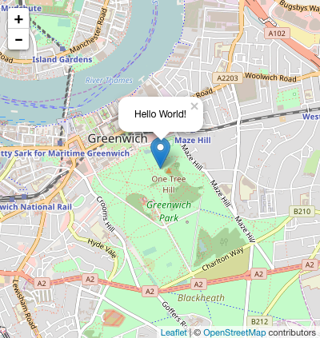
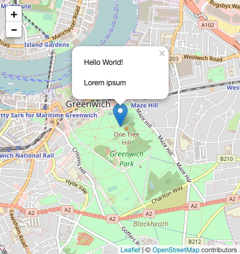
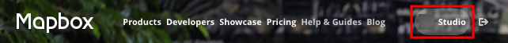
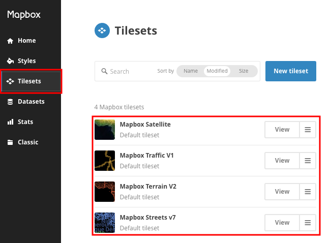
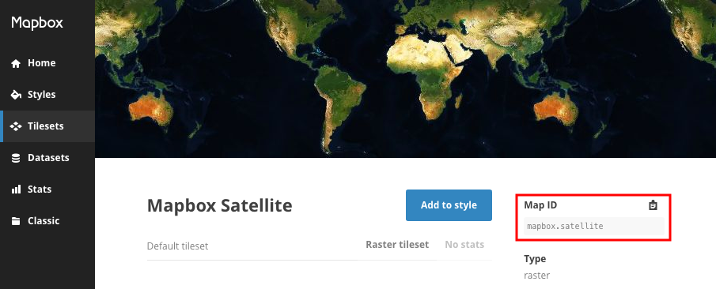
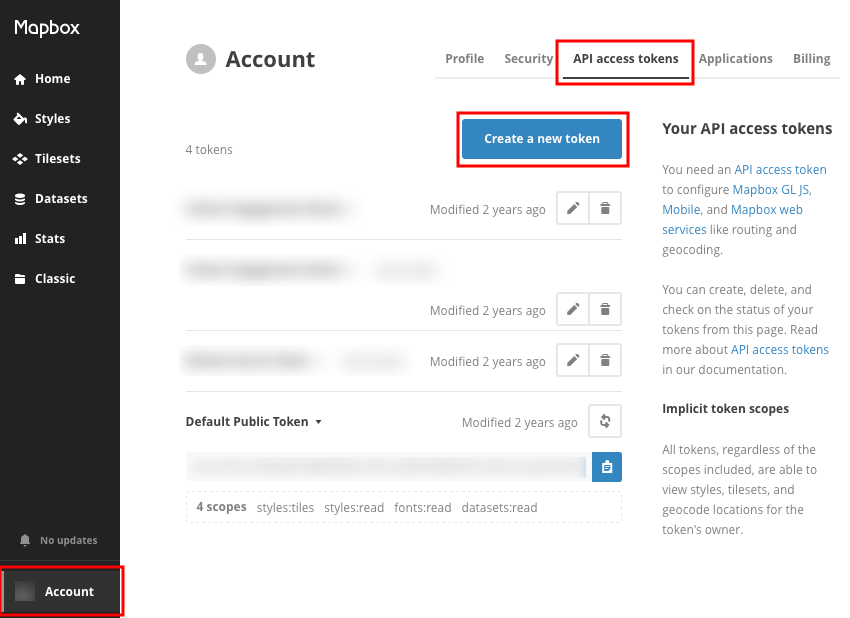
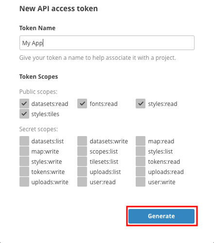
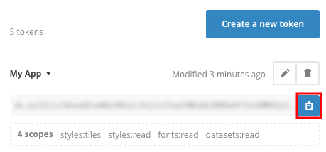
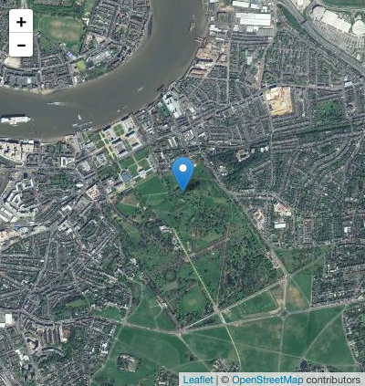

# Ionic Extras

Useful tools to add to an Ionic application.

**You will need**

* [Cordova][cordova]
* A running [Ionic][ionic] application

**Recommended reading**

* [Ionic](../ionic/)
* [Angular](../angular/)

<!-- START doctoc generated TOC please keep comment here to allow auto update -->
<!-- DON'T EDIT THIS SECTION, INSTEAD RE-RUN doctoc TO UPDATE -->


- [Geolocation](#geolocation)
  - [Getting the user's location](#getting-the-users-location)
  - [Geolocation on insecure origins](#geolocation-on-insecure-origins)
  - [Geolocation doesn't work on my device](#geolocation-doesnt-work-on-my-device)
- [Leaflet](#leaflet)
  - [Your map state](#your-map-state)
  - [Adding a map](#adding-a-map)
  - [Adding markers to your map](#adding-markers-to-your-map)
  - [Leaflet events](#leaflet-events)
- [Mapbox](#mapbox)
  - [Mapbox tilesets](#mapbox-tilesets)
  - [Mapbox map ID](#mapbox-map-id)
  - [Mapbox access tokens](#mapbox-access-tokens)
  - [Using a Mapbox tileset with Leaflet](#using-a-mapbox-tileset-with-leaflet)
  - [Mapbox and Leaflet](#mapbox-and-leaflet)
- [Using your mobile device's camera](#using-your-mobile-devices-camera)
  - [Create an Angular service for the camera](#create-an-angular-service-for-the-camera)
  - [Calling the camera service](#calling-the-camera-service)
  - [The camera and `ionic serve`](#the-camera-and-ionic-serve)
- [Resources](#resources)

<!-- END doctoc generated TOC please keep comment here to allow auto update -->


## Geolocation

The [HTML Geolocation API][html-geolocation] allows the user to provide their geographical location to web applications.
Since an Ionic app is a web app, you can use it directly.

However, you can also use the [Cordova Geolocation plugin][cordova-geolocation] and the [Ionic Native Geolocation][ionic-native-geolocation] plugin.
It's already ready for Angular and has the added benefit of working even on platforms where the HTML Geolocation API might not be available in the browser.

Install the Cordova plugin with `ionic cordova` and the Ionic plugin with `npm`:

```bash
$> ionic cordova plugin add \
   cordova-plugin-geolocation \
   --variable GEOLOCATION_USAGE_DESCRIPTION="To locate you"

$> npm install --save @ionic-native/geolocation
```


### Registering the Geolocation service with Angular

The `@ionic-native/geolocation` plugin provides an **Angular service** named `Geolocation` that you can use to locate the user.
To be able to **inject** it in your application's components or services, you must add that service to your module's **providers**.

For example, you may add it to `AppModule` in `src/app/app.module.ts` in a standard starter project:

```ts
// Other imports...
*import { Geolocation } from '@ionic-native/geolocation';

@NgModule({
  // ...
  providers: [
    // Other providers...
*   Geolocation
  ]
})
export class AppModule {}
```


### Injecting the Geolocation service

Now that the `Geolocation` service is registered, you can inject it in one of your components or services.

Here's an example of how you would inject it in a sample `ExamplePage` component:

```ts
// Other imports...
*import { Geolocation } from '@ionic-native/geolocation';

@Component({
  selector: 'page-example',
  templateUrl: 'example.html',
})
export class ExamplePage {
  // ...
  constructor(
    // Other injections...
*   private geolocation: Geolocation
  ) {}
  // ...
}
```


### Getting the user's location

Once that's done, obtaining the user's current geographic coordinates is as simple as calling the service's `getCurrentPosition()` method:

```ts
// ...
export class ExamplePage {
  // ...
  ionViewDidLoad() {
    // ...

*   const geolocationPromise = this.geolocation.getCurrentPosition();
*   geolocationPromise.then(position => {
*     const coords = position.coords;
*     console.log(\`User is at ${coords.longitude}, ${coords.latitude}`);
*   }).catch(err => {
*     console.warn(\`Could not retrieve user position because: ${err.message}`);
*   });
  }
  // ...
}
```

It's an **asynchronous** operation which returns a promise,
so you have to call `.then()` to be notified when the location is available.
You should also call `.catch()` to be notified if there's a problem retrieving the location
(e.g. the position cannot be determined because the user is indoors).


### Allowing the brower to retrieve the user's location

When developing locally with `ionic serve`, the browser will ask for permission to get the user's location.
Click **Allow**:

<p class='center'></p>


### Geolocation on insecure origins

If you get the following warning:

```txt
*getCurrentPosition() and watchPosition() no longer work on insecure origins.
*To use this feature, you should consider switching your application to a
*secure origin, such as HTTPS. See https://goo.gl/rStTGz for more details.
```

It's because your Ionic app is not running on localhost but on your IP address
(e.g. you are on `http://192.168.1.100:8100` in your browser's address bar),
and getting the user's location over unencrypted HTTP is **no longer allowed on insecure origins**.

You should run your Ionic app on localhost to solve this issue:

```bash
$> ionic serve --address localhost
```


## Leaflet

There are many JavaScript map libraries, each with their own advantages.
For this tutorial, we'll use [Leaflet][leaflet] as it's one of the most popular,
and it has a pretty good Angular library: [angular-leaflet-directive][angular-leaflet-directive].

You can install both with Bower (it will automatically install Leaflet as well):

```bash
$> bower install --save angular-leaflet-directive
```

There are 3 files you need to include in `www/index.html`;
Leaflet's stylesheet, and the JavaScript files for Leaflet and the Angular directive:

```html
<link href='lib/leaflet/dist/leaflet.css' rel='stylesheet'>
<script src='lib/leaflet/dist/leaflet-src.js'></script>
<script src='lib/angular-leaflet-directive/dist/angular-leaflet-directive.js'>
</script>
```

Also add the `leaflet-directive` module as a dependency of your application in `www/js/app.js`:

```js
angular.module('my-app', [ '...', `'leaflet-directive'` ])
```


### Your map state

We'll assume you have a **map state** defined with Angular UI router,
and that this state has a template and a controller.
It could look something like this:

```js
.state('map', {
  url: '/map',
  controller: 'MapCtrl',
  controllerAs: 'mapCtrl',
  templateUrl: 'templates/map.html'
})
```

If you're using **tabs**, it could look like this instead:

```js
.state('tab.map', {
  url: '/map',
  views: {
    'tab-map': {
      controller: 'MapCtrl',
      controllerAs: 'mapCtrl',
      templateUrl: 'templates/map.html'
    }
  }
})
```


### Adding a map

Let's attach some data to our controller.
The map will need it:

```js
angular.module('my-app').controller('MapCtrl', function() {
  var mapCtrl = this;

* mapCtrl.defaults = {};
* mapCtrl.markers = [];
* mapCtrl.center = {
*   lat: 51.48,
*   lng: 0,
*   zoom: 14
* };
});
```

Use the `<leaflet>` directive from the angular-leaflet-directive library to display a map in the template:

```html
<ion-content scroll='false' data-tap-disabled='true'>
* <leaflet width='100%' height='100%'
*          defaults='mapCtrl.defaults'
*          center='mapCtrl.center'
*          markers='mapCtrl.markers'>
* </leaflet>
</ion-content>
```

#### Leaflet maps and Ionic

Be sure not to forget to add `scroll='false'` and `data-tap-disabled='true'` to your map's enclosing element:

```html
<ion-content `scroll='false'` `data-tap-disabled='true'`>
```

This prevents Ionic's mobile gestures from interfering with controlling the map.

Also do not forget to give your map a width and height:

```html
<leaflet `width='100%'` `height='100%'` ...>
```


### Adding markers to your map

You can add a marker simply by adding it to the `mapCtrl.markers` array we defined earlier.
Angular's two-way binding will do the rest:

<!-- slide-column -->

```js
mapCtrl.markers.push({
  lat: 51.48,
  lng: 0
});
```

<!-- slide-column -->



#### Marker tooltips

If you want a tooltip to open when the marker is clicked, you can simply add a `message` property:

<!-- slide-column -->

```js
mapCtrl.markers.push({
  lat: 51.48,
  lng: 0,
  message: 'Hello World!'
});
```

<!-- slide-column -->



#### Dynamic marker tooltips

If you want to display dynamic data in the marker,
you must create an Angular scope for the marker with `getMessageScope()`:

<!-- slide-column -->

```js
var record = {
  title: 'Lorem ipsum'
};

*var msg = '<p>Hello World!</p>';
*msg += '<p>{{ record.title }}</p>';

mapCtrl.markers.push({
  lat: 51.48,
  lng: 0,
  message: `msg`,
* getMessageScope: function() {
*   var scope = $scope.$new();
*   scope.record = record;
*   return scope;
* }
});
```

<!-- slide-column -->



<!-- slide-container -->

Do not forget to inject `$scope` in your controller for this example to work.

#### Complex marker templates

It's hard to maintain a marker template when you have to construct it manually like in the previous example.
If your marker template becomes too complex, save it in a file like `templates/mapTooltip.html`.

Then, when creating your marker, use the `ng-include` directive to load that template:

```js
var record = {
  title: 'Lorem ipsum'
};

mapCtrl.markers.push({
  lat: 51.48,
  lng: 0,
* message: '<div ng-include="\'templates/mapTooltip.html\'" />',
  getMessageScope: function() {
    var scope = $scope.$new();
    scope.record = record;
    return scope;
  }
});
```


### Leaflet events

Leaflet broadcasts several [events][angular-leaflet-directive-events] on the Angular scope.
You can react to them by injecting `$scope` and using its `$on()` function.

For example, the `leafletDirectiveMap.dragend` event is fired after the user drags the map:

```js
$scope.$on('`leafletDirectiveMap.dragend`', function(event, map){
  console.log('Map was dragged');
});
```

The `leafletDirectiveMarker.click` event is fired when the user clicks on a marker:

```js
$scope.$on('`leafletDirectiveMarker.click`', function(event, marker) {
  var coords = marker.model.lng + '/' + marker.model.lat;
  console.log('Marker at ' + coords + ' was clicked');
});
```


## Mapbox

[Mapbox][mapbox] is a mapping platform you can use to design maps.
You can integrate it into Leaflet to have a better looking map than the default one.

Create an account, log in and go to the Mapbox studio:

<p class='center'></p>


### Mapbox tilesets

Choose a **map tileset** for your app:

<p class='center'></p>


### Mapbox map ID

Copy the **map ID** of your tileset, which you will need it to tell Leaflet to use it:

<p class='center'></p>


### Mapbox access tokens

Go into your **Account** settings and generate a new API access token:

<p class='center'></p>

#### New mapbox access token

<!-- slide-column -->

You can leave the basic settings untouched and click on **Generate**:

<!-- slide-column 60-->



#### Copy the mapbox access token

Once you're done, copy the access token:

<p class='center'></p>


### Using a Mapbox tileset with Leaflet

To use your Mapbox tileset with angular-leaflet-directive, you have to construct a **tile layer URL**
containing both your **Mapbox tileset map ID** and your **Mapbox access token**:

```js
var `mapboxMapId` = 'mapbox.satellite';  // Use your favorite tileset here
var `mapboxAccessToken` = 'changeme';    // Use your access token here

// Build the tile layer URL
var mapboxTileLayerUrl = 'http://api.tiles.mapbox.com/v4/' + `mapboxMapId`;
mapboxTileLayerUrl = mapboxTileLayerUrl + '/{z}/{x}/{y}.png';
mapboxTileLayerUrl = mapboxTileLayerUrl + '?access_token=' + `mapboxAccessToken`;
```

You can then add this URL to the Leaflet map's configuration object in the `mapCtrl.defaults` variable in your map controller:

```js
mapCtrl.defaults = {
  tileLayer: mapboxTileLayerUrl
};
```


### Mapbox and Leaflet

Your map should now be using your Mapbox tileset:

<p class='center'></p>


## Using your mobile device's camera

The camera is part of your mobile device's hardware,
so you'll need Cordova to access it for you.

Install [cordova-plugin-camera][cordova-camera] with the following command in your app's directory:

```bash
$> cd /path/to/projects/my-app
$> cordova plugin add cordova-plugin-camera
```

This plugin adds a `navigator.camera` object that you can use to take pictures
(only when running your app on an actual mobile device).


### Create an Angular service for the camera

Instead of using the camera object directly, it's a good idea to put it into an Angular service.
We'll create a `CameraService` service with a `getPicture()` function which returns a promise:

```js
angular.module('my-app').factory(`'CameraService'`, function($q) {

  var service = {
    `getPicture`: function() {
      var deferred = $q.defer();
      var options = { // Return the raw base64 PNG data
        destinationType: navigator.camera.DestinationType.DATA_URL,
        correctOrientation: true
      };

      `navigator.camera.getPicture`(function(result) {
        deferred.resolve(result);
      }, function(err) {
        deferred.reject(err);
      }, options);

      return deferred.promise;
    }
  };

  return service;
});
```


### Calling the camera service

You can now inject and use the `CameraService` in your controllers.
Let's add a `takePicture()` function to a controller:

```js
angular.module('my-app').controller('MyCtrl', function(`CameraService`, $log) {
  var myCtrl = this;

  `myCtrl.takePicture` = function() {
    `CameraService.getPicture()`.then(function(result) {
      $log.debug('Picture taken!');
      `myCtrl.pictureData` = result;
    }).catch(function(err) {
      $log.error('Could not get picture because: ' + err.message);
    });
  };
});
```

Call it in the view and display the result:

```html
<button type='button button-positive' ng-click='`myCtrl.takePicture()`'>
  Take picture
</button>

```


### The camera and `ionic serve`

The camera and the `navigator.camera` object will only be available on physical devices,
so your code will produce errors during local development with `ionic serve`.

To mitigate this issue, you can add a function to your service to test if the camera is available:

```js
angular.module('my-app').factory('CameraService', function($q) {
  var service = {
*   isSupported: function() {
*     return navigator.camera !== undefined;
*   },
    // ...
  };
  return service;
});
```

#### Notifying the user that the feature is unsupported

That way you can display some kind of notification to tell the user that he won't be able to use the camera,
for example using Ionic's `$ionicPopup` service:

```js
.controller('MyCtrl', function(CameraService, `$ionicPopup`, $log) {
  var myCtrl = this;

  myCtrl.takePicture = function() {
*   if (!CameraService.isSupported()) {
*     return $ionicPopup.alert({
*       title: 'Not supported',
*       template: 'You cannot use the camera on this platform'
*     });
*   }
    // ...
  };
});
```


## Resources

**Documentation**

* [angular-leaflet-directive][angular-leaflet-directive] ([examples][angular-leaflet-directive-examples])
* [cordova-plugin-camera][cordova-camera]
* [Cordova Geolocation plugin][cordova-geolocation] & [Ionic Native Geolocation plugin][ionic-native-geolocation]
* [Ionic v1 documentation][ionic-docs]


[angular-leaflet-directive]: https://github.com/tombatossals/angular-leaflet-directive
[angular-leaflet-directive-events]: http://tombatossals.github.io/angular-leaflet-directive/#!/examples/events
[angular-leaflet-directive-examples]: http://tombatossals.github.io/angular-leaflet-directive/#!/examples/simple-map
[cordova]: https://cordova.apache.org
[cordova-camera]: https://github.com/apache/cordova-plugin-camera
[cordova-geolocation]: https://github.com/apache/cordova-plugin-geolocation
[ionic]: http://ionicframework.com
[ionic-docs]: http://ionicframework.com/docs/v1/
[ionic-native-geolocation]: https://ionicframework.com/docs/native/geolocation/
[html-geolocation]: https://developer.mozilla.org/en-US/docs/Web/API/Geolocation/Using_geolocation
[leaflet]: http://leafletjs.com
[mapbox]: https://www.mapbox.com/
