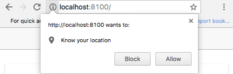
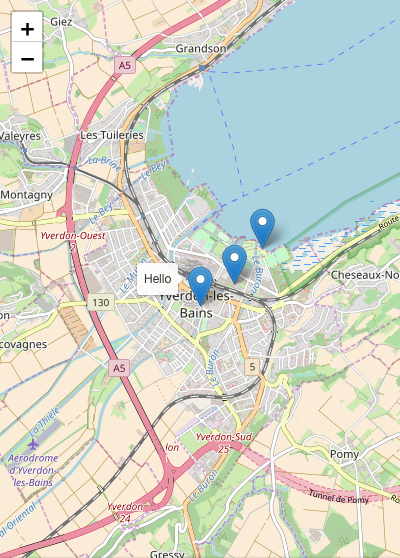

# Ionic Extras

Useful tools to add to an Ionic application.

**You will need**

* [Cordova][cordova]
* A running [Ionic][ionic] application

**Recommended reading**

* [Ionic](../ionic/)
* [Angular](../angular/)

<!-- START doctoc generated TOC please keep comment here to allow auto update -->
<!-- DON'T EDIT THIS SECTION, INSTEAD RE-RUN doctoc TO UPDATE -->


- [Geolocation](#geolocation)
  - [Getting the user's location](#getting-the-users-location)
  - [Geolocation on insecure origins](#geolocation-on-insecure-origins)
  - [Geolocation doesn't work on my device](#geolocation-doesnt-work-on-my-device)
- [Leaflet](#leaflet)
  - [Your map state](#your-map-state)
  - [Adding a map](#adding-a-map)
  - [Adding markers to your map](#adding-markers-to-your-map)
  - [Leaflet events](#leaflet-events)
- [Mapbox](#mapbox)
  - [Mapbox tilesets](#mapbox-tilesets)
  - [Mapbox map ID](#mapbox-map-id)
  - [Mapbox access tokens](#mapbox-access-tokens)
  - [Using a Mapbox tileset with Leaflet](#using-a-mapbox-tileset-with-leaflet)
  - [Mapbox and Leaflet](#mapbox-and-leaflet)
- [Using your mobile device's camera](#using-your-mobile-devices-camera)
  - [Create an Angular service for the camera](#create-an-angular-service-for-the-camera)
  - [Calling the camera service](#calling-the-camera-service)
  - [The camera and `ionic serve`](#the-camera-and-ionic-serve)
- [Resources](#resources)

<!-- END doctoc generated TOC please keep comment here to allow auto update -->


## Geolocation

The [HTML Geolocation API][html-geolocation] allows the user to provide their geographical location to web applications.
Since an Ionic app is a web app, you can use it directly.

However, you can also use the [Cordova Geolocation plugin][cordova-geolocation] and the [Ionic Native Geolocation][ionic-native-geolocation] plugin.
It's already ready for Angular and has the added benefit of working even on platforms where the HTML Geolocation API might not be available in the browser.

Install the Cordova plugin with `ionic cordova` and the Ionic plugin with `npm`:

```bash
$> ionic cordova plugin add \
   cordova-plugin-geolocation \
   --variable GEOLOCATION_USAGE_DESCRIPTION="To locate you"

$> npm install --save @ionic-native/geolocation
```


### Registering the Geolocation service with Angular

The `@ionic-native/geolocation` plugin provides an **Angular service** named `Geolocation` that you can use to locate the user.
To be able to **inject** it in your application's components or services, you must add that service to your module's **providers**.

For example, you may add it to `AppModule` in `src/app/app.module.ts` in a standard starter project:

```ts
// Other imports...
*import { Geolocation } from '@ionic-native/geolocation';

@NgModule({
  // ...
  providers: [
    // Other providers...
*   Geolocation
  ]
})
export class AppModule {}
```


### Injecting the Geolocation service

Now that the `Geolocation` service is registered, you can inject it in one of your components or services.

Here's an example of how you would inject it in a sample `ExamplePage` component:

```ts
// Other imports...
*import { Geolocation } from '@ionic-native/geolocation';

@Component({
  selector: 'page-example',
  templateUrl: 'example.html',
})
export class ExamplePage {
  // ...
  constructor(
    // Other injections...
*   private geolocation: Geolocation
  ) {}
  // ...
}
```


### Getting the user's location

Once that's done, obtaining the user's current geographic coordinates is as simple as calling the service's `getCurrentPosition()` method:

```ts
// ...
export class ExamplePage {
  // ...
  ionViewDidLoad() {
    // ...

*   const geolocationPromise = this.geolocation.getCurrentPosition();
*   geolocationPromise.then(position => {
*     const coords = position.coords;
*     console.log(\`User is at ${coords.longitude}, ${coords.latitude}`);
*   }).catch(err => {
*     console.warn(\`Could not retrieve user position because: ${err.message}`);
*   });
  }
  // ...
}
```

It's an **asynchronous** operation which returns a promise,
so you have to call `.then()` to be notified when the location is available.
You should also call `.catch()` to be notified if there's a problem retrieving the location
(e.g. the position cannot be determined because the user is indoors).


### Allowing the brower to retrieve the user's location

When developing locally with `ionic serve`, the browser will ask for permission to get the user's location.
Click **Allow**:

<p class='center'></p>


### Geolocation on insecure origins

If you get the following warning:

```txt
*getCurrentPosition() and watchPosition() no longer work on insecure origins.
*To use this feature, you should consider switching your application to a
*secure origin, such as HTTPS. See https://goo.gl/rStTGz for more details.
```

It's because your Ionic app is not running on localhost but on your IP address
(e.g. you are on `http://192.168.1.100:8100` in your browser's address bar),
and getting the user's location over unencrypted HTTP is **no longer allowed on insecure origins**.

You should run your Ionic app on localhost to solve this issue:

```bash
$> ionic serve --address localhost
```


## Leaflet

There are many JavaScript map libraries, each with their own advantages.
For this tutorial, we'll use [Leaflet][leaflet] as it's one of the most popular open source libraries.
We'll also use [ngx-leaflet][ngx-leaflet], which is an Angular wrapper around Leaflet.

You can install both with npm:

```bash
$> npm install leaflet @asymmetrik/ngx-leaflet
```

As we are in a TypeScript project and Leaflet is not written in TypeScript,
you'll also need to install its [type definitions][definitely-typed]:

```bash
$> npm install --save-dev @types/leaflet
```


### Importing Leaflet styles

It's easy to use Leaflet's JavaScript components, as we just have to `import` them,
but it's a little bit harder to include Leaflet's CSS, as the Ionic build chain doesn't include it by default.

You need to add a new `copy.config.js` file to your project.
This file configures Ionic to copy Leaflet's stylesheet and images to its build directory (`www`):

```js
module.exports = {
  copyLeaflet: {
    src: ['{{ROOT}}/node_modules/leaflet/dist/leaflet.css'],
    dest: '{{WWW}}/assets/leaflet/'
  },
  copyLeafletAssets: {
    src: ['{{ROOT}}/node_modules/leaflet/dist/images/**/*'],
    dest: '{{WWW}}/assets/leaflet/images/'
  }
};
```

#### Adding a copy configuration file to Ionic

You must tell Ionic to use this configuration file by adding this to your `package.json` file:

```json
{
  "...": "...",
* "config": {
*   "ionic_copy": "copy.config.js"
* },
  "...": "..."
}
```

Once that's done, start (or restart) your `ionic serve` command.

You should see that Leaflet's stylesheet and images have been copied under the `www/assets/leaflet` directory:

```bash
$> ls www/assets/leaflet
images   leaflet.css
```

#### Adding the Leaflet stylesheet

Now that the stylesheet is available in your project's build directory,
you can add it to `src/index.html` with a new `<link>` tag:

```html
<!DOCTYPE html>
<html lang='en'>
<head>
  <!-- ... -->
* <link href='assets/leaflet/leaflet.css' rel='stylesheet'>
  <link href='build/main.css' rel='stylesheet'>
</head>
<body>
  <!-- ... -->
&lt;/body&gt;
</html>
```

Leaflet's styles are now loaded.


### Registering the Leaflet module with Angular

To use the [ngx-leaflet][ngx-leaflet] library,
you must add its `LeafletModule` to your application's module in `src/app/app.module.ts`:

```ts
// Other imports...
*import { LeafletModule } from '@asymmetrik/ngx-leaflet';

@NgModule({
  // ...
  imports: [
    // Other imports...
*   LeafletModule.forRoot()
  ]
  // ...
})
export class AppModule {}
```


### Displaying a map

To display map, you need to define some basic map options.
Here's how you could add them to a sample `ExamplePage` component:

```ts
// Other imports...
*import { latLng, MapOptions, tileLayer } from 'leaflet';

@Component({
  selector: 'page-example',
  templateUrl: 'example.html',
})
export class ExamplePage {
* mapOptions: MapOptions;

  constructor(/* ... */) {
    // ...
*   const tileLayerUrl = 'http://{s}.tile.openstreetmap.org/{z}/{x}/{y}.png';
*   const tileLayerOptions = { maxZoom: 18 };
*   this.mapOptions = {
*     layers: [
*       tileLayer(tileLayerUrl, tileLayerOptions)
*     ],
*     zoom: 13,
*     center: latLng(46.778186, 6.641524)
*   };
  }
}
```

#### Adding the map to the component's template

You can now add the map to the component's HTML template.
Assuming you want the map to fill the entire page,
you can replace the entire contents of the template with this:

```html
<div class='map' leaflet [leafletOptions]='mapOptions'></div>
```

<!-- slide-column -->

The `leaflet` attribute instructs the ngx-leaflet library to create a map in this DOM element,
with our previously defined `mapOptions` bound through the `[leafletOptions]` attribute.

The map will have no height by default,
so add the following to the component's stylesheet to make it visible:

```scss
page-example {
  .map {
    height: 100%;
  }
}
```

You should now have a working Leaflet map!

<!-- slide-column 30 -->


### Markers

Adding markers to the map is quite simple.

First, you need to create some markers.
Let's add them to the component:

```ts
// Other imports...
import { latLng, MapOptions, `marker, Marker`, tileLayer } from 'leaflet';

// ...
export class ExamplePage {
  // ...
* mapMarkers: Marker[];

  constructor(/* ... */) {
    // ...
*   this.mapMarkers = [
*     marker([ 46.778186, 6.641524 ]),
*     marker([ 46.780796, 6.647395 ]),
*     marker([ 46.784992, 6.652267 ])
*   ];
  }
}
```

#### Adding the markers to the map

<!-- slide-column -->

Now all you need to do is bind the array of markers you just defined to the `leaflet` directive in the component's template with `[leafletLayers]`:

```html
<div class='map' leaflet
     [leafletOptions]='mapOptions'
     `[leafletLayers]='mapMarkers'`>
</div>
```

<!-- slide-column 30 -->


#### Adding a tooltip to a marker

<!-- slide-column -->

The markers you created in the `mapMarkers` array in the component are regular Leaflet [Marker][leaflet-marker] objects.

Check out the Leaflet documentation to see what you can do with them.

<!-- slide-column 30 -->



<!-- slide-container -->

For example, you could add a [Tooltip][leaflet-tooltip]:

```ts
this.mapMarkers = [
  marker([ 46.778186, 6.641524 ])`.bindTooltip('Hello')`,
  marker([ 46.780796, 6.647395 ]),
  marker([ 46.784992, 6.652267 ])
];
```


### Getting a reference to the map

You might need to get direct access to the Leaflet [Map][leaflet-map] object to register events or whatever.
The `leaflet` directive will emit a `leafletMapReady` event when it's done initializing the map.
You can bind to this event to retrieve the map object created by Leaflet:

```html
<div class='map' leaflet
     [leafletOptions]='mapOptions' [leafletLayers]='mapMarkers'
     `(leafletMapReady)='onMapReady($event)'`>
</div>
```

Now all you need to do is retrieve the map in your component:

```ts
// Other imports...
import { latLng, `Map`, MapOptions, marker, Marker, tileLayer } from 'leaflet';

// ...
export class ExamplePage {
* map: Map;
  // ...
* onMapReady(map: Map) {
*   this.map = map;
* }
}
```


### Listening to map events

You got a hold of the Leaflet [Map][leaflet-map] instance with the previous example,
so you have access to [all its events][leaflet-map-events].

For example, you could listen to its `moveend` event to check the new coordinates every time the user moves the map:

```ts
// ...
export class ExamplePage {
  // ...
  onMapReady(map: Map) {
    this.map = map;
*   this.map.on('moveend', () => {
*     const center = this.map.getCenter();
*     console.log(\`Map moved to ${center.lng}, ${center.lat}`);
*   });
  }
}
```


## Using your mobile device's camera

The camera is part of your mobile device's hardware,
so you'll need Cordova to access it for you.

Install [cordova-plugin-camera][cordova-camera] with the following command in your app's directory:

```bash
$> cd /path/to/projects/my-app
$> cordova plugin add cordova-plugin-camera
```

This plugin adds a `navigator.camera` object that you can use to take pictures
(only when running your app on an actual mobile device).


### Create an Angular service for the camera

Instead of using the camera object directly, it's a good idea to put it into an Angular service.
We'll create a `CameraService` service with a `getPicture()` function which returns a promise:

```js
angular.module('my-app').factory(`'CameraService'`, function($q) {

  var service = {
    `getPicture`: function() {
      var deferred = $q.defer();
      var options = { // Return the raw base64 PNG data
        destinationType: navigator.camera.DestinationType.DATA_URL,
        correctOrientation: true
      };

      `navigator.camera.getPicture`(function(result) {
        deferred.resolve(result);
      }, function(err) {
        deferred.reject(err);
      }, options);

      return deferred.promise;
    }
  };

  return service;
});
```


### Calling the camera service

You can now inject and use the `CameraService` in your controllers.
Let's add a `takePicture()` function to a controller:

```js
angular.module('my-app').controller('MyCtrl', function(`CameraService`, $log) {
  var myCtrl = this;

  `myCtrl.takePicture` = function() {
    `CameraService.getPicture()`.then(function(result) {
      $log.debug('Picture taken!');
      `myCtrl.pictureData` = result;
    }).catch(function(err) {
      $log.error('Could not get picture because: ' + err.message);
    });
  };
});
```

Call it in the view and display the result:

```html
<button type='button button-positive' ng-click='`myCtrl.takePicture()`'>
  Take picture
</button>

```


### The camera and `ionic serve`

The camera and the `navigator.camera` object will only be available on physical devices,
so your code will produce errors during local development with `ionic serve`.

To mitigate this issue, you can add a function to your service to test if the camera is available:

```js
angular.module('my-app').factory('CameraService', function($q) {
  var service = {
*   isSupported: function() {
*     return navigator.camera !== undefined;
*   },
    // ...
  };
  return service;
});
```

#### Notifying the user that the feature is unsupported

That way you can display some kind of notification to tell the user that he won't be able to use the camera,
for example using Ionic's `$ionicPopup` service:

```js
.controller('MyCtrl', function(CameraService, `$ionicPopup`, $log) {
  var myCtrl = this;

  myCtrl.takePicture = function() {
*   if (!CameraService.isSupported()) {
*     return $ionicPopup.alert({
*       title: 'Not supported',
*       template: 'You cannot use the camera on this platform'
*     });
*   }
    // ...
  };
});
```


## Resources

**Documentation**

* [cordova-plugin-camera][cordova-camera]
* [Cordova Geolocation plugin][cordova-geolocation] & [Ionic Native Geolocation plugin][ionic-native-geolocation]
* [ngx-leaflet][ngx-leaflet]
* [Ionic documentation][ionic-docs]


[cordova]: https://cordova.apache.org
[cordova-camera]: https://github.com/apache/cordova-plugin-camera
[cordova-geolocation]: https://github.com/apache/cordova-plugin-geolocation
[definitely-typed]: http://definitelytyped.org
[ionic]: http://ionicframework.com
[ionic-docs]: https://ionicframework.com/docs/
[ionic-native-geolocation]: https://ionicframework.com/docs/native/geolocation/
[html-geolocation]: https://developer.mozilla.org/en-US/docs/Web/API/Geolocation/Using_geolocation
[leaflet]: http://leafletjs.com
[leaflet-map]: http://leafletjs.com/reference-1.3.0.html#map-example
[leaflet-map-events]: http://leafletjs.com/reference-1.3.0.html#map-event
[leaflet-marker]: http://leafletjs.com/reference-1.3.0.html#marker
[leaflet-tooltip]: http://leafletjs.com/reference-1.3.0.html#tooltip
[ngx-leaflet]: https://github.com/Asymmetrik/ngx-leaflet#readme
