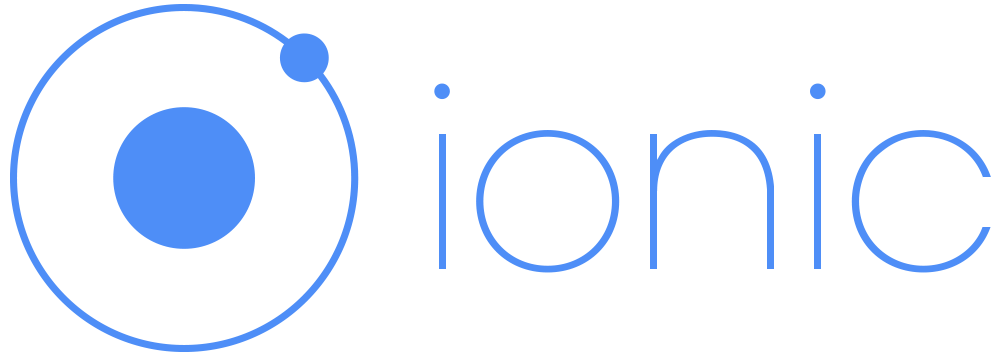
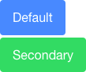

# Ionic

Learn about [Ionic][ionic], an open source framework to build hybrid mobile applications based on [Cordova][cordova] and [Angular][angular].

**You will need**

* [Node.js][node] 6+

**Recommended reading**

* [Angular](../angular/)

<!-- START doctoc generated TOC please keep comment here to allow auto update -->
<!-- DON'T EDIT THIS SECTION, INSTEAD RE-RUN doctoc TO UPDATE -->


- [What is Ionic?](#what-is-ionic)
  - [Which OS should you support?](#which-os-should-you-support)
  - [How can you deal with OS fragmentation?](#how-can-you-deal-with-os-fragmentation)
  - [Cordova](#cordova)
  - [What about Ionic?](#what-about-ionic)
- [Demo](#demo)
  - [Install Ionic](#install-ionic)
- [Basics of Ionic](#basics-of-ionic)
  - [CSS components](#css-components)
  - [JavaScript components](#javascript-components)
- [Resources](#resources)

<!-- END doctoc generated TOC please keep comment here to allow auto update -->


## What is Ionic?

<!-- slide-front-matter class: center, middle, image-header -->

<p class='center'></p>


### Which OS should you support?

<p class='center'></p>


### How can you deal with OS fragmentation?

<p class='center'></p>


### Cordova

<!-- slide-column 30 -->

<p class='center'></p>

<!-- slide-column -->

> "[Cordova][cordova] wraps your **HTML/JavaScript app** into a **native container** which can **access the device functions** of several platforms.
> These functions are exposed via a unified JavaScript API,
> allowing you to easily write one set of code to target nearly every phone or tablet on the market today and publish to their app stores."

<!-- slide-container -->

<p class='center'></p>
<p class='center'>Wait... what?</p>

#### Hybrid mobile applications

<!-- slide-column -->

Write your app with HTML, CSS and JavaScript, **like a website**:


<!-- slide-column 10 -->

<p class='center' style='margin-top:150px;font-size:2em;'><i class='fa fa-arrow-right' aria-hidden='true'></i></p>

<!-- slide-column -->

Embed it into a **native application**:


<!-- slide-container -->

<!-- slide-column 10 -->

<div class='center'>
  <i class='fa fa-camera x2' aria-hidden='true'></i>
  <br />
  <i class='fa fa-location-arrow x2' aria-hidden='true'></i>
  <br />
  <i class='fa fa-arrows-alt x2' aria-hidden='true'></i>
</div>

<!-- slide-column -->

Since you are writing a **web app**, you can access **web APIs** like the [geolocation API][geolocation-api].

But with Cordova, you can also access **device hardware** like the **camera** or the **accelerometer**, and you can do it **in JavaScript**.


### What about Ionic?

<!-- slide-column 35 -->


<!-- slide-column -->

> "Free and open source, Ionic offers a **library of mobile-optimized HTML, CSS and JS components**, gestures, and tools for building highly interactive apps.

> Ionic utilizes **Angular** in order to create a framework most suited to develop rich and robust applications."

<!-- slide-container -->

Ionic is basically **Cordova** and **Angular** plugged together:

<div class='center'>
  
  
</div>

#### What can I do with it?

Ionic lets you build web apps that **look like native apps** with HTML, CSS and JavaScript:

<p class='center'></p>


## Demo

<!-- slide-front-matter class: center, middle, image-header -->

<p class='center'></p>


### Install Ionic

Cordova and Ionic are both **npm packages**.
Install them globally with the following command:

```bash
$> npm install -g cordova ionic
```

You're now ready to use Ionic.
Let's generate an app called `ionic-demo` with the `tabs` starter template:

```bash
$> cd /path/to/projects
$> ionic start ionic-demo tabs
```

The app should open in your browser.


## Basics of Ionic

<!-- slide-front-matter class: center, middle -->


### CSS components

Ionic has many [CSS components][ionic-css] you can use out of the box:

<!-- slide-column 65 -->

```html
<button class="`button button-positive`">
  button-positive
</button>
```

<!-- slide-column -->



<!-- slide-container -->

<!-- slide-column 65 -->

```html
<div class="`card`">
  <div class="item item-text-wrap">
    This is a basic Card
    which contains an item
    that has wrapping text.
  </div>
</div>
```

<!-- slide-column -->


<!-- slide-container -->

<!-- slide-column 65 -->

```html
<div class="`list`">
  <label class="item item-input">
    <input type="text" placeholder="First Name">
  </label>
  <label class="item item-input">
    <input type="text" placeholder="Last Name">
  </label>
  <label class="item item-input">
    &lt;textarea placeholder="Comments"&gt;&lt;/textarea&gt;
  </label>
</div>
```

<!-- slide-column -->


### JavaScript components

Ionic also provides many [JavaScript components][ionic-js] that are in fact **Angular directives**.
Here's an example of the code for a **list view**:

```js
<`ion-list` ng-controller='MyCtrl' show-delete='true' show-reorder='true'
          can-swipe='listCanSwipe'>
  <`ion-item` ng-repeat='item in items' class='item-thumbnail-left'>

    
    <h2>{{item.title}}</h2>
    <p>{{item.description}}</p>
    <`ion-option-button` class='button-positive' ng-click='share(item)'>
      Share
    </ion-option-button>
    <`ion-option-button` class='button-info' ng-click='edit(item)'>
      Edit
    </ion-option-button>
    <`ion-delete-button` class='ion-minus-circled'
                       ng-click='items.splice($index, 1)'>
    </ion-delete-button>
    <`ion-reorder-button` class='ion-navicon'
                        on-reorder='reorderItem(item, $fromIndex, $toIndex)'>
    </ion-reorder-button>

  </ion-item>
</ion-list>
```

#### List examples

<!-- slide-column 65 -->

```html
<`ion-list` show-delete='true' show-reorder='true'>
  <`ion-item` ng-repeat='item in items'>
    <!-- ... -->
  </ion-item>
</ion-list>
```

<!-- slide-column -->


<!-- slide-container -->

<!-- slide-column 65 -->

```html
<`ion-option-button` class='button-positive'>
  Share
</ion-option-button>
<`ion-option-button` class='button-info'>
  Edit
</ion-option-button>
```

<!-- slide-column -->


<!-- slide-container -->

<!-- slide-column 65 -->

```html
<`ion-delete-button` class='ion-minus-circled'
                     ng-click='...'>
</ion-delete-button>
```

<!-- slide-column -->


<!-- slide-container -->

<!-- slide-column 65 -->

```html
<`ion-reorder-button` class='ion-navicon'
                      on-reorder='...'>
</ion-reorder-button>
```

<!-- slide-column -->


## Resources

**Documentation**

* [Ionic][ionic-docs]
  * [CSS components][ionic-css]
  * [JavaScript components][ionic-js]


[angular]: https://angular.io
[cordova]: https://cordova.apache.org
[geolocation-api]: https://developer.mozilla.org/en-US/docs/Web/API/Geolocation/Using_geolocation
[ionic]: http://ionicframework.com
[ionic-css]: http://ionicframework.com/docs/components/
[ionic-docs]: http://ionicframework.com/docs/v1/
[ionic-js]: http://ionicframework.com/docs/api/
[node]: https://nodejs.org/en/
