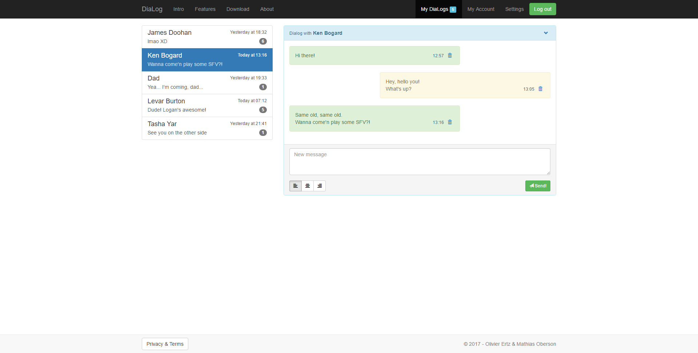

# jQuery - DOM Manipulation

Learn how to use the jQuery library for manipulating the DOM of a WebPage and, thus, creating interactivity.

<!-- slide-include ../../BANNER.md -->

**You will need**

* [Google Chrome][chrome] (recommended, any browser with developer tools will do)
* [Sublime Text][sublime] (recommended, any code editor will do... **except Notepad**)
* [Live-Server][ls] (should already be installed)

**Recommended reading**

* [JavaScript][js]

<!-- START doctoc generated TOC please keep comment here to allow auto update -->
<!-- DON'T EDIT THIS SECTION, INSTEAD RE-RUN doctoc TO UPDATE -->


- [What is this subject?](#what-is-this-subject)
  - [What?](#what)
- [Resources](#resources)

<!-- END doctoc generated TOC please keep comment here to allow auto update -->

## Example file

This subject will use [this `index.html` file][ex-file] as illustration.

Be sure to download it and place it in a new project directory (e.g. `jquery-course`), if you want to try and follow with the examples.

<p class="center"></p>

> Note that this example file includes Bootstrap through a CDN. Feel free to change that to a local link if you'd prefer ([see here][local-bs]).

<!-- slide-front-matter class: center, middle -->

## What is jQuery

<!-- slide-front-matter class: center, middle, image-header -->

<p class='center'></p>

> jQuery is a JavaScript (_hereafter JS_) library created in 2006 by John Resig, and originally designed to ease the creation of client-side JS script, especially regarding DOM manipulation.

> **This slide-deck is based on the `3.1.1` version of jQuery.**
> 
> **As such, some examples could be out-of-date.**

## Include jQuery

To add jQuery in your project, you can include it via a CDN link, in your `index.html` file:

```html
<body>
  ...
  <script src="https://code.jquery.com/jquery-3.1.1.min.js" integrity="sha256-hVVnYaiADRTO2PzUGmuLJr8BLUSjGIZsDYGmIJLv2b8=" crossorigin="anonymous"></script>
</body>
```

You can also [download the latest version][dl-jquery], and save the file in a `js` directory in your project directory. Then, include the file in your `index.html`:

```html
<body>
  ...
  <script type="text/javascript" src="js/jquery-3.1.1.min.js"></script>
</body>
```
> Wait... am I not supposed to put my `<script>` tags in the `<head>`?
> 
> What are they doing right before the closing `</body>` tag?

### Script inclusions

It's considered a good practice to include JS scripts **at the end of your HTML page**.

> When your browser loads the JS, it doesn't just load the file. It also **parses** it.

Parsing the JS files **pauses the load of all other resources**, effectively blocking everythig until the JS has been completely parsed.

> This can result in **slow loading pages**, especially when you have multiple or big scripts.

Plus, loading JS files while the DOM is not forces you to start all your JS scripts with the `window.onlad = function {}` syntax.

> With the `<script>` tag at the end of the HTML file, you can be sure that your JS is loaded **after** the DOM is.

### Add custom script

We will write our JS code in a custom script file.

In the `js` directory insode your project directory, create a new `script.js` and include it at the bottom of your `index.html` page:

```html
<body>
  ...
  <script type="text/javascript" src="js/script.js"></script>
</body>
```
> Be extra-sure to include your custom `script.js` file **after** the inclusion of the jQuery file.

### Test everything

Add the following line in your `script.js` file, and save it:

```js
console.log($("body").jquery);
```
Start your project with `live-server` and access your browser console. You should see the following lines:

```bash
3.1.1
Live reload enabled.
```
> If it's the case, you're good to go. jQuery and your custom script are both correctly include in your project.

## jQuery documentation

Everything that is presented in this slide-deck can also be found in **the jQuery documentation**, along with lot of **examples** and **information**.

We highly recommend that you check it out.

[jQuery Documentation][jq-doc]

<!-- slide-front-matter class: center, middle -->

## The `$` object

The complete jQuery library is accessible in your JS code through the use of the global `$` variable.

> Some other libraries also offers a `$` variable as there main entry-point. That could be the cause for conflict between jQuery and those librairies.

If it's the case, you can use the global `jQuery` variable instead.

To be sure to remove all possible conflicts, you can use the special `.noConflict()` jQuery method at the top of your JS file:

```js
$.noConflict();
// Code that uses other library's $ can follow here.
// But use the jQuery variable to access jQuery's method.
```
> This shouldn't be the case in this course.

## Selecting things

Being a library designed to easily handle DOM manipulation, jQuery allows you to select DOM elements.

The selection functionnality are **quite broad and powerful**, and are based on the **same syntax as CSS selectors**.

To select DOM elements and receive jQuery objects matching the selected elements, use the `$()` function, passing it a selector as parameter

| Selector | CSS example | jQuery | Result |
| :------- | :----- | :---------- | :----- |
| Element  | `p` | `$("p")` | **All** `<p>` elements in the page |
| Id       | `#logo` | `$("#logo")` | **Unique** element with the `logo` id |
| Class    | `.active` | `$(".active")` | **All** elements with a `active` class |

> Using a jQuery selector will always return you an `array` of jQuery objects, event with an Id selector.

### Storing jQuery object

You can obviously store in a variable any jQuery array returned from a call to the `$()` function, for future reference:

```js
var paragraphs = $("p");
console.log(paragraph); // Will print an array with all the "p" in the page.
```
This has **two** main advantages:
* If you selected very specific elements using a **particularly complex selector**, you won't have to type this selector again.
```js
var eles = $("div.theCycle:visible input[type=text].required");
```
* Navigating the DOM is an **expensive operation**; limiting them is always a good thing. Storing the result of a jQuery selection in a variable helps you to do just that.
```js
var parag = $("p");
parag.css("color", "white");
parag.html("Hello World");
parag.hide();
```

## Modifying things

After selecting HTML elements, you will probably want to modify them.

With jQuery, you can do every DOM modification that you can do with pure JS.

That is:

* Create element(s)
* Create new attribute(s) for an element
* Change the content of an element (either text or HTML)
* Add new class(es) to element(s)
* Remove class(es) from element(s)
* Insert element(s) before or after others

### The `text()` method

To change the textual content of an HTML element, that is what's between the opening and the closing tag, you can use the `text()` method, and pass it the new content as parameter.

Let's change all the content of the **badges** in the page.

Remove all the code from your `script.js` file and add this instead:

```js
$(".badge").text("12");
```
> All the badges in the left list should now have the value `12`.

## Resources

**Documentation**

* [jQuery Documentation][jq-doc]
* [List of CSS selectors][css-select]

**Further reading**

[sublime]: https://www.sublimetext.com/
[chrome]: https://www.google.com/chrome/
[js]: ../js
[dl-jquery]: https://code.jquery.com/jquery-3.1.1.min.js
[ex-file]: https://gist.githubusercontent.com/Tazaf/2ca35d60688eec1281fd9546abe1f76a/raw/70c767db08e1e57b7db78df17258739d3ebeea2e/index.html
[jq-doc]: http://api.jquery.com/
[ls]: https://www.npmjs.com/package/live-server
[local-bs]: ../bootstrap-basics/#5
[css-select]: https://www.w3schools.com/cssref/css_selectors.asp

## TODO

* Add `#align-buttons` line 126
* Add `#dialog` line 74

## TOADD

* click()
* $(this)
* children()
* hasClass()
* e.preventDefault()
* blur()
* Select element in sub-scope