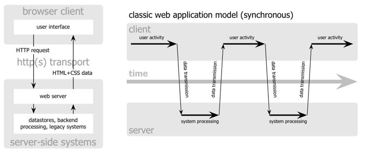
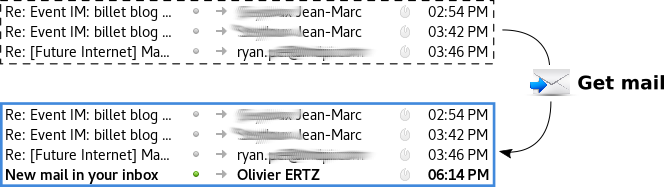
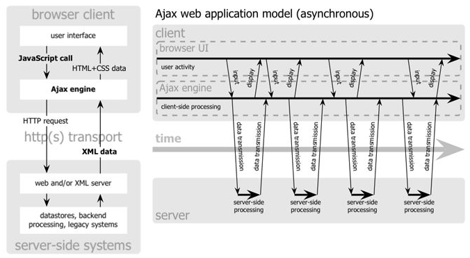

# Asynchronous browser/server interaction

<!-- slide-include ../../BANNER.md -->

We will talk about a technology called **AJAX (Asynchronous JavaScript and XML)** which allows in some ways to improve the user interface behaviour with a good effect on the user experience.

**You will need**

* [Google Chrome][chrome] (recommended, any browser with developer tools will do)
* [Sublime Text][sublime] (recommended, any code editor will do... **except Notepad**)

**Recommended reading**

* [Project setup][projset]
* [Bootstrap][bootstrap]
* [JavaScript][js-bas]
* [DOM API][js-dom]
* [jQuery basics][jq-dom]

<!-- START doctoc generated TOC please keep comment here to allow auto update -->
<!-- DON'T EDIT THIS SECTION, INSTEAD RE-RUN doctoc TO UPDATE -->


<!-- END doctoc generated TOC please keep comment here to allow auto update -->

## AJAX technology

From "classical" web sites (~ 1.0) to "desktop-like" **web applications** (~ 2.0)

* Exchange data between browser and server
  * raw text
  * HTML
  * XML, **JSON**, ...
* Using asynchronous techniques 
  * Dynamic Script Loading
  * **XMLHttpRequest**


* With JavaScript to orchestrate the communication

> Also known as **Single Page Application**

## Classic model



> The page is **fully reconstructed and reloaded** to update the content (quite inefficient) and the user activity is **interrupted, waiting** the end of the action request



## Asynchronous model



> Only **update a part** of the content and the user activity is **not interrupted** (continue to play with UI while update is in progress)  


> The AJAX User eXperience is a key concept of the [web as a platform](https://platform.html5.org/)

## Starting file

This subject will use [this `index.html` file][ajsf] as illustration.
Be sure to download it, if you want to try and follow with the examples.

The basic idea of the following examples is about a user interface allowing to choose among a list of airports of Switzerland so as to get weather observation each time the user click on the button.

<!-- slide-front-matter class: center, middle -->

## Dynamic Script Loading (1)

At first we need to add some interaction with the button, calling a function named `send`, for example like this:

```js
document.onreadystatechange = function () {
    if (document.readyState === "complete") {
        var btn = document.getElementById("get-observation");
        btn.addEventListener("click", send);
    }
};
```

> You can also decide to load the JavaScript at the end of the body ...

## Dynamic Script Loading

Now it's time for a first asynchronous request like this:

```js
function send() {
    var serviceURL = "http://dfa-ogo.rhcloud.com/getWeatherIcaoHTML.php";
    var code = document.getElementById("airportCode").selectedOptions[0].value;
    serviceURL+= "?icao=" + code;

    var DSLScript = document.createElement("script");
    DSLScript.src = serviceURL;
    DSLScript.type = "text/javascript";
    document.body.appendChild(DSLScript);

    document.body.removeChild(DSLScript);
    document.getElementById("status").childNodes[0].data = "Waiting ...";
}

```
* we compose the **web service URL** call with a **GET parameter**
* we **insert a script element** so as to trigger the loading of an instruction
* given that Dynamic script loading is asynchronous, the code **execution can go on**, so we insert a status message in the UI

## Web service, web resource, URL, HTTP GET, POST, ...

Let's already have a look at these slides:

[https://mediacomem.github.io/comem-webdev-docs/2017/subjects/rest/#10](https://mediacomem.github.io/comem-webdev-docs/2017/subjects/rest/#10)

<!-- slide-front-matter class: center, middle -->

## Web resource `getWeatherIcaoHTML`

Let's click the button and nothing happens, except ...

* we can see that a GET request **in the background**

`http://dfa-ogo.rhcloud.com/getWeatherIcaoHTML.php?icao=LSZB`

* we can see an **error**

`ReferenceError: callback is not defined`

* we can see the result of the GET request (a **JavaScript function call**)

```js
callback('<tr><td>Bern / Belp </td><td>16</td><td>29</td><td>clouds and visibility OK</td></tr>')
```

> Something is missing! 

> We need to declare a callback function ...

## Callback function declaration

This is the function which the loaded instruction does order to call

```js
function callback(sMessage) {
    var info = document.getElementById("tableInfo");
    info.insertAdjacentHTML("beforeend", sMessage);

    document.getElementById("status").childNodes[0].data = "Done";
}

```

* as soon as **the script loaded is executed** by the browser (because it was insert in a `<script>` element), it calls the function called `callback`
* it comes with a value parameter which contains some **HTML ready to be inserted in the page** (it is a `<tr>` element)
* `insertAdjacentHTML` is used to insert the new line in the table, at the right place (before end)

> We get some ready to be used HTML which means the **presentation logic is at the server-side**. The data are already tailored!

> First AJAX call ... clap clap clap!

## Web resource `getWeatherIcaoJSONP`

Let's get **only the data** encoded with the **JSON format**.

> Replace the service URL variable like this (and [try it!](http://dfa-ogo.rhcloud.com/getWeatherIcaoJSONP.php?icao=LSZB))

`var serviceURL = "http://dfa-ogo.rhcloud.com/getWeatherIcaoJSONP.php";`

> Replace the callback function like this

```js
function callback(sMessage) {
    var weatherInfo = JSON.parse(sMessage);
    console.log(weatherInfo);                
    displayInfo(weatherInfo);    

    document.getElementById("status").childNodes[0].data = "Done";
}
```
* what we expect is a value parameter of the callback function which contains some JSON, so we parse it
* AJAX with a response built of JSON data encapsulated in a function callback is called _JSON with padding_ aka **JSONP**
* we get only data that we decide to display according to a dedicated function `displayInfo` ...

## Create the HTML user interface

Add the following function to build the user interface so as to tailor the data we received

```js
function displayInfo(info) {
    // clone the hidden row
    var newtr = document.getElementsByClassName("hidden").item(0).cloneNode(true);
    newtr.classList.remove("hidden");

    // feed the new row
    newtr.children[0].childNodes[0].data = info.stationName;
    newtr.children[1].childNodes[0].data = info.temperature;
    newtr.children[2].childNodes[0].data = info.humidity;
    newtr.children[3].childNodes[0].data = info.clouds;

    // append it to the table
    var tbody = document.getElementsByTagName("tbody").item(0);
    tbody.appendChild(newtr);
}
```
> We get only data which means the **presentation logic is at the client-side**. The client has to know how to tailor the data into the existing UI!

## Web resource `getWeatherIcaoJSON`

Dynamic Script Loading is useful but less and less used. When possible, prefer **the ultimate AJAX tool, the `XMLHttpRequest` object**!

> Replace the `send` function like this

```js
function send() {
    // Compose service URL call with a GET parameter
    var serviceURL = "http://dfa-ogo.rhcloud.com/getWeatherIcaoJSON.php";
    var code = document.getElementById("airportCode").selectedOptions[0].value;
    serviceURL+= "?icao=" + code;

    // -- On prépare l'objet XHR
    var xmlhttp = new XMLHttpRequest();
    xmlhttp.open("GET", serviceURL, true);
    xmlhttp.onreadystatechange = callback;
    xmlhttp.send(null);

    // -- Cette technique étant asynchrone, l'interpréteur continue l'exécution des instructions ...
    document.getElementById("status").childNodes[0].data = "Waiting ...";
}
```
> May be you want to try the [getWeatherIcaoJSON](http://dfa-ogo.rhcloud.com/getWeatherIcaoJSON.php?icao=LSZB) web service used here.

## Callback function listener

Everything with JavaScript now! 
* AJAX request is configured using a dedicated `XMLHttpRequest` object (XHR)
* Callback function is a listener we need to configure

> Replace the callback function like this

```js
function callback(evt) {
    console.log("State change => " + this.readyState);

    if (this.readyState === 4 && this.status === 200) {
        var weatherInfo = JSON.parse(this.responseText);
        console.log(weatherInfo);

        displayInfo(weatherInfo);
        document.getElementById("status").childNodes[0].data = "Done";
    }
}
```
* parse the response when the request is [DONE](https://developer.mozilla.org/en-US/docs/Web/API/XMLHttpRequest/readyState) with successful HTTP status, 
* it is stored as raw text in the `responseText` property of the XHR object

## Using jQuery to AJAX

Write less, do more ! Let's see how jQuery help us to manage AJAX. We rewrite everything with jQuery.

>  At first, insert the library like this

```js
<script src="https://code.jquery.com/jquery-3.1.1.min.js"></script>
```
> Then register a click event listener on the button

```js
$(document).ready(function (e) {
    $("#get-observation").click(send);
}); 
``` 
> Let's add an AJAX request:

* there is the [main method][jqajdoc] `jQuery.ajax()` or `$.ajax()` which offers all the possible functionalities. 
* there are [shorthand methods][smsdoc] for the more common and specific types of AJAX requests with even less code - `jQuery.get(), jQuery.getJSON(), jQuery.getScript(), jQuery.post(), .load()`.

## Use of `$.ajax()`

The send() function is completely replaced by this

```js
function send() {
    $.ajax({
        url: "http://dfa-ogo.rhcloud.com/getWeatherIcaoJSON.php",
        method: "GET",
        data: {
            icao: document.getElementById("airportCode").selectedOptions[0].value
        },
        dataType: "json"
    }).done(callbackOk);

    $("#status").text("Waiting ...");
}
```

* `$.ajax` takes an object - it holds properties to configure the AJAX request
 * the service URL and HTTP method
 * the data object whose keys/values are used to complete the request
 * the expected data type of the result 
* we register a function callback which is called when the request terminates successfully (done) 

## Resources

You will find the final HTML file for this course here

**Documentation**

* [XMLHttpRequest Web API][xhr]

[bootstrap]: ../bootstrap
[js-bas]: ../js
[js-dom]: ../js-dom
[jq-dom]: ../jquery-dom
[projset]: ../masrad-project-setup
[chrome]: https://www.google.com/chrome/
[sublime]: https://www.sublimetext.com/
[ajsf]: https://gist.githubusercontent.com/oertz/f5b661e075aa59a326b2d56a4567495d/raw/567a446ecfe951db315c971079e652ee16e66c54/ajax_0
[fef]: https://gist.githubusercontent.com/oertz/164a883774727e34fd9190e6abf84bd2/raw/95374b82a1fd742538dea9f72d9443d3dee5e08d/index.html
[xhr]: https://developer.mozilla.org/en-US/docs/Web/API/XMLHttpRequest
[smsdoc]: https://api.jquery.com/category/ajax/shorthand-methods/
[jqajdoc]: https://api.jquery.com/jQuery.ajax/