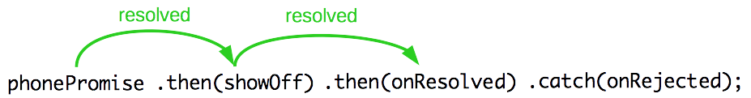
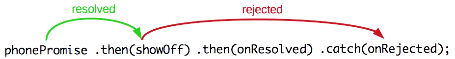
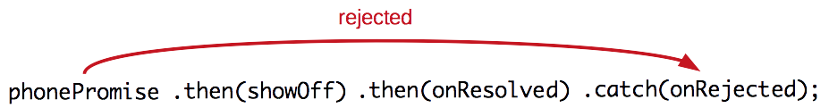
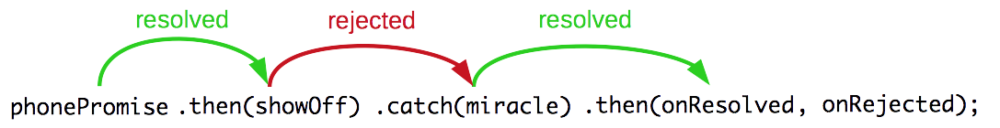
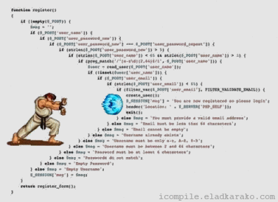
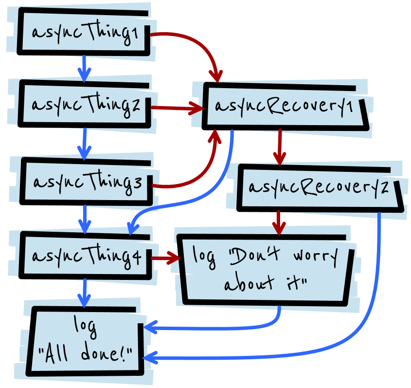
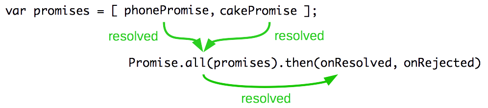
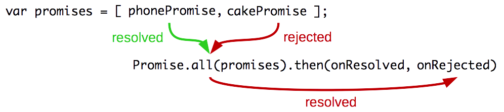

# JavaScript Promises

Learn to use promises for asynchronous computation.

**Recommended reading**

* [JavaScript](../js/)
* [JavaScript Closures](../js-closures/)

<!-- START doctoc generated TOC please keep comment here to allow auto update -->
<!-- DON'T EDIT THIS SECTION, INSTEAD RE-RUN doctoc TO UPDATE -->


- [What is a promise?](#what-is-a-promise)
  - [Asynchronous callback styles](#asynchronous-callback-styles)
  - [Promises/A+ specification](#promisesa-specification)
  - [English, please?](#english-please)
  - [Code, please?](#code-please)
  - [Consuming a promise](#consuming-a-promise)
  - [Promises are resolved with one and only one value](#promises-are-resolved-with-one-and-only-one-value)
- [Chaining promises](#chaining-promises)
  - [Promise resolution procedure](#promise-resolution-procedure)
  - [An example](#an-example)
  - [Resolving promises in chains](#resolving-promises-in-chains)
  - [Rejecting promises in chains](#rejecting-promises-in-chains)
  - [Using `catch()`](#using-catch)
  - [Behavior of a promise chain](#behavior-of-a-promise-chain)
  - [Handling errors in a promise chain](#handling-errors-in-a-promise-chain)
- [Why use promises?](#why-use-promises)
  - [Triumph over the callback hell](#triumph-over-the-callback-hell)
  - [Complex chains](#complex-chains)
- [Asynchronicity](#asynchronicity)
- [Parallel execution](#parallel-execution)
  - [Successful parallel execution](#successful-parallel-execution)
  - [Failed parallel execution](#failed-parallel-execution)
- [Resources](#resources)

<!-- END doctoc generated TOC please keep comment here to allow auto update -->


## What is a promise?

<!-- slide-front-matter class: center, middle -->


> "A promise represents the **eventual result of an asynchronous operation**.
> It is a placeholder into which the **successful result value or reason for failure** will materialize."


### Asynchronous callback styles

There are many asynchronous callback styles.
Some libraries use **custom callbacks**:

```js
function onDone(data) {
  console.log('Data: ' + data);
}
function onFail(xhr) {
  console.warn('Request failed');
}

$.get('http://example.com').done(onDone).fail(onFail);
```

Node.js imposes a well-defined **convention**:

```js
fs.readFile('hello.txt', 'utf-8', function(err, result) {
  if (err) {
    return console.warn(err);
  }

  console.log(result);
});
```


### Promises/A+ specification

Promises are another way to organize asynchronous code.

All promises follow the [Promises/A+ specification](promises-spec).
Basically, a promise is an object with a `then()` function that has the following signature:

```js
promise.then(onResolved, onRejected)
```

It takes **2 callback functions**:

* The **first** one is called when the asynchronous operation is **successful**;
  in this case, we say the promise is **resolved**
* The **second** one is called when the asynchronous operation **failed**;
  in this case, we say the promise is **rejected**

**Only one** of them is called, never both.


### English, please?

<!-- slide-column -->

Imagine you are a **kid**.
Your mom **promises** you that she'll get you a **new phone next week**.

You don't **know** if you will get that phone **until next week**.
Your mom can either **really buy** you a brand new phone, or **stand you up** and withhold the phone if she is not happy.

<!-- slide-column 30 -->


<!-- slide-container -->

That's a promise.
A promise has 3 states; it can be:

* **Pending:** you don't know if you will get that phone until next week
* **Resolved:** your mom really does buy you a brand new phone
* **Rejected:** you don't get a new phone because your mom is not happy


### Code, please?

Here's the same scenario in **ES6** JavaScript:

```js
// Mom might be happy (or not)
var isMomHappy = Math.random() < 0.5;

// Make a promise
// We are given two functions to resolve or reject the promise with
var phonePromise = `new Promise(function(resolve, reject) {`

  var oneWeek = 1000 * 60 * 60 * 24 * 7;

  // In one week...
  setTimeout(function() {
    if (`isMomHappy`) {
      var phone = {
        brand: 'Samsung',
        color: 'black'
      };
*     resolve(phone); // Resolve the promise (if mom is happy)
    } else {
      var reason = new Error('mom is very disappointed');
*     reject(reason); // Reject the promise (if mom is not happy)
    }
  }, oneWeek);
`})`;
```


### Consuming a promise

As we've seen from the specification,
you simply call a promise's `then()` method to be notified when it is resolved or rejected:

```js
function onResolved(phone) {
  console.log("I got a new phone! It's a " + phone.brand);
}

function onRejected(reason) {
  console.log("I didn't get a phone because " + reason);
}

phonePromise.then(onResolved, onRejected);
```

* If a promise is **resolved**, the **first callback** will be called with the **resolved value** (the one passed to `resolve()` in the promise function)
* If a promise is **rejected**, the **second callback** will be called with the **rejection reason** (the one passed to `reject()` in the promise function)

#### Let's try it

You could test this code with an interval to see that the promise is really **pending** until it is either **resolved or rejected**:

```js
var interval = setInterval(function() {
  console.log("I still don't know if I'll get it...");
}, 1000);

function onResolved(phone) {
  console.log("I got a new phone! It's a " + phone.brand);
  clearInterval(interval);
}

function onRejected(reason) {
  console.log("I didn't get a phone because " + reason);
  clearInterval(interval);
}

phonePromise.then(onResolved, onRejected);
```

[See it in action here.][promises-codepen]


### Promises are resolved with one and only one value

**Only one value** can be passed whenusing `resolve()` in a promise.
Additional values will be ignored:

```js
var fruitsPromise = new Promise(function(resolve, reject) {
  resolve('apple', 'banana', 'orange');
});

fruitsPromise.then(console.log); // "apple"
```

If you need to send multiple values to the next callback,
use an **array or object**:

```js
var fruitsPromise = new Promise(function(resolve, reject) {
  resolve([ 'apple', 'banana', 'orange' ]);
});

fruitsPromise.then(console.log); // [ "apple", "banana", "orange" ]
```


## Chaining promises

Promises are chainable; the `then()` function also **returns a promise**:

```js
var promise2 = phonePromise.then(onResolved, onRejected);
```

Will `promise2` be resolved or rejected?
That depends on `phonePromise`, `onResolved` and `onRejected`.

The simplest case is this one:

```js
var promise2 = phonePromise.then();
```

If neither `onResolved` nor `onRejected` is given, `promise2` will have the same state as `phonePromise`
(i.e. it will be resolved if `phonePromise` is resolved, or rejected when `phonePromise` is rejected).


### Promise resolution procedure

What if `phonePromise` is **resolved** and `onResolved` is called?

```js
var promise2 = phonePromise.then(`onResolved`, onRejected);
```

* If `onResolved` returns **a value**, `promise2` will be resolved with that value
* If `onResolved` returns **another promise**, `promise2` will have the same state as that new promise
* If `onResolved` throws an error, `promise2` will be rejected with that error as the reason

Similarly if `phonePromise` is **rejected** and `onRejected` is called:

```js
var promise2 = phonePromise.then(onResolved, `onRejected`);
```

* If `onRejected` returns **a value**, `promise2` will be resolved with that value
* If `onRejected` returns **another promise**, `promise2` will have the same state as that new promise
* If `onRejected` throws an error, `promise2` will be rejected with that error as the reason


### An example

Let's say, you, the kid, **promise** your friend that you will **show them the new phone** when your mom buy you one.
That's another promise.
Let's write it!

```js
function showOff(phone) {
  return new Promise(function(`resolve`, reject) {
    var message = 'Hey friend, I have a new ' +
        phone.color + ' ' + phone.brand + ' phone';

    `resolve`(message);
  });
}
```

Chaining this promise together with the phone promise is as simple as:

```js
function onResolved(result) {
  console.log(result);
}

phonePromise`.then(showOff)`.then(onResolved, onRejected);
```

#### Not calling `reject`

Note that we **didn't call reject** in that second promise:

```js
function showOff(phone) {
  return new Promise(function(`resolve`, reject) {
    var message = 'Hey friend, I have a new ' +
        phone.color + ' ' + phone.brand + ' phone';

    `resolve`(message);
  });
}
```

You **don't have to call both** `resolve()` and `reject()`.
Sometimes, you know things will not fail (like you showing off your new phone to your friend).


### Resolving promises in chains

<!-- slide-column -->

That second promise we wrote looks a bit complicated.
All we're doing is resolving it with a message.

<!-- slide-column 65 -->

```js
function showOff(phone) {
  return new Promise(function(`resolve`, reject) {
    var message = 'Hey friend...';
    `resolve`(message);
  });
}
```

<!-- slide-container -->

<!-- slide-column -->

You can use the `Promise.resolve` shortcut instead.
It will create a promise that is automatically resolved with the passed value.

<!-- slide-column 65 -->

```js
function showOff(phone) {
  var message = 'Hey friend...';
  return `Promise.resolve`(message);
}
```

<!-- slide-container -->

<!-- slide-column -->

Actually, a promise chain will even do that for you **automatically**.

<!-- slide-column 65 -->

```js
function showOff(phone) {
  return 'Hey friend...';
}
```

<!-- slide-container -->

In this promise chain, the 3 `showOff()` functions above are **equivalent**:

```js
phonePromise.then(showOff).then(onResolved, onRejected);
```


### Rejecting promises in chains

<!-- slide-column -->

You could also **always reject** the promise.
Maybe you broke your leg and can't show off.

<!-- slide-column 65 -->

```js
function showOff(phone) {
  return new Promise(function(resolve, `reject`) {
    var reason = new Error('I broke my leg');
    `reject`(reason);
  });
}
```

<!-- slide-container -->

<!-- slide-column -->

You can also use the `Promise.reject` shortcut.

<!-- slide-column 65 -->

```js
function showOff(phone) {
  var reason = new Error('I broke my leg');
  return `Promise.reject`(message);
}
```

<!-- slide-container -->

<!-- slide-column -->

A third way is to simply **throw an error**.
That will **automatically reject the promise**.

<!-- slide-column 65 -->

```js
function showOff(phone) {
  throw new Error('I broke my leg');
}
```

<!-- slide-container -->

In this promise chain, the 3 `showOff()` functions above are **equivalent**:

```js
phonePromise.then(showOff).then(onResolved, onRejected);
```


### Using `catch()`

The `catch()` function is simply a shortcut to plug a **rejection callback** into a promise chain:

```js
phonePromise.then(showOff).then(onResolved)`.catch(onRejected)`;
```

It's equivalent to:

```js
phonePromise.then(showOff).then(onResolved, onRejected);
```

Or to:

```js
phonePromise.then(showOff).then(onResolved).then(undefined, onRejected);
```

But it's easier to read and is similar in behavior to `try/catch`.


### Behavior of a promise chain

We've seen that `then()` returns a promise, which is resolved or rejected depending on the state of the original promise and the result of the callback.

* What happens if you get the phone and successfully show off to your friend?
* What happens if you get the phone but break your leg and can't show off?
* What happens if you don't get the phone?

```js
phonePromise.then(showOff).then(onResolved).catch(onRejected);
```

**What functions are called** in these 3 cases?

#### All's right with the world

Assuming **mom is happy**,
and you didn't break your leg and **successfully showed off** to your friend,
this is what will happen:

<p class='center'></p>

Both `showOff()` and `onResolved()` will be called,
because **each promise** in the chain **is resolved**,
so the **first callback** of the two `then()` calls are executed.

`onRejected()` is **not called**.

Remember, `catch()` is equivalent to this:

```js
phonePromise.then(`showOff`).then(`onResolved`, onRejected);
```

Since everything is resolved, only the **first callback** of each `then()` call is executed.

#### Catching errors in a promise chain

What happens if **mom is happy** and gives you the phone,
but you break your leg and **can't show off** to your friend?

<p class='center'></p>

In this case, `showOff()` is called because `phonePromise` was **resolved**,
but `onResolved()` is **not called**.

`showOff()` was rejected, so the promise returned by `then(showOff)` is rejected as well,
therefore `onResolved()` will not be called.

Instead, the **second callback**, or **the next `catch()`** will be called,
therefore `onRejected()` is called:

```js
phonePromise.then(`showOff`).then(onResolved, `onRejected`);
phonePromise.then(`showOff`).then(onResolved).catch(`onRejected`);
```

#### Early errors in a promise chain

What happens if **you don't get the phone**?

<p class='center'></p>

In this case, `phonePromise` is **rejected**, so `showOff()` will **not be called**,
and the promise returned by `then(showOff)` will **also be rejected**, so `onResolved()` will not be called.

This time, only `onRejected()` is called:

```js
phonePromise.then(showOff).then(onResolved, `onRejected`);
phonePromise.then(showOff).then(onResolved).catch(`onRejected`);
```


### Handling errors in a promise chain

Remember the promise resolution procedure when a promise is **rejected**:

```js
var promise2 = phonePromise.then(onResolved, `onRejected`);
```

* **If `onRejected` returns a value, `promise2` will be resolved with that value**
* **If `onRejected` returns another promise, `promise2` will have the same state as that new promise**
* If `onRejected` throws an error, `promise2` will be rejected with that error as the reason

The first two cases are what interests us.
Even if `phonePromise` is rejected, if `onRejected` returns a **value or promise**,
the new promise returned by `then()` **might still be resolved** instead of rejected.

#### Handling error example

Let's assume `phonePromise` will be **resolved** successfully,
what will be the output of that code?

```js
function showOff(phone) {
  // Throwing an error will reject the promise
  // returned by phonePromise.then(showOff)
  throw new Error('I broke my leg');
}

function miracle(reason) {
  console.warn(reason);
  return "But I'm fine now";
}

function onResolved(result) {
  console.log(result);
}

function onRejected(reason) {
  console.warn(reason);
}

phonePromise.then(showOff).catch(miracle).then(onResolved, onRejected);
```

Will `onResolved()` or `onRejected()` be called?
What will it be called with?

#### Handling error result

The output will be:

```txt
I broke my leg
But I'm fine now
```

The following functions will be called:

<p class='center'></p>

* `phonePromise` is **resolved**, so `showOff()` will be called
* By throwing an error, `showOff()` will **reject** the promise returned by `phonePromise.then(showOff)`,
  so `miracle()` will be called since it's in a `catch()`
* **By returning a value, `miracle()` handles the failure** and the promise returned by `phonePromise.then(showOff).catch(miracle)` will be **resolved**
* Finally, `onResolved()` is called, since the previous promise has been **resolved**


## Why use promises?

<!-- slide-front-matter class: center, middle -->


### Triumph over the callback hell

<!-- slide-column -->

Promises are one solution to the infamous **callback hell** or **pyramid of doom**.

Asynchronous code tends to be **nested** very deeply and be quite difficult to read and maintain.

<!-- slide-column -->



#### Callback hell example

Imagine that you want to do **3 sequential asynchronous operations** with a web service when a new user registers on your website:

* Register a new user
* Log in that user
* Retrieve statistics about that user

With jQuery, you could write it like this:

```js
$.post('/api/users', userData, function(createdUser) {
  $.post('/api/auth', userData, function(authData) {
    var query = { userId: createdUser.id, token: authData.token };
    $.get('/api/stats', query, function(statsData) {
      // Do something with statsData...
    });
  })
})
```

You have to **nest the callbacks** because AJAX requests are asynchronous.

This is pretty deep already, and we're not even handling errors yet.

#### Flatten the pyramid of doom

You could mitigate the issue by separating the calls into isolated functions:

```js
function createUser(userData) {
  $.post('/api/users', userData, function(createdUser) {
    authenticateUser(createdUser);
  });
}

function authenticateUser(createdUser) {
  $.post('/api/auth', userData, function(authData) {
    retrieveUserStats(createdUser, authData);
  });
}

function retrieveUserStats(createdUser, authData) {
  var query = { userId: createdUser.id, token: authData.token };
  $.get('/api/stats', { userId: createdUser.id }, function(statsData) {
    // Do something with statsData...
  });
}

createUser({ name: 'foo', password: 'test' });
```

But now you **don't see a clear call sequence** anymore.
You have to read the whole thing to know that `createUser` calls `authenticateUser`, which itself calls `retrieveUserStats`.
And we're **still not handling errors**.

#### Flatten the pyramid of doom with promises

It just so happens that jQuery AJAX calls also **return promises**:

```js
function createUser(userData) {
  return $.post('/api/users', userData);
}

function authenticateUser(createdUser) {
  return $.post('/api/auth', userData).then(function(authData) {
    return { createdUser: createdUser, authData: authData };
  });
}

function retrieveUserStats(data) {
  var query = { userId: data.createdUser.id, token: data.authData.token };
  return $.get('/api/stats', { userId: createdUser.id });
}

*createUser()
* .then(authenticateUser)
* .then(retrieveUserStats)
* .then(function(statsData) {
*   // Do something with statsData
* }).catch(function(err) {
*   // Any error that occurred at any step in the chain ends up here
* });
```

Now we have **flat code and automatic error handling**.


### Complex chains

This behavior enables complex asynchronous workflows with smart error handling:

<!-- slide-column -->

```js
`asyncThing1`().then(function() {
  return `asyncThing2`();
}).then(function() {
  return `asyncThing3`();
}).`catch`(function(err) {
  return `asyncRecovery1`();
}).then(function() {
  return `asyncThing4`();
}, function(err) {
  return `asyncRecovery2`();
}).`catch`(function(err) {
  console.log("Don't worry about it");
}).then(function() {
  console.log("All done!");
})
```

<!-- slide-column -->



<!-- slide-container -->

Promises are a **powerful abstraction** that make it **easy to compose asynchronous workflows**.


## Asynchronicity

A promise is **always asynchronous**:

```js
function `onResolved`(phone) {
  console.log('I got a ' + phone.brand);
}

console.log('Before promising a phone');

var phonePromise = new Promise(function(`resolve`, reject) {
  // Immediately resolve the promise
  `resolve`({ brand: 'Samsung' });
});

phonePromise.then(`onResolved`);

console.log('After promising a phone');
```

The output of this code will **always** be:

```txt
Before promising a phone
After promising a phone
I got a Samsung
```


## Parallel execution

We've seen how to handle **sequential** asynchronous operations,
but promises also allow you to handle **parallel asynchronous operations**.

The `Promise.all()` method takes an **array of promises** and returns a **new promise**.
This new promise will be resolved **when all the promises in the array have been resolved**.

```js
Promise.all([ promise1, promise2, promise3 ]).then(function(results) {
  console.log(results); // [ result1, result2, result3 ]
}).catch(function(err) {
  // At least one promise was rejected
});
```

It will be resolved with an **array of results** which contains the resolution values of the original promises **in the same order** as they are passed to `Promise.all()`.

If one or more of the original promises is **rejected**,
the new promise **is also rejected** with the same reason as the first promise to be rejected.


### Successful parallel execution

Here's an example of parallel promise execution where **both are resolved**:

```js
var phonePromise = new Promise(function(resolve, reject) {
  resolve({ brand: 'Samsung' });
});

var cakePromise = new Promise(function(resolve, reject) {
  resolve('Yummy');
});

var promises = [ phonePromise, cakePromise ];

Promise.all(promises).then(function(results) {
  console.log(results.length); // 2
  console.log(results[0]); // { brand: 'Samsung' }
  console.log(results[1]); // 'Yummy'
});
```

<p class='center'></p>


### Failed parallel execution

Here's an example of parallel promise execution where **one is rejected**:

```js
var phonePromise = new Promise(function(resolve, reject) {
  resolve({ brand: 'Samsung' });
});

var cakePromise = new Promise(function(resolve, reject) {
  reject(new Error('The cake is a lie'));
});

var promises = [ phonePromise, cakePromise ];

Promise.all(promises).then(function(results) {
  // not called
}).catch(function(err) {
  console.log(err.message); // 'The cake is a lie'
});
```

<p class='center'></p>


## Resources

**Documentation**

* [Promises/A+ specification][promises-spec]
* [Promises][mdn-promises]

**Further reading**

* [JavaScript Promises for Dummies][javascript-promises-for-dummies]
* [JavaScript Promises: an Introduction][javascript-promises-an-introduction]
* [Promise nuggets][promise-nuggets]
* [Aren't promises just callbacks?][arent-promises-just-callbacks]

**Popular promise librairies**

* [Bluebird][bluebird]
* [q][q]


[arent-promises-just-callbacks]: http://stackoverflow.com/questions/22539815/arent-promises-just-callbacks
[bluebird]: http://bluebirdjs.com/docs/getting-started.html
[javascript-promises-an-introduction]: https://developers.google.com/web/fundamentals/getting-started/primers/promises
[javascript-promises-for-dummies]: https://scotch.io/tutorials/javascript-promises-for-dummies
[mdn-promises]: https://developer.mozilla.org/en-US/docs/Web/JavaScript/Reference/Global_Objects/Promise
[promises-codepen]: http://codepen.io/AlphaHydrae/pen/PpJNXb?editors=1010
[promise-nuggets]: https://promise-nuggets.github.io/
[promises-spec]: https://promisesaplus.com
[q]: https://github.com/kriskowal/q
