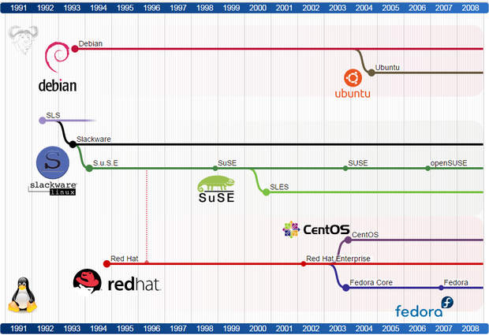

# Linux

Learn the basics of the Linux operating system and how to manage it from the command line.

<!-- slide-include ../../BANNER.md -->

## Unix history

## Linux distribution timeline

<a href='images/linux-distribution-timeline.svg'>Full timeline</a>

