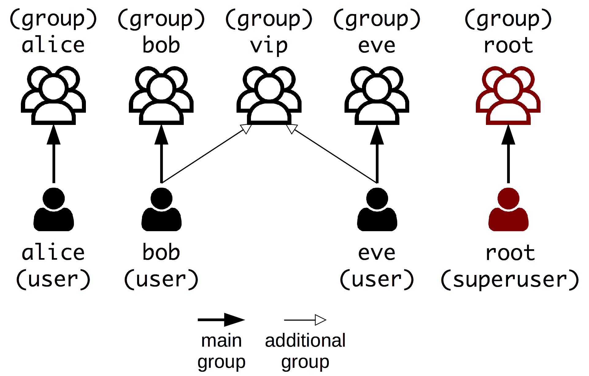

# Linux

Learn the basics of the Linux operating system and how to manage it from the command line.

<!-- slide-include ../../BANNER.md -->


## TODO

* File system, everything is a file
* Users
* Permissions
* Root & sudo, privilege escalation
* Processes (exit codes, signals)
* Ports
* Useful commands
  * Inspect storage, cpu, memory, processes
  * Find files
* Pipes & Unix philosophy
* Output (stdout/stderr, redirection)
* Package management


## Unix history


## Linux distribution timeline

<p class='center'></p>

<p class='center'><a href='images/linux-distribution-timeline.svg'>Full timeline</a></p>


## File system

* supported file systems (vs other platforms)
* only one root
  * mounted drives
* common Linux directories


## Linux users

Linux is a multi-user system (as are all Unix-like operating systems),
meaning that more than one user can have access to the system at the same time.

A **user** is **anyone who uses the system**.
This may be:

* A **person**, like Alice or Bob.
* A **system service**, like a MySQL database or an SSH server.

Linux maintains a list of user accounts representing these people and system services,
each with a different **name** such as `alice`, `bob` or `sshd`.
Each of these user accounts is also identified by a **numerical user ID (or UID)**.

> Note that one person may have multiple user accounts on a Linux system,
> as long as they each have a different name.

### User access

Managing users is done for the purpose of security by limiting access in certain ways, such as file permissions.

The **superuser**, named `root`, has complete access to the system and its configuration.
It is intended for administrative use only.

Linux also has the notion of **groups**.
Much like a user account, a group is identified by a **name** and by a **numerical group ID (or GID)**.

Each user belongs to a **main group**, and can also be **added to other groups**,
which grants that user all privileges assigned to each group.

<!-- slide-column -->

> Linux usually creates a main group for each user, with the same name as the user.
> For example, user `alice` has the `alice` group as its main group.
>
> This provides a quick way of giving `bob` access to `alice`'s files
> by adding him to the `alice` group, if necessary.

<!-- slide-column 45 -->



### Permissions

Someone who logs in on a Linux system can use any file their user account is permitted to access.
Linux determines whether or not a user or group can access a file based on the permissions assigned to it.

There are **three different permissions** for file, directories and executables.
They are represented by one character:

* `r` - Indicates that a given category of user can **read** a file or list a directory.
* `w` - Indicates that a given category of user can **write** to a file or create/delete files in a directory.
* `x` - Indicates that a given category of user can **execute** the contents of a file or **traverse** a directory.

Additionally, the symbol `-` (a hyphen) indicates that no access is permitted.

#### User categories

Each of the three permissions are assigned to three different categories of users:

* `owner` - The **user** who owns the file.
* `group` - The **group** that owns the file.
* `other` - Any user with access to the system.

#### Checking file permissions

When you run the `ls` command with the `-l` option (long format),
you can see the permissions of files:

```bash
$> ls -l
drwxr-xr-x 2 root root 4096 Sep  7 12:16 some-directory
-rwxr-x--- 1 root vip   755 Jan 18  2018 some-executable
-rw-r----- 1 bob  bob   321 Jan 18  2018 some-file
```

The first three columns represent the permissions,
with the first 10-letter column separable into one letter for the type of file,
and three 3-letter groups for owner, group and other permissions respectively:

```
TYPE  OWNER PERMS  GROUP PERMS  OTHER PERMS  OWNER  GROUP
d     rwx          r-x          r-x          root   root   ... some-directory
-     rwx          r-x          ---          root   vip    ... some-executable
-     rw-          r--          ---          bob    bob    ... some-file
```

### User database files

These files define what user accounts and groups are available on a Linux system:

| File           | Contents                                                                                                                                              |
| :---           | :---                                                                                                                                                  |
| `/etc/passwd`  | List of user accounts, as well as their primary group, home directory and default shell (it originally also contained user passwords, hence the name) |
| `/etc/shadow`  | Hashes of user passwords (more secure than storing them in word-readable `/etc/passwd`)                                                               |
| `/etc/group`   | List of groups and their members                                                                                                                      |
| `/etc/gshadow` | Hashes of group passwords (optional), group administrators                                                                                            |

You should **never edit these files by hand**.

Linux provides various **system administration commands** for this purpose, such as `useradd`, `passwd` and `groupadd`.

#### The `/etc/passwd` file

Each line in [`/etc/passwd`][etc-passwd] defines a user account, with data separated by semicolons:

```
jdoe:x:500:500:jdoe:/home/jdoe:/bin/bash
```

* **Username** (`jdoe`) - The name of the user account (used to log in).
* **Password** (`x`) - User password (or `x` if the password is stored in `/etc/shadow`).
* **User ID (UID)** (`500`) - The numerical equivalent of the username.
* **Group ID (GID)** (`500`) - The numerical equivalent of the user's primary group name (often the same as the UID for most users, on a Linux system with default settings).
* **GECOS** (`jdoe`) - Historical field used to store extra information (usually the user's full name).
* **Home directory** (`/home/jdoe`) - The absolute path to the user's home directory.
* **Shell** (`/bin/bash`) - The program automatically launched whenever the user logs in (e.g. on a terminal or through SSH).
  This can be used to prevent some users, like system users, from logging in (e.g. by using `/bin/false` or `/usr/sbin/nologin`).

#### The `/etc/group` file

Each line in [`/etc/group`][etc-group] defines a group, also semicolon-separated:

```
vip:x:512:bob,eve
```

* **Group name** (`vip`) - The name of the group.
* **Group password** (`x`) - Optional group password (or `x` if the password is stored in `/etc/gshadow`).
  If specified, allows users not part of the group to join it with the correct password.
* **Group ID (GID)** (`512`) - The numerical equivalent of the group name.
* **Member list** (`bob,eve`) - A comma-separated list of the users belonging to the group.

#### The shadow files

Both `/etc/passwd` and `/etc/group` must be **readable by anyone** on a Linux system,
because they are used to perform the translation from username to UID and from group name to GID.

It is therefore bad practice to store passwords in these files, even encrypted or hashed.
Any user might copy them to a separate, more powerful infrastructure and attempt to brute-force them.

Therefore, the corresponding shadow files exist:

* [`/etc/shadow`][etc-shadow] stores password hashes for user accounts, and other security-related data such as password expiration dates.
* [`/etc/gshadow`][etc-gshadow] stores password hashes for groups, and other security-related such as who is the group administrator.

These files are only readable by the `root` user
(or any user that belongs to the `root` or `shadow` groups).


## References

* [Introduction to System Administration (Red Hat Enterprise Linux 4)](https://access.redhat.com/documentation/en-US/Red_Hat_Enterprise_Linux/4/html/Introduction_To_System_Administration/)


[etc-group]: https://access.redhat.com/documentation/en-US/Red_Hat_Enterprise_Linux/4/html/Introduction_To_System_Administration/s3-acctspgrps-group.html
[etc-gshadow]: https://access.redhat.com/documentation/en-US/Red_Hat_Enterprise_Linux/4/html/Introduction_To_System_Administration/s3-acctsgrps-gshadow.html
[etc-passwd]: https://access.redhat.com/documentation/en-US/Red_Hat_Enterprise_Linux/4/html/Introduction_To_System_Administration/s2-acctsgrps-files.html
[etc-shadow]: https://access.redhat.com/documentation/en-US/Red_Hat_Enterprise_Linux/4/html/Introduction_To_System_Administration/s3-acctsgrps-shadow.html
