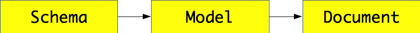

# Mongoose

<!-- slide-include ../../BANNER.md -->

<!-- START doctoc generated TOC please keep comment here to allow auto update -->
<!-- DON'T EDIT THIS SECTION, INSTEAD RE-RUN doctoc TO UPDATE -->


- [MongoDB Node.js driver](#mongodb-nodejs-driver)
  - [Usage](#usage)
  - [MongoDB client API](#mongodb-client-api)
  - [Should I use it?](#should-i-use-it)
- [What is Mongoose?](#what-is-mongoose)
  - [Object-Document Mapper (ODM)](#object-document-mapper-odm)
  - [Mongoose validations](#mongoose-validations)
  - [Unique constraints](#unique-constraints)
  - [Mongoose queries](#mongoose-queries)
  - [Debugging](#debugging)
  - [Should I use it?](#should-i-use-it-1)
- [Resources](#resources)

<!-- END doctoc generated TOC please keep comment here to allow auto update -->


## MongoDB Node.js driver

<!-- slide-front-matter class: center, middle -->

The official MongoDB driver for Node.js


### Usage

The native Node.js client is an npm package:

```bash
$> npm install mongodb --save
```

You can then connect to your MongoDB database:

```js
const MongoClient = require('mongodb').MongoClient;

// Connection URL
const url = 'mongodb://localhost:27017/myproject';

// Use connect method to connect to the Server
MongoClient.connect(url, function(err, db) {
  if (err) {
    console.warn('Could not connect to database because: ' + err.message);
  } else {
    console.log('Connected to MongoDB');

    // Do something with "db"...

    db.close();
  }
});
```


### MongoDB client API

This client provides a [similar API][collection-api] to the MongoDB shell:

```js
collection.insertOne(document, options, callback)
collection.find(query)
collection.updateMany(query, update, options, callback)
collection.deleteOne(query, options, callback)
collection.createIndex(fields, options, callback)
```

For example, to insert a document:

```js
const person = {
  name: 'John Doe',
  age: 42
};

db.collection('people').insertOne(person, function(err, commandResult) {
  if (err) {
    console.warn('Could not insert person: ' + err.message);
  } else {
    console.log('Inserted ' + commandResult.insertedCount + ' person');
    db.close();
  }
});
```

#### Finding documents

To find documents:

```js
db.collection('people')
  .find({ 'age': { '$gt': 18 },  'phone.type': 'professional' })
  .skip(40)
  .limit(20)
  .project({ 'name': 1 })
  .toArray(function(err, people) {
    if (err) {
      console.warn('Could not fetch people because: ' + err.message);
    } else {
      console.log('Found ' + people.length + ' people');
      db.close();
    }
  })
```


### Should I use it?

<!-- slide-column -->

**Advantages**

* Similar API to MongoDB (the names are almost the same, e.g. `insert` vs `insertOne/insertMany`)
* You use the MongoDB query language directly

<!-- slide-column -->

**Disadvantages**

* Very low level
  * No serialization and deserialization of objects
  * No validation
* No connection abstraction (you must manage the connections yourself; no pool)

<!-- slide-container -->

**Alternatives**

* [Camo][alt-camo]: a class-based ES6 ODM for Mongo-like databases
* [Mongoose][mongoose]: elegant MongoDB object modeling for Node.js
* [Waterline][alt-waterline]: an adapter-based ORM for Node.js with support for MySQL, MongoDB, Postgres, Redis, and more


## What is Mongoose?

<!-- slide-front-matter class: center, middle, image-header -->

<p class='center'></p>

> "Mongoose provides a straight-forward, **schema-based** solution to **model** your application data. It includes built-in **type casting, validation, query building**, business logic hooks and more, out of the box."


### Object-Document Mapper (ODM)

Mongoose **maps JavaScript objects to MongoDB documents**, much like an Object-Relational Mapper (ORM) maps objects to relational database tables.

<p class='center'></p>

* Everything in Mongoose starts with a [Schema][mongoose-guide]:
  each schema maps to a MongoDB collection and defines the **shape of the documents** within that collection
* [Models][mongoose-model] are fancy **constructors** compiled from our Schema definitions
* Mongoose [Documents][mongoose-document] represent a one-to-one mapping to **documents** as stored in MongoDB:
  each document is an instance of its Model

<!-- slide-notes -->

ORM examples: Hibernate (Java), Active Record (Ruby), SQLAlchemy (Python).

#### Connect to the database

Simply call `mongoose.connect()`:

```js
const mongoose = require('mongoose');
mongoose.connect('mongodb://localhost/myproject');
```

Notice that you don't have to specify a callback.
Mongoose will start connecting and delay your first requests until it is done.
It will also automatically create and manage a **connection pool** for you.

#### Create a schema

The schema defines the shape of the documents you want to save:

```js
const mongoose = require('mongoose');
const `Schema` = mongoose.Schema;

// Define a schema
const blogSchema = `new Schema`({
  title: String,
  body: String,
  date: { type: Date, default: Date.now  }, // Default value
  comments: [ // Nested array of documents
    {
      body: String,
      date: Date
    }
  ],
  meta: { // Nested document
    votes: Number,
    favs: Number
  }
});
```

#### Create a model

Once you have your schema, you can create a model to link that schema to a MongoDB collection:

```js
const mongoose = require('mongoose');
const Schema = mongoose.Schema;

// Define a schema
const blogSchema = new Schema({
  // ...
});

// Create a model
*mongoose.model('Blog', blogSchema);
```

`mongoose.model()` takes a **singular** name, but will then look for a collection with the **lowercase, plural version** of that name in the MongoDB database.
In this case, the model will store documents in the `blogs` collection (not `Blog`).

You can also choose your own collection name if you prefer:

```js
mongoose.model('Blog', blogSchema, 'awesome-blog-collection');
```

#### Create a document

The model is a **constructor** that you can use to create documents:

```js
// Retrieve the model from another file
const `Blog` = mongoose.model('Blog');

// Create a document with it
let blog = `new Blog`({
  title: 'Teaching Mongoose',
  body: 'So cool',
  comments: [
    { body: 'orly?', date: new Date(2015, 10, 20, 15, 14) },
    { body: 'yarly', date: new Date(2015, 10, 20, 15, 17) }
  ],
  meta: {
    votes: 0,
    favs: 3
  }
});
```

#### Saving documents

Once you have your document, you can insert or update it with `save()`:

```js
let blog = new Blog({
  // ...
});

`blog.save`(function(err) { // This will insert a new document
  if (err) {
    return console.warn('Could not save blog because: ' + err.message);
  }
  console.log('Saved blog');

  blog.meta.votes = 5; // Update something

  `blog.save`(function(err, updatedBlog) { // This will update the document
    if (err) {
      return console.warn('Could not save blog because: ' + err.message);
    }

    console.log('Updated blog');
  });
});
```

The first time, your blog document has no `_id` so Mongoose will **insert** it.
The second time, Mongoose has added the `_id` to the document object, so it
knows that it exists and should be **updated** instead.


### Mongoose validations

Mongoose schemas have build-in validations:

```js
const personSchema = new Schema({
  name: {
    type: String, // Type validation
    required: true, // Mandatory
    minlength: [ 3, 'Name is too short' ], // Minimum length
    maxlength: 20 // Maximum length
  },
  address {
    city: {
      type: String,
      required: true
    }
  },
  honorific: {
    type: String,
    enum: [ 'Mr', 'Mrs', 'Ms', 'Dr' ] // Limit valid values
  },
  age: {
    type: Number,
    min: 0, // Minimum value
    max: 122 // Maximum value
  },
  interests: [{ type: String, maxlength: 10 }]
});
```

#### Handling validations

The callback passed to `save()` will receive an error if validations fail:

```js
let person = new Person({
  name: 'Bo',
  age: -4,
  honorific: 'Great'
});

person.save(function(err) {
  if (err) {
*   if (err.name == 'ValidationError') {
*     console.log(err.errors);
*     // {
*     //   "honorific": { "message": "'Great' is not a valid enum value" },
*     //   "age": { "message": "Path 'age' (-4) is less than minimum" },
*     //   "name": { "message": "Name is too short" }
*     // }
*     return console.warn('Person is invalid');
    } else {
      return console.warn('Could not save person because: ' + err.message);
    }
  }

  console.log('Person is valid');
});
```

#### Custom validations

You can also write your own validators.

For example, this validates that the `name` property of users is in lower case:

```js
const userSchema = new Schema({
  name: {
    type: String,
*   validate: {
*     // Returns true if the name is valid (in lower case)
*     validator: function(value) {
*       return value.toLowerCase() == value;
*     },
*     // Custom error message
*     message: '{VALUE} is not in lower case'
*   }
  }
});
```


### Unique constraints

Simply add the `unique: true` property to the schema property you want to be unique:

```js
const personSchema = new Schema({
  name: {
    type: String,
    required: true,
    minlength: [ 3, 'Name is too short' ],
    maxlength: 20,
    `unique`: true
  },
  // ...
});
```

To create a unique index on **multiple fields**, use `index()` on the schema:

```js
`personSchema.index`({ name: 1, age: 1  }, { unique: true });
```


### Mongoose queries

You can make MongoDB queries with the `find()` or `findOne()` methods of Mongoose models:

```js
Person
* .find({
*   name: /arnold/i,
*   'address.city': 'Los Angeles',
*   age: { $gt: 17, $lt: 80 },
*   interests: { $in: ['shooting', 'talking'] }
* })
  .limit(10)
  .sort({ name: -1 })
  .select({ name: 1, address: 1 })
  .exec(function(err, people) {
    if (err) {
      return console.warn('Could not find people because: ' + err.message);
    }

    console.log('Found ' + people.length + ' people');
  });
```

#### Query builder

You can also use chainable query methods:

```js
Person
  .find()
* .where('name', /arnold/i)
* .where('address.city').equals('Los Angeles')
* .where('age').gt(17).lt(80)
* .where('interests').in(['shooting', 'talking'])
  .limit(10)
  .sort('-name')
  .select('name address')
  .exec(function(err, people) {
    if (err) {
      return console.warn('Could not find people because: ' + err.message);
    }

    console.log('Found ' + people.length + ' people');
  });
```

#### Counting documents

Use `count()` instead of `exec()` at the end of your query builder to count the matching documents:

```js
Person
  .find()
  .where('name', /arnold/i)
  .where('address.city').equals('Los Angeles')
  .where('age').gt(17).lt(80)
  .where('interests').in(['shooting', 'talking'])
  .count(function(err, total) {
    if (err) {
      return console.warn('Could not count people because: ' + err.message);
    }

    console.log('There are ' + total + ' people matching the criteria');
  });
```


### Debugging

Sometimes you want to see the queries Mongoose is sending to the database:

```js
mongoose.set('debug', true);
```

You will then see them in your CLI log:

```txt
Mongoose: people.find({
  name: /arnold/,
  'city.address': 'Los Angeles',
  age: { '$gt': 17, '$lt': 66 },
  interests: { '$in': [ 'shooting', 'talking' ] }
}, {
  limit: 10,
  sort: { occupation: -1 },
  fields: { name: 1, occupation: 1 }
})
```


### Should I use it?

<!-- slide-column -->

**Advantages**

* Schemas
* Validations
* Complex query building
* Connection pooling

<!-- slide-column -->

**Disadvantages**

* Additional abstraction layer between you and the database

<!-- slide-container -->

Mongoose uses the **native Node.js client** under the hood, and you can even access it **directly** if need be:

```js
const Blog = mongoose.model('Blog');

Blog.collection.insertOne({ foo: 'bar' }, function(err, commandResult) {
  if (err) {
    return console.warn('Could not insert blog because: ' + err.message);
  }

  console.log(commandResult.insertedCount + ' documents inserted');
});
```


## Resources

* MongoDB Node.js client
  * [Collection API][collection-api]

* Mongoose
  * [Getting started][mongoose-getting-started]
  * [Guide][mongoose-guide]
  * [API documentation][mongoose-api]


[alt-camo]: https://www.npmjs.com/package/camo
[alt-waterline]: https://github.com/balderdashy/waterline
[collection-api]: http://mongodb.github.io/node-mongodb-native/2.2/api/Collection.html
[mongoose]: http://mongoosejs.com
[mongoose-api]: http://mongoosejs.com/docs/api.html
[mongoose-document]: http://mongoosejs.com/docs/documents.html
[mongoose-getting-started]: http://mongoosejs.com/docs/index.html
[mongoose-guide]: http://mongoosejs.com/docs/guide.html
[mongoose-model]: http://mongoosejs.com/docs/models.html
