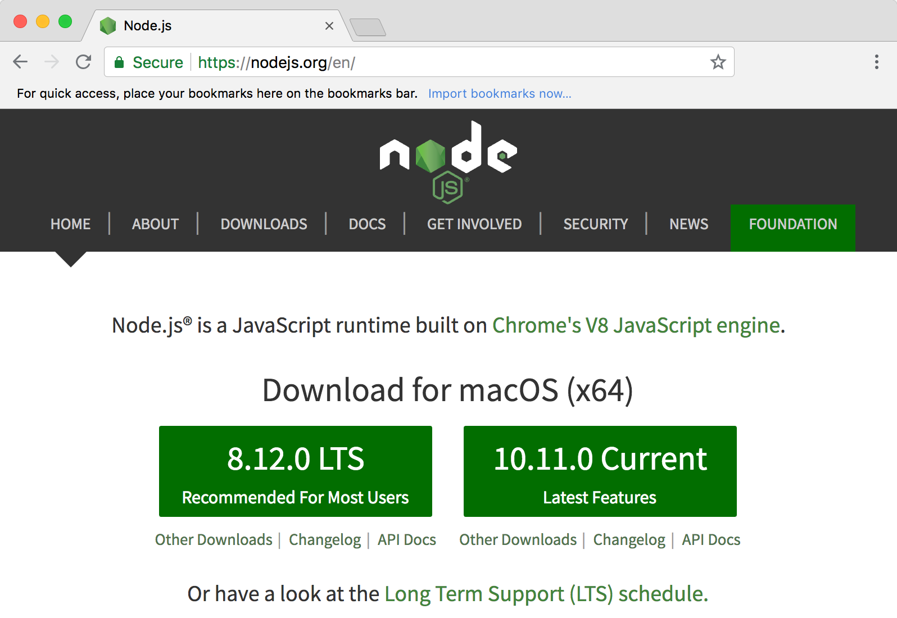
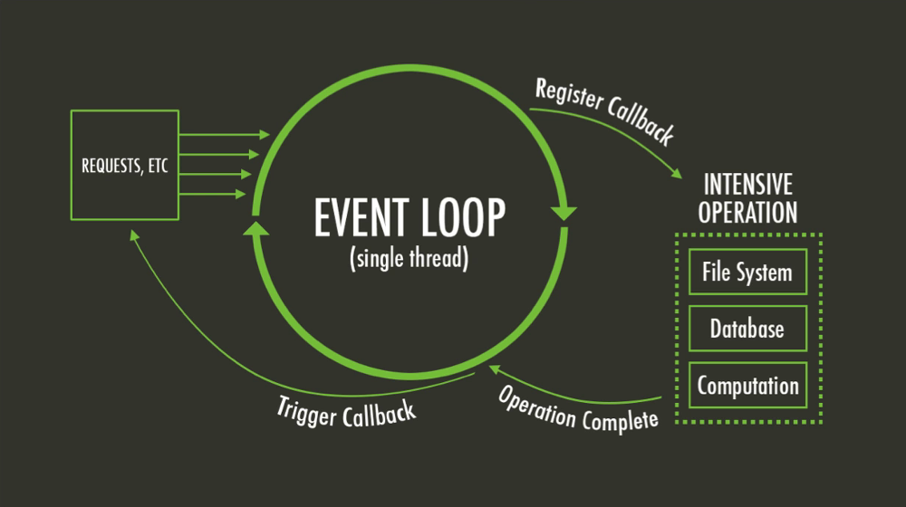

# Node.js Introduction

<!-- START doctoc generated TOC please keep comment here to allow auto update -->
<!-- DON'T EDIT THIS SECTION, INSTEAD RE-RUN doctoc TO UPDATE -->


- [What is Node.js?](#what-is-nodejs)
- [Asynchronous](#asynchronous)
- [A synchronous example](#a-synchronous-example)
- [An asynchronous example](#an-asynchronous-example)
- [Node.js callback convention](#nodejs-callback-convention)
- [List of Node.js modules](#list-of-nodejs-modules)
- [Another example (http)](#another-example-http)
- [HTTP module events](#http-module-events)
- [Node.js event loop](#nodejs-event-loop)
- [Node.js event loop](#nodejs-event-loop-1)
- [Resources](#resources)

<!-- END doctoc generated TOC please keep comment here to allow auto update -->


## What is [Node.js][node]?

<!-- slide-front-matter class: center, middle -->

> "Node.js is an **asynchronous JavaScript runtime** built on Chrome's V8 JavaScript engine.
> Node.js uses an **event-driven**, **non-blocking I/O** model that makes it lightweight and efficient."


### Installation

<p class='center'></p>


### Which Node.js version to choose?

<p class='center'></p>

* Odd-numbered versions (e.g. v5, v7) are **unstable** releases with the latest features, and will **no longer be supported after 6-9 months**.
* Even-numbered versions (e.g. v4, v6) have **long term support (LTS)**.
  They are actively developed for 6 months.
  They are supported for 18 months after that.
  They are still maintained (e.g. security fixes) for 12 months after that.
  So they are **supported for 36 months**.


## Synchronous vs. Asynchronous

<!-- slide-front-matter class: center, middle -->


### Synchronous code

Basic JavaScript code is synchronous.

It means that only one command or function can be executed at a time.

```js
function getRandomNumber() {
  return Math.random();
}

console.log('Hello');

var result = getRandomNumber();

console.log('Result: ' + result);
console.log('End of program');
```

Code executes **sequentially**:

```txt
Hello
Result: 0.12438
End of program
```

The call to `getRandomNumber()` blocks the thread until its execution is complete.


### Asynchronous code

With asynchronous code, some operations are executed **in parallel**.

```js
var fs = require('fs');

console.log('Hello');

fs.readFile('random.txt', { encoding: 'utf-8' }, function(err, result) {
  console.log('Result: ' + result);
  console.log('Done');
});

console.log('End of program');
```

Code execution is **not sequential**:

```txt
Hello
End of program
Result: 0.581
Done
```

How does this work?


### Non-blocking I/O

The signature of `fs.readFile` is:

```
  fs.readFile(file[, options], callback)
```

The third argument is a **callback function**:

* With synchronous code, the call blocks the thread until it is done.
* With asynchronous code, the rest of the code keeps executing, and `fs.readFile`
  will **call you back** when it is done.

Under the hood, Node.js will read the file in a separate thread,
then execute your callback function when it's ready.


### Your Node.js code is single-threaded

Although I/O operations are non-blocking, **your code always executes in a single thread**:

```js
var value = 1;

fs.readFile('five.txt', { encoding: 'utf-8' }, function(err, result) {
  value = value + parseFloat(result);
});

value = value * 2;
console.log(value);
```

This will always log **7** (i.e. (1 * 2) + 5).

Even if the file is read instantaneously and the contents of the file is ready immediately,
Node.js **guarantees** that `value = value * 2` will be executed first.

Callback functions will always wait for the blocking code to finish executing.


### The event loop

This is the mechanism that enables the behavior in the previous slides:



???

* Event loop:
  * Run the initial script (which will register callbacks)
  * Get the next event in the queue
  * Invoke the registered callbacks in sequence
  * Delegate I/O operations to the Node platform (in separate, non-blocking threads)


### Other event-driven, non-blocking I/O architectures

Similar mechanisms are used in other frameworks and tools:

* [Event Machine][event-machine] (Ruby event-processing library)
* [nginx][nginx] (web server written in C with an event-driven architecture)
* [Twisted][twisted] (Python event-driven networking engine)


## Node.js callback convention

Node.js callback functions usually have this signature:

```
  function(err, result)
```

There are two ways that the function can be called back:

1. The operation **failed**:
  * `err` contains an error describing the problem
  * `result` is `null` or `undefined`

2. The operation **succeeded**:
  * `err` is `null` or `undefined`
  * `result` contains the result of the operation


### **Always** check for errors

You should never forget to check for errors:

```js
fs.readFile('name.txt', { encoding: 'utf-8' }, function(err, data) {
* if (err) {
*   console.warn('Oops, could not read the file because: ' + err.message);
*   return;
* }

  console.log('Hello ' + data);
});
```

If you forget to check `err`, this code could log `Hello undefined` if the operation fails (e.g. the file doesn't exist, is corrupt, etc).

Do not forget the `return` either, or use `else`, to ensure that your "success" code is not run when an error occurs.


## Node.js core modules

<!-- slide-front-matter class: center, middle -->


## Node.js has many modules out of the box

<!-- slide-column 30 -->

* Assertion Testing
* Buffer
* C/C++ Addons
* **Child Processes**
* Cluster
* Command Line Options
* Console
* **Crypto**
* Debugger
* DNS
* Domain
* Errors

<!-- slide-column 30 -->

* **Events**
* **File System**
* Globals
* **HTTP**
* **HTTPS**
* Modules
* Net
* OS
* **Path**
* **Process**
* Punycode
* Query Strings

<!-- slide-column 30 -->

* Readline
* REPL
* Stream
* String Decoder
* Timers
* TLS/SSL
* TTY
* UDP/Datagram
* URL
* Utilities
* V8
* VM
* ZLIB


## Another example (http)

```js
/*global require */

var http = require("http");

/**
 * This function starts a http daemon on port 9000. It also
 * registers a callback handler, to handle incoming HTTP
 * requests (a simple message is sent back to clients).
 */
function runHttpServer() {
  var server = http.createServer();

  server.on("request", function (req, res) {
    console.log("A request has arrived: URL=" + req.url);
    res.writeHead(200, {
      'Content-Type': 'text/plain'
    });
    res.end('Hello World\n');
  });

  console.log("Starting http server...");
  server.listen(9000);
}

runHttpServer();
```

* We use a standard Node module that takes care of the HTTP protocol.
* Node can provide us with a ready-to-use server.
* We can attach event handlers to the server. Node will notify us asynchronously, and give us access to the request and response.
* We can send back data to the client.
* We have wired everything, let’s welcome clients!


## HTTP module events

Screenshot of http docs

* These are events that are emitted by the class. You can write callbacks and react to these events.


## Resources

* Understanding the Node.js Event Loop
  http://strongloop.com/strongblog/node-js-event-loop/
* Mixu's Node book: What is Node.js? (chapter 2)
  http://book.mixu.net/node/ch2.html
* Node.js Explained, video
  http://kunkle.org/talks/


[event-machine]: http://rubyeventmachine.com
[nginx]: https://www.nginx.com
[node]: https://nodejs.org/en/
[twisted]: http://twistedmatrix.com/trac/
