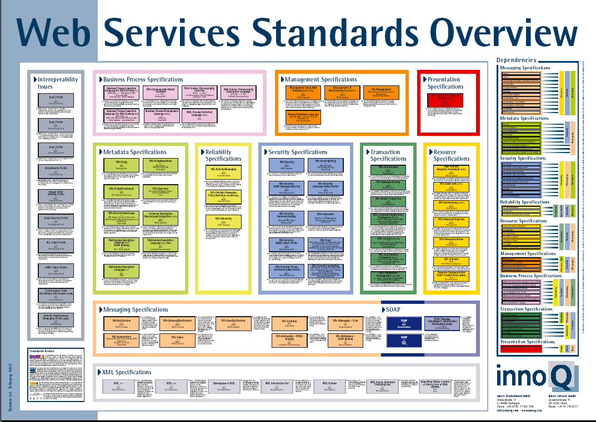

# REST APIs Introduction

<!-- START doctoc -->
<!-- END doctoc -->

## What is a Web Service?

How do they...
...find each other?
...know what logic can be invoked?
...talk to each other?

Image: clients <-> network <-> server (logic + data)

Remote services (RMI) in Java?

## Big web services

### Web services standards overview

<p class='center'></p>

### Big web services

Approach
Services are often designed and developed with a RPC style (even if Document-Oriented Services are possible).

Core Standards
Simple Object Access Protocol (SOAP)
Web Services Description Language (WSDL)

Benefits
Very rich protocol stack (support for security, transactions, reliable transfer, etc.)

Problem
Very rich protocol stack (complexity, verbosity, incompatibility issues, theoretical human readability, etc.)

## RESTful web services

* REST: REpresentational State Transfer
* REST is an architectural style for building distributed systems.
* REST has been introduced in Roy Fielding’s Ph.D. thesis (Roy Fielding has been a contributor to the HTTP specification, to the apache server, to the apache community).
* The WWW is one example for a distributed system that exhibits the characteristics of a REST architecture.

### Principles of a REST architecture

* The state of the application is captured in a set of resources
  * Users, photos, comments, tags, albums, etc.
* Every resource is identified with a standard format (e.g. URL)
* Every resource can have several representations
* There is one unique interface for interacting with resources (e.g. HTTP methods)

### References

* Very good article, with presentation of key concepts and illustrative examples:
  http://www.infoq.com/articles/rest-introduction
* Suggestions for the design of “pragmatic APIs”
  http://www.vinaysahni.com/best-practices-for-a-pragmatic-restful-api

### HTTP is a protocol for interacting with **resources**

* At first glance, one could think that a resource is a file on a web server:
  * an HTML document, an XML document, a PNG document
* That fits the vision of the “static content” web
* But of course, the web is now more than a huge library of hypermedia documents:
  * through the web, we interact with services and a lot of the content is dynamic.
  * more and more, through the web we interact with physical objects (machines, sensors, actuators)
  * We need a more generic definition for resources!

### What is a resource?

* A resource is "something" that can be named and uniquely identified:
  * Example 1: an article published in the "24 heures" newspaper
  * Example 2: the collection of articles published in the sport section of the newspaper
  * Example 3: a person’s resume
  * Example 4: the current price of the Nestlé stock quote
  * Example 5: the vending machine in the school hallway
  * Example 6: the list of grades of the student Jean Dupont
* URL (Uniform Resource Locator) is a mechanism for identifying resources
  * Example 1: http://www.24heures.ch/vaud/vaud/2008/08/04/trente-etudiants-partent-rencontre-patrons
  * Example 2: http://www.24heures.ch/articles/sport
  * Example 5: http://www.smart-machines.ch/customers/heig/machines/8272

### Resource vs. representation

* A "resource" can be something intangible (stock quote) or tangible (vending machine)
* The HTTP protocol supports the exchange of data between a client and a server.
* Hence, what is exchanged between a client and a server is not the resource. It is a representation of a resource.
* Different representations of the same resource can be generated:
  * HTML representation
  * XML representation
  * PNG representation
  * WAV representation

### HTTP provides the **content negotiation** mechanisms

```http
GET /books HTTP/1.1
Accept: application/json
```

```http
HTTP/1.1 200 OK
Content-Type: application/json

[
  { "title": "Fahrenheit 451" }
]
```

```http
GET /article/game-of-thrones HTTP/1.1
Accept: */*
```

```http
HTTP/1.1 200 OK
Content-Type: text/html

<html>
  <head>
    <title>Game of Thrones</title>
  </head>
  <body>Awesome show!</body>
</html>
```

### Languages, platforms, communities

* Client vs. server...
* Frameworks...
* Full JavaScript...
* Specific tools we will use: node, express, mongodb, mongoose
