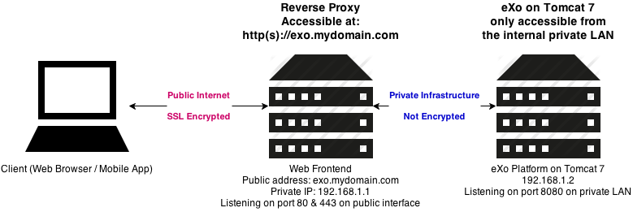

# Reverse Proxying

Learn about reverse proxying and load balancing, and put it in practice using nginx.

<!-- slide-include ../../BANNER.md -->

<!-- START doctoc -->
<!-- END doctoc -->

## What is a proxy?

<!-- slide-front-matter class: center, middle -->

> A [**proxy server**][proxy] is a computer or application that acts as an **intermediary** for requests from clients seeking resources from other servers.

### Types of proxy servers

There are 3 main kinds of proxy servers:

* A [**tunneling proxy**][tunneling-proxy] or [**gateway**][gateway] passes **unmodified requests and responses** from a client to a server.
* A [**forward proxy**][open-proxy] is used to retrieve data from a server usually on the Internet.
* A [**reverse proxy**][reverse-proxy] is an **internal-facing proxy** used to control and protect access to servers in a **private network**.

#### Tunneling proxy

A [tunneling proxy][tunneling-proxy] can pass **unmodified requests and responses** from one network to another.
It can also be used to encapsulate a protocol into another, such as running IPv6 over IPv4.

<!-- slide-column -->

For example, an SSH connection may be relayed by a proxy server to a different target server.
The proxy server simply passes the packets through, with no ability to compromise the security of the communication.

<!-- slide-column -->

<!-- slide-container -->

[**Virtual private networks (VPN)**][vpn] use tunneling protocols, usually with an additional layer of encryption.

#### Forward proxy

A **forward proxy** retrieves data from a server on behalf of a client.

<!-- slide-column -->

An [**open proxy**][open-proxy] is a forward proxy accessible by any Internet user.
It can be either **anonymous** or **transparent**.

##### Anonymous or transparent

<!-- slide-column -->

An **anonymous forward proxy** reveals its identity as a server but conceals that of the client.
Since the target server does not know who the original client is, it can be used to protect privacy.
[VPNs][vpn] are often used in combination with this type of proxy server.

A **transparent forward proxy** identifies both itself and the original client through the use of HTTP headers.
It can be used to cache websites.

Schools often use this kind of proxy to restrict access to particular websites (e.g. Facebook).

<!-- slide-column -->

<!-- slide-container -->

When many clients go through the same forward proxy server, its IP address may get banned,
since the target server only sees one computer (the proxy) making too many requests at the same time.

#### Reverse proxy

A [**reverse proxy**][reverse-proxy] is a server that **appears to clients to be an ordinary server**,
but actually **transmit their requests to** one or more **other servers in an internal private network** which handle the requests.

<!-- slide-column -->

The response from the private server is returned as if it was coming from the proxy server itself,
leaving the client with no knowledge of the structure of the internal network.

<!-- slide-column -->

## Why use a reverse proxy?

<!-- slide-front-matter class: center, middle -->

### Hiding internal architecture

Reverse proxies can **hide the existence and characteristics of an internal network's private servers**.
Since the client only sees the proxy server, it is unaware of the complexity of the internal architecture
and does not have to worry about it.

In a scenario where you have only a single public IP address available,
a reverse proxy allows you to make multiple private servers accessible on that IP address through the proxy server.

### Hiding multi-component websites

Modern websites can be complex applications, often with a **separate frontend and backend** developed by different teams with different technologies.
Putting a reverse proxy in front can make it **appear as one single website** on a single domain name, avoiding [CORS][cors] issues.

### SSL termination

Managing SSL certificates to provide websites over HTTPS is rather complex.
It can be hard to configure some frameworks or tools to ensure they are only using secure communications.

A reverse proxy can help by being the **secure endpoint** with all the SSL certificates,
then **forwarding unencrypted requests** to the servers or applications in the private network.

### Scalability

[Scalability][scalability] is the capability of a server, for example, to handle a growing amount of work, such as many clients making requests at the same time.

<!-- slide-column -->

There are 2 broad ways of adding more resources for a particular application.

<!-- slide-column 60 -->

### Load balancing

## TODO

* Reverse proxying
  * Uses
    * Hide origin server, avoid cors
    * SSL termination
    * Load balancing
    * Caching
    * Compression
    * Spoon-feeding
    * Authentication
  * Vertical vs. horizontal scalability
* Nginx configuration syntax

[cors]: https://en.wikipedia.org/wiki/Cross-origin_resource_sharing
[gateway]: https://en.wikipedia.org/wiki/Gateway_(telecommunications)
[horizontal-and-vertical-scaling]: https://en.wikipedia.org/wiki/Scalability#Horizontal_and_vertical_scaling
[open-proxy]: https://en.wikipedia.org/wiki/Open_proxy
[proxy]: https://en.wikipedia.org/wiki/Proxy_server
[reverse-proxy]: https://en.wikipedia.org/wiki/Reverse_proxy
[scalability]: https://en.wikipedia.org/wiki/Scalability
[tunneling-proxy]: https://en.wikipedia.org/wiki/Tunneling_protocol
[vpn]: https://en.wikipedia.org/wiki/Virtual_private_network
