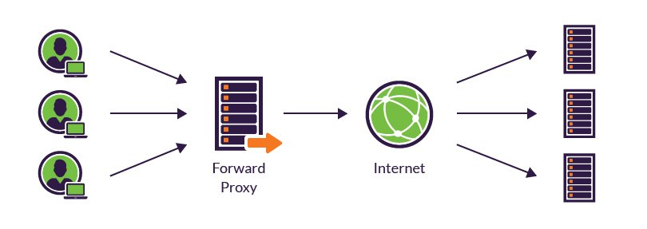
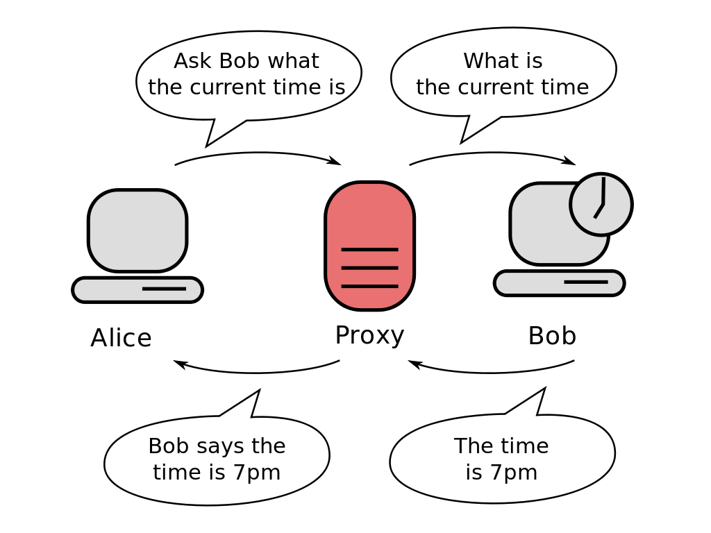
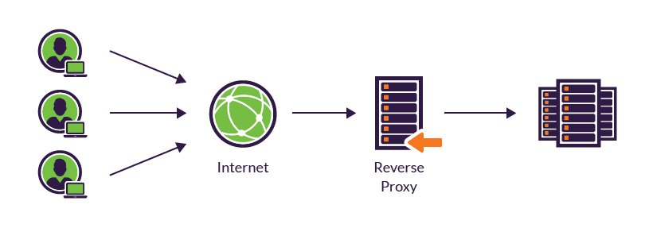

# Reverse Proxying

Learn about reverse proxying and load balancing, and put it in practice using nginx.

<!-- slide-include ../../BANNER.md -->

**You will need**

* A Unix CLI
* A server with an Ubuntu operating system and a public IP address

**Recommended reading**

* [Unix Administration](../unix-admin/)
* [Unix Networking](../unix-networking/)
* [APT](../apt/)

<!-- START doctoc -->
<!-- END doctoc -->


## What is a proxy?

<!-- slide-front-matter class: center, middle -->


> A [**proxy server**][proxy] is a computer or application that acts as an **intermediary** for requests from clients seeking resources from other servers.

### Types of proxy servers

There are 3 main kinds of proxy servers:

* A [**tunneling proxy**][tunneling-proxy] or [**gateway**][gateway] passes **unmodified requests and responses** from a client to a server.
* A [**forward proxy**][open-proxy] is used to retrieve data from a server usually on the Internet.
* A [**reverse proxy**][reverse-proxy] is an **internal-facing proxy** used to control and protect access to servers in a **private network**.

#### Tunneling proxy

A [tunneling proxy][tunneling-proxy] can pass **unmodified requests and responses** from one network to another.
It can also be used to encapsulate a protocol into another, such as running IPv6 over IPv4.

<!-- slide-column -->

For example, an SSH connection may be relayed by a proxy server to a different target server.
The proxy server simply passes the packets through, with no ability to compromise the security of the communication.

<!-- slide-column -->


<!-- slide-container -->

[**Virtual private networks (VPN)**][vpn] use tunneling protocols, usually with an additional layer of encryption.

#### Forward proxy

A **forward proxy** retrieves data from a server on behalf of a client.

<p class='center'></p>

<!-- slide-column -->

An [**open proxy**][open-proxy] is a forward proxy accessible by any Internet user.
It can be either **anonymous** or **transparent**.

##### Anonymous or transparent

<!-- slide-column -->

An **anonymous forward proxy** reveals its identity as a server but conceals that of the client.
Since the target server does not know who the original client is, it can be used to protect privacy.
[VPNs][vpn] are often used in combination with this type of proxy server.

A **transparent forward proxy** identifies both itself and the original client through the use of HTTP headers.
It can be used to cache websites.

Schools often use this kind of proxy to restrict access to particular websites (e.g. Facebook).

<!-- slide-column -->




<!-- slide-container -->

When many clients go through the same forward proxy server, its IP address may get banned,
since the target server only sees one computer (the proxy) making too many requests at the same time.

#### Reverse proxy

A [**reverse proxy**][reverse-proxy] is a server that **appears to clients to be an ordinary server**,
but actually **transmit their requests to** one or more **other servers in an internal private network** which handle the requests.

<p class='center'></p>

<!-- slide-column -->

The response from the private server is returned as if it was coming from the proxy server itself,
leaving the client with no knowledge of the structure of the internal network.

<!-- slide-column -->


## Why use a reverse proxy?

<!-- slide-front-matter class: center, middle -->


### Hiding internal architecture

Reverse proxies can **hide the existence and characteristics of an internal network's private servers**.
Since the client only sees the proxy server, it is unaware of the complexity of the internal architecture
and does not have to worry about it.

<p class='center'></p>

In a scenario where you have only a single public IP address available,
a reverse proxy allows you to make multiple private servers accessible on that IP address through the proxy server.

### Hiding multi-component websites

Modern websites can be complex applications, often with a **separate frontend and backend** developed by different teams with different technologies.
Putting a reverse proxy in front can make it **appear as one single website** on a single domain name, avoiding [CORS][cors] issues.

<p class='center'></p>

### SSL termination or authentication

Managing SSL certificates to provide websites over HTTPS is rather complex.
It can be hard to configure some frameworks or tools to ensure they are only using secure communications.

<p class='center'></p>

A reverse proxy can help by being the **secure endpoint** with all the SSL certificates,
then **forwarding unencrypted requests** to the servers or applications in the private network.

Similarly, a reverse proxy could also require **authentication** before letting a client access an insecure application,
adding security without having to modify the application itself.

### Scalability

[Scalability][scalability] is the capability of a computer system to handle a growing amount of work,
such as many clients making requests to an application at the same time.

<!-- slide-column -->

There are [2 broad ways][horizontal-and-vertical-scaling] of adding more resources for a particular application.

**Vertical scaling** consists in using a more powerful computer,
with more CPU, RAM, throughput, etc.
The added power will allow the server to serve more clients.

<!-- slide-column 60 -->


<!-- slide-container -->

**Horizontal scaling** means adding more computers to handle the same work.
For example, 3 instances of a web application can probably handle 3 times as many clients at the same time.
Computers or applications can be combined in [clusters][cluster] to improve performance.

#### Load balancing

A common function of reverse proxies is to perform [**load balancing**][load-balancing],
i.e. the distribution of workloads across multiple servers to achieve **horizontal scaling**.

<p class='center'></p>

As multiple clients arrive simultaneously,
the reverse proxy will distribute requests to different servers,
spreading the load between them.

### Other uses

Reverse proxies also have [other uses][reverse-proxy-uses] such as:

* Cache static content and dynamic content to reduce load on internal servers.
  This is known as [web acceleration][web-acceleration].
* Optimize content by transparently compressing it to speed up loading times.
* *Spoon-feeding*, a technique where the reverse proxy temporarily stores a dynamically generated page,
  then serves it to the client a little bit at a time.
  This avoids the internal server having to wait for slow clients such as mobile applications.
* Protect against [denial-of-service (DoS) attacks][dos] and distributed denial-of-service (DDoS) attacks.
* Allow [A/B testing][ab-testing] by dynamically modifying served content.


## nginx

<!-- slide-front-matter class: center, middle, image-header -->


### What is nginx?

[nginx][nginx] is an HTTP and reverse proxy server used by more than 25% of the busiest sites in December 2018.
It was developed to solve the [C10k problem][c10k], i.e. the capability of a computer system to handle ten thousand concurrent connections,
thanks to its [event-driven architecture][nginx-performance]. It also has [many other features][nginx-features] to serve modern web applications.

It is a concurrent of the well-known [Apache HTTP server][apache].

<p class='center'></p>

#### Apache vs. nginx

Although Apache is still used to serve more websites,
nginx leads the pack in web performance,
and is used more for the busiest websites.

<p class='center'></p>

### Installing nginx

<!-- slide-front-matter class: center, image-header -->

<p class='center'></p>

It's as simple as installing it with APT:

```bash
$> sudo apt install nginx
```

#### Making sure it's working

APT should automatically launch nginx, which will start listening on port 80 right away.

```bash
$> ss -tlpn
State  Recv-Q Send-Q Local Address:Port
LISTEN 0      128          0.0.0.0:`80`   ... users:(("`nginx`",...)
LISTEN 0      128             [::]:`80`   ... users:(("`nginx`",...)
...
```

You can check that the service is running with the following command:

```bash
$> sudo systemctl status nginx
```

<!-- slide-column -->

You should be able to access your server's public IP address in a browser and see nginx's welcome message:

<!-- slide-column -->


### Nginx configuration files

Nginx stores its configuration in the `/etc/nginx` directory.

<!-- slide-column 40 -->

```bash
$> ls -1 /etc/nginx
*conf.d
fastcgi.conf
fastcgi_params
koi-utf
koi-win
mime.types
modules-available
modules-enabled
*nginx.conf
proxy_params
scgi_params
*sites-available
*sites-enabled
snippets
uwsgi_params
win-utf
```

<!-- slide-column -->

The most important files are highlighted:

* `nginx.conf` is the main configuration file.
  Everything starts from there.
* `conf.d` is a directory to store reusable configuration fragments.
* `sites-available` is a directory where website configuration files are stored.
* `sites-enabled` is a directory containing symbolic links to the configurations in `sites-available`.

#### The main configuration file

The main `/etc/nginx/nginx.conf` file is a tree-like structure formed of **contexts** delimited by braces (`{` and `}`).
Each context contains configuration related to a specific area of concern.

The basic structure is as follows:

```nginx
// Main context: global nginx options

events {
  // Events context: connection handling options
}

http {
  // HTTP context: web server & reverse proxy configuration

  server {
    // Server context: website configuration
  }

  server {
    // Another server...
  }
}
```

These contexts can contain a number of [directives][nginx-directives].


## References

* [Proxy server][proxy]
  * [Tunneling proxy][tunneling-proxy]
  * [Open proxy][open-proxy]
  * [Reverse proxy][reverse-proxy]
      * [Load balancing][load-balancing]
      * [Scalability][scalability]
* [Nginx Documentation][nginx-docs]
  * [Nginx Beginner's Guide](http://nginx.org/en/docs/beginners_guide.html)
* [Digital Ocean][digital-ocean]
  * [How to Install Nginx on Ubuntu 18.04](https://www.digitalocean.com/community/tutorials/how-to-install-nginx-on-ubuntu-18-04)
  * [Understanding the Nginx Configuration File Structure and Configuration Contexts](https://www.digitalocean.com/community/tutorials/understanding-the-nginx-configuration-file-structure-and-configuration-contexts)


## TODO

* `include`
* static website configuration
* reverse proxy configuration
* cors configuration
* load balancer configuration


[ab-testing]: https://en.wikipedia.org/wiki/A/B_testing
[apache]: https://httpd.apache.org/
[c10k]: https://en.wikipedia.org/wiki/C10k_problem
[cluster]: https://en.wikipedia.org/wiki/Computer_cluster
[cors]: https://en.wikipedia.org/wiki/Cross-origin_resource_sharing
[digital-ocean]: https://www.digitalocean.com/
[dos]: https://en.wikipedia.org/wiki/Denial-of-service_attack
[gateway]: https://en.wikipedia.org/wiki/Gateway_(telecommunications)
[horizontal-and-vertical-scaling]: https://en.wikipedia.org/wiki/Scalability#Horizontal_and_vertical_scaling
[load-balancing]: https://en.wikipedia.org/wiki/Load_balancing_(computing)
[nginx]: http://nginx.org/
[nginx-directives]: http://nginx.org/en/docs/dirindex.html
[nginx-docs]: http://nginx.org/en/docs/
[nginx-features]: http://nginx.org/en/#basic_http_features
[nginx-performance]: https://www.nginx.com/blog/inside-nginx-how-we-designed-for-performance-scale/
[open-proxy]: https://en.wikipedia.org/wiki/Open_proxy
[proxy]: https://en.wikipedia.org/wiki/Proxy_server
[reverse-proxy]: https://en.wikipedia.org/wiki/Reverse_proxy
[reverse-proxy-uses]: https://en.wikipedia.org/wiki/Reverse_proxy#Uses_of_reverse_proxies
[scalability]: https://en.wikipedia.org/wiki/Scalability
[tunneling-proxy]: https://en.wikipedia.org/wiki/Tunneling_protocol
[vpn]: https://en.wikipedia.org/wiki/Virtual_private_network
[web-acceleration]: https://en.wikipedia.org/wiki/Web_accelerator
