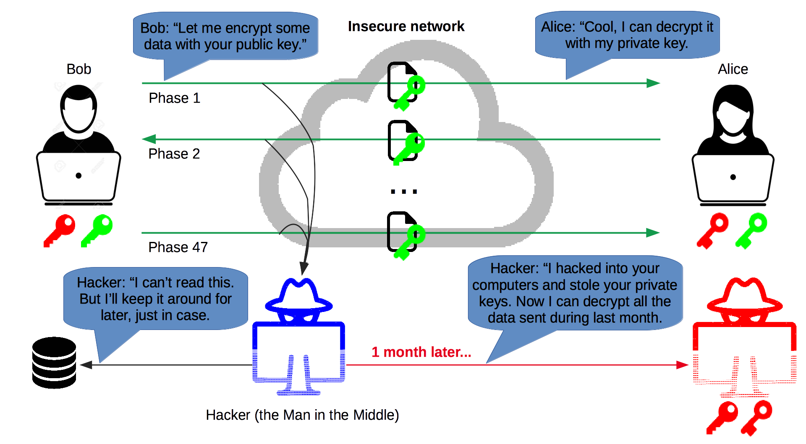

# Secure Shell (SSH)

Learn to use the SSH cryptographic network protocol to connect to other computers.

<!-- slide-include ../../BANNER.md -->

<!-- START doctoc -->
<!-- END doctoc -->


## What is SSH?

<!-- slide-front-matter class: center, middle -->

> SSH is a **cryptographic network protocol** for operating network services **securely over an unsecured network**.

> Its main uses are **remote command-line login** and **securing network services like Git or FTP**.


## Secure channel

SSH establishes a **secure channel** between two computers **over an insecure network** (e.g. a local network or the internet).


It's a **client-server** protocol.
Using an SSH client, a user (or application) on machine A can connect to an SSH server running on machine B,
either to log in to machine B (with a command line shell) or to execute simple commands.

Establishing and using the secure channel requires a combination of **symmetric encryption**, **asymmetric cryptography** (including a **key exchange** method and **digital signatures**) and **hashing**.

### Symmetric encryption

Symmetric-key algorithms can be used to encrypt communications between two or more parties using a **shared secret**.
[AES][aes] is one such algorithm.

<p class='center'></p>

**Assuming all parties possess the secret key**, they can encrypt data, send it over an insecure network, and decrypt it on the other side.
An attacker who intercepts the data **cannot decrypt it without the key** (unless a weakness is found in the algorithm or [its implementation][enigma-operating-shortcomings]).

#### Example: symmetric encryption with AES

> **Windows users using Git Bash** may want to open a new shell with the command `winpty bash` before attempting to reproduce these examples.
> This is because of a [bug in Git Bash](https://github.com/mintty/mintty/issues/540) which causes problems with some interactive commands.

You may encrypt a **plaintext**, in this example the words "too many secrets",
with the [OpenSSL library][openssl] (installed on most computers).
Executing the following command pipeline will prompt you for an encryption key.
They key "changeme" was used in this example:

```bash
$> echo "too many secrets" | openssl aes-256-cbc | openssl enc -base64
enter aes-256-cbc encryption password:
Verifying - enter aes-256-cbc encryption password:
U2FsdGVkX1+Mfeh5m81iMlA7JwiLnq2V2bhJM0yVJqKDjbxLbLLfjJfxtgg2szg3
```

The resulting **ciphertext** cannot be decrypted without the key.
Executing the following command pipeline and entering the same key as before ("changeme") when prompted will decrypt it:

```bash
$> echo "U2FsdGVkX1+Mfeh5m81iMlA7JwiLnq2V2bhJM0yVJqKDjbxLbLLfjJfxtgg2szg3" \
   | openssl enc -d -base64 | openssl aes-256-cbc -d
enter aes-256-cbc decryption password:
too many secrets
```

#### Symmetric encryption over an insecure network

Both parties must possess the shared encryption key.
It used to be **physically transferred**,
for example in the form of the codebooks used to operate the German [Enigma machine][enigma] during World War II.
But that is **impractical for modern computer networks**.
And **sending the key over the insecure network risks it being compromised** by a [Man-in-the-Middle attack][mitm].


### Asymmetric cryptography

[Public-key or asymmetric cryptography][pubkey] is any cryptographic system that uses pairs of keys:
**public keys** which may be disseminated widely, while **private keys** which are known only to the owner.
It has several use cases:

<!-- slide-column -->

**Encryption**

Encrypt and decrypt data.


<!-- slide-column -->

**Key exchange**

Securely exchange shared secret keys.


<!-- slide-column -->

**Digital Signatures**

Verify identity and protect against tampering.


#### How does asymmetric cryptography work?

There is a mathematical relationship between a public and private key,
based on problems that currently admit no efficient solution
such as [integer factorization][integer-factorization], [discrete logarithm][discrete-logarithm] and [elliptic curve][elliptic-curve] relationships.

Here's a [mathematical example][pubkey-math] based on integer factorization.

Basically, these problems allow a private-public key pair to have the following properties:

* It is easy and **computationally economical to generate a key pair**.
* It is too **computationally expensive to find the private key** from its paired public key.
* Possession of the the private key allows you to solve complex mathematical problems based on the public key,
  thus **proving that you own that public key**.

Effective security only requires keeping the private key private;
**the public key can be openly distributed without compromising security**.

### Asymmetric encryption

<p class='center'></p>

One use case of asymmetric cryptography is **asymmetric encryption**, where the **sender encrypts a message with the recipient's public key**.
The message can only be **decripted by the recipient using the matching private key**.

#### Example: asymmetric encryption with RSA (key pair)

Let's try encryption with [RSA][rsa] this time, an asymmetric algorithm.
To do that, we need to generate a **key pair, i.e. a private and public key**.
The following commands will generate first a private key in a file named `private.pem`,
then a corresponding public key in a file named `public.pem`:

```bash
$> mkdir rsa-example

$> cd rsa-example

$> openssl genrsa -out private.pem 1024
Generating RSA private key, 1024 bit long modulus
.............++++++
.................................++++++
e is 65537 (0x10001)

$> openssl rsa -in private.pem -out public.pem -outform PEM -pubout
writing RSA key

$> ls
private.pem public.pem
```

#### Example: asymmetric encryption with RSA (encryption)

Create a file containing your **plaintext**:

```bash
$> echo 'too many secrets' > plaintext.txt
```

**Encrypt it with the public key** using the OpenSSL library:

```bash
$> openssl rsautl -encrypt -inkey public.pem -pubin \
   -in plaintext.txt -out ciphertext.rsa
```

In addition to your key pair, you should have two additional files containing the plaintext and ciphertext:

```bash
$> ls
ciphertext.rsa plaintext.txt private.pem public.pem
```

#### Example: asymmetric encryption with RSA (decryption)

The ciphertext can now be **decrypted with the corresponding private key**:

```bash
$> openssl rsautl -decrypt -inkey private.pem -in ciphertext.rsa
too many secrets
```

Note that you **cannot decrypt the ciphertext using the public key**:

```bash
$> openssl rsautl -decrypt -inkey public.pem -in ciphertext.rsa
unable to load Private Key [...]
```

Of course, a hacker using **another private key cannot decrypt it either**:

```bash
$> openssl genrsa -out hacker-private.pem 1024
Generating RSA private key, 1024 bit long modulus [...]

$> openssl rsautl -decrypt -inkey hacker-private.pem -in ciphertext.rsa
RSA operation error [...]
```

Hence, you can encrypt data and send it to another party provided that you have their public key.
**No single shared key needs to be exchanged** (the private key remains a secret known only to the recipient).

#### Asymmetric encryption and forward secrecy

Asymmetric encryption protects data sent over an insecure network from attackers,
but **only as long as the private keys remain private**.
It does not provide **forward secrecy**, meaning that if the private keys are compromised in the future,
all data encrypted in the past is also compromised.



### Asymmetric key exchange

So far we learned that:

* Symmetric encryption works but provides no solution
  to the problem of securely transmitting the shared secret key.
* Asymmetric encryption works even better as it does not require a shared secret key,
  but it does not provide forward secrecy.

Additionally, it's important to note that **symmetric encryption is much faster than asymmetric encryption**.
It's also less complex and can easily be implemented as hardware (most modern processors support hardware-accelerated AES encryption).

Ideally, we would want to be able to share a fast symmetric encryption key without transmitting it physically or over the network.
This is where asymmetric cryptography comes to the rescue again.
Encryption is not all it can do; it can also do **key exchange**.

The [Diffie-Hellman Key Exchange][dh], invented in 1976 by Whitfield Diffie and Martin Hellman,
was one of the first public key exchange protocols allowing users to **securely exchange secret keys**
even if an attacker is monitoring the communication channel.

#### Diffie-Hellman key exchange

<!-- slide-column -->

This conceptual diagram illustrates the general idea behind the protocol:

* The two parties, Alice and Bob, agree on an **arbitrary starting color** that is different every time,
  but does not need to be kept secret. Yellow, in this example.
* Each of them selects a **secret color known only to themselves**, in this case orange and blue-green.
* Alice and Bob then **mix their own secret color with the mutually shared color**,
  resulting in orange-tan and light-blue respectively, and **publicly exchange** the two mixed colors.
* Finally, Alice and Bob **mix the color he or she received** from each other **with his or her own private color**.
  The result is a final color mixture (yellow-brown in this case) that is **identical to the partner's final color mixture**,
  and which was never shared publicly.

<!-- slide-column 30 -->


When using large numbers rather than colors, it would be computationally difficult for a third party to determine the secret numbers.

### Man-in-the-Middle attack on Diffie-Hellman

The Diffie-Hellman key exchange solves the problem of transmitting
the shared secret key over the network by computing it using asymmetric cryptography.
It is therefore never transmitted.

However, **a Man-in-the-Middle attack is still possible** if the attacker can position himself
between the two parties to **intercept and relay all communications**.


### Asymmetric digital signature

TODO

#### Example: digital signature with RSA

TODO

### Combining it all together in SSH

TODO

#### Man-in-the-Middle attack on SSH

TODO


## The `ssh` command

The `ssh` command is available on most Unix-like systems (e.g. Linux & macOS) and in Unix shells on Windows (e.g. Git Bash or WSL):
Its basic syntax is:

```
ssh [user@]hostname [command]
```

Here's a few examples:

* `ssh example.com` - Connect to the SSH server at `example.com` and log in (with the same username as in your current shell).
* `ssh jdoe@example.com` - Connect to the SSH server at `example.com` and log in as user `jdoe`.
* `ssh 192.168.50.4 hostname` - Run the `hostname` command as user `jdoe` on the SSH server at `192.168.50.4`.

Run `man ssh` to see available options (or just `ssh` in Git Bash).


## SSH known hosts

When you connect to an SSH server for the first time,
you will most likely get a message similar to this:

```bash
$> ssh example.com
The authenticity of host 'example.com (192.168.50.4)' can't be established.
ECDSA key fingerprint is SHA256:colYVucS/YU0JSK7woiLAf5ChPgJYAR1BWJlET2EwDI=
Are you sure you want to continue connecting (yes/no)?
```

What does this mean? *I thought SSH was **secure**?*

### Are you really the SSH server I'm looking for?

As we've seen, when SSH establishes a secure channel,
a Diffie-Hellman asymmetric key exchange will occur to agree on a secret symmetric encryption key.
To secure this exchange, the server will perform an asymmetric digital signature
so that no attacker can impersonate the server.

To verify the signature, **your SSH client will ask the server for its public key**.
**This is where a man-in-the-middle attack is possible.**
SSH warns you that someone is sending you a public key,
but it has no way of verifying whether it's actually the server's public key,
or whether it's the public key of an attacker performing a man-in-the-middle attack.

Basically, **SSH makes the following guarantee**:

* Once you have established a secure channel to a given server,
  no third party can decrypt your communications.
  Forward secrecy is also guaranteed in the event your credentials are compromised in the future.

**SSH does not guarantee** that:

* You are connecting to the correct server.
  You may be connecting to an attacker's server.

#### How can I solve this problem?

If you are using SSH to transmit sensitive data,
**you should check that the server's public key is the correct one before connecting.**

One way to do this is to use the **key fingerprint** that is shown to you when first connecting.
The key fingerprint is a [cryptographic hash][hash] of the public key:

```bash
ECDSA key fingerprint is SHA256:colYVucS/YU0JSK7woiLAf5ChPgJYAR1BWJlET2EwDI=
```

Some services that allow you to connect over SSH, like GitHub,
[publish their SSH key fingerprints on their website][github-fingerprints]
so that users may check them.
In other cases, the key may be physically transmitted to you, or dictated over the phone.

You should **check that both fingerprints match** before proceeding with the connection.
If it does not, either you typed the wrong server address, or an attacker is trying to hack your connection.

### Known hosts file

If you accept the connection, SSH will save the server's address and public key in its **known hosts file**.
You can see the contents of this file with the following command:

```bash
$> cat ~/.ssh/known_hosts
example.com,192.168.50.4 ecdsa-sha2-nistp256 eTJtK2wrRzhW5RQzUHprbFJa...
```

The format of each line in this file is `[domain],[ipaddr] algorithm pubkey`.

The line above means that when SSH connects to `example.com` at IP address `192.168.50.4`,
it expects the server to send this specific public key (`eTJtK2wrRzhW5RQzUHprbFJa...`)
using the [ECDSA][ecdsa] algorithm
(another asymmetric algorithm like RSA, based on elliptic curve cryptography).

#### Adding public keys to the known hosts file

Another solution to SSH man-in-the-middle attacks when first connecting
is to put the server's public key in the known hosts file yourself.

If you have previously obtained the server's public key (the full key, not just the fingerprint),
you can **add it to the known hosts file** before attempting to connect.

If you do that, SSH will consider that the server is already a *known host*,
and will not prompt you to accept the public key.

#### Preventing future man-in-the-middle attacks

The known hosts file has another purpose.
Once SSH knows to expect a specific public key for a given domain or IP address,
it will warn you if that public key changes:

```
$> ssh 192.168.50.4
@@@@@@@@@@@@@@@@@@@@@@@@@@@@@@@@@@@@@@@@@@@@@@@@@@@@@@@@@@@
@    WARNING: REMOTE HOST IDENTIFICATION HAS CHANGED!     @
@@@@@@@@@@@@@@@@@@@@@@@@@@@@@@@@@@@@@@@@@@@@@@@@@@@@@@@@@@@
IT IS POSSIBLE THAT SOMEONE IS DOING SOMETHING NASTY!
Someone could be eavesdropping on you right now (man-in-the-middle attack)!
It is also possible that a host key has just been changed.
The fingerprint for the ECDSA key sent by the remote host is
SHA256:FUwFoK/hcqRAvJgDFmljwOur8t/mhfbm4tfIxdaVTQ==.
Please contact your system administrator.
Add correct host key in /path/to/.ssh/known_hosts to get rid of this message.
Offending ECDSA key in /path/to/.ssh/known_hosts:33
ECDSA host key for 192.168.50.4 has changed and you have requested strict checking.
Host key verification failed.
```

As the message mentions, either the server changed its SSH key pair,
or **an attacker may be intercepting your communications**.

If you're sure it's not an attack, for example if you know the server actually changed its key pair,
you can eliminate this warning by putting the correct public key in the known hosts file
(or by removing the offending line).


## Password authentication

Establishing a secure channel is one thing,
but that only ensures an attacker cannot intercept communications.
Once the channel is established, you must still **authenticate**,
i.e. **prove that you are in fact the user you are attempting to log in as**.

How you authenticate depends on how the SSH server is configured.
**Password authentication** is one method.
When enabled, the SSH server will prompt you for the correct password;
in this example, the password of the user named `jdoe` in the server's user database:

```bash
$> ssh jdoe@192.168.50.4

The authenticity of host '192.168.50.4 (192.168.50.4)' can't be established.
ECDSA key fingerprint is SHA256:E4GYJCEoz+G5wv+EdkPyRLytgP7aTj9BS9lr1d38Xg==.
Are you sure you want to continue connecting (yes/no)? yes
Warning: Permanently added '192.168.50.4' (ECDSA) to the list of known hosts.

jdoe@192.168.50.4's password:
```

(Most SSH clients will not display anything while you type your password.
Simply press `Enter` when you're done to submit it.)


## Logging in with SSH

If you run the `ssh` command with no extra arguments and authenticate with your password,
**SSH will run the default [shell][shell]** configured for that user, typically [Bash][bash] on Linux servers:

```bash
$> ssh jdoe@192.168.50.4
jdoe@192.168.50.4's password:
Welcome to Ubuntu 18.04.1 LTS (GNU/Linux 4.15.0-33-generic x86_64)

  System information as of Fri Sep  7 13:16:56 UTC 2018
  ...

$
```

> Note that you may have a different command line prompt once you are connected,
in this example `$` instead of `$>`.

### Typing commands while connected through SSH

You are now **connected to a Bash shell running on the server**.
Anything you type is encrypted through SSH's secure channel and interpreted by that shell.
Any data it outputs is sent back through the channel and displayed in your terminal.

<p class='center'></p>

### Disconnecting

Disconnect with the command `exit` (or with `Ctrl-D` on Linux or macOS).
You should be back to the shell running on your local computer, with your usual prompt:

```bash
$ exit
Connection to 192.168.50.4 closed.

$>
```

### Where am I?

Sometimes, you might forget what shell your terminal is connected to.
Is it a shell on your local machine or one running on the server?

If you're not sure, the `hostname` command may help you.
It prints the network name of the current machine:

```bash
$> hostname
MyComputer.local

$> ssh jdoe@192.168.50.4
jdoe@192.168.50.4's password:

$ hostname
example.com
```

In this example, the local computer is named `MyComputer.local`,
while the server is named `example.com`.

As you can see, the `hostname` command returns different results before and after connecting to the server with SSH,
because it's running on your local machine the first time, but is running on the server the second time.


## Logging in or running a command

When you execute `ssh` with the `[command]` option,
it will execute the command and close the connection as soon as that command is done.

Run this from your local shell:

```bash
$> hostname
MyComputer.local

$> ssh jdoe@192.168.50.4 echo Hello World
Hello World

$> hostname
MyComputer.local
```

As you can see, you are still in your local shell.
The connection was closed as soon as the `echo` command completed.


## Public key authentication

Password authentication works, but it has some drawbacks:

* Attackers may try to [brute force][brute-force] your password.
* If an attacker succeeds in performing a man-in-the-middle attack
  (for example if you forget to check the public key the first time you connect),
  he may steal your password.
* If the server is compromised, an attacker may modify the SSH server
  to steal your password.

As explained earlier, SSH uses asymmetric cryptography (among other techniques) to establish its secure channel.
It's **also possible to use asymmetric cryptography to authenticate**.

### How does it work?

If you have a **private-public key pair**, you can **give your public key to the server**.
Using **your private key**, your SSH client **can prove to the SSH server that you are the owner of that public key**.

This has advantages over password authentication:

* It's virtually impossible to brute-force
  (it is larger and probably has much more [entropy][entropy] than your password).
* Your private key will not be compromised by a man-in-the-middle attack or if the server is compromised,
  as it is never transmitted to the server, only used to solve mathematical problems based on the public key.

> Note that **public key authentication is only as secure as the file containing your private key**.
> If you publish that file anywhere or allow your local machine to be compromised,
> the attacker will be able to impersonate you on any server or service where you put your public key.

### Generate a private-public key pair

The `ssh-keygen` command is usually installed along with SSH and can generate a key pair for you.


## TODO

* Introduction
  * What is SSH? (remote login & network services, e.g. Git, SCP, SFTP)
* Authentication methods
  * Public key
* Key management (local & remote)
* Other uses (tunneling)


## References

* [How does SSH Work](https://www.hostinger.com/tutorials/ssh-tutorial-how-does-ssh-work)
* [Demystifying Symmetric and Asymmetric Methods of Encryption](https://www.cheapsslshop.com/blog/demystifying-symmetric-and-asymmetric-methods-of-encryption)
* [Diffie-Hellman Key Exchange][dh]
* [Simplest Explanation of the Math Behind Public Key Cryptography][pubkey-math]


[aes]: https://en.wikipedia.org/wiki/Advanced_Encryption_Standard
[bash]: https://en.wikipedia.org/wiki/Bash_(Unix_shell)
[brute-force]: https://en.wikipedia.org/wiki/Brute-force_attack
[dh]: https://en.wikipedia.org/wiki/Diffie%E2%80%93Hellman_key_exchange
[discrete-logarithm]: https://en.wikipedia.org/wiki/Discrete_logarithm
[ecdsa]: https://en.wikipedia.org/wiki/Elliptic_Curve_Digital_Signature_Algorithm
[elliptic-curve]: https://en.wikipedia.org/wiki/Elliptic-curve_cryptography
[enigma]: https://en.wikipedia.org/wiki/Enigma_machine#Operation
[enigma-operating-shortcomings]: https://en.wikipedia.org/wiki/Cryptanalysis_of_the_Enigma#Operating_shortcomings
[entropy]: https://en.wikipedia.org/wiki/Password_strength#Entropy_as_a_measure_of_password_strength
[forward-secrecy]: https://en.wikipedia.org/wiki/Forward_secrecy
[github-fingerprints]: https://help.github.com/articles/github-s-ssh-key-fingerprints/
[hash]: https://en.wikipedia.org/wiki/Cryptographic_hash_function
[integer-factorization]: https://en.wikipedia.org/wiki/Integer_factorization
[key-exchange]: https://en.wikipedia.org/wiki/Key_exchange
[mitm]: https://en.wikipedia.org/wiki/Man-in-the-middle_attack
[openssl]: https://www.openssl.org
[pubkey]: https://en.wikipedia.org/wiki/Public-key_cryptography
[pubkey-math]: https://www.onebigfluke.com/2013/11/public-key-crypto-math-explained.html
[rsa]: https://en.wikipedia.org/wiki/RSA_(cryptosystem)
[shell]: https://en.wikipedia.org/wiki/Shell_(computing)
