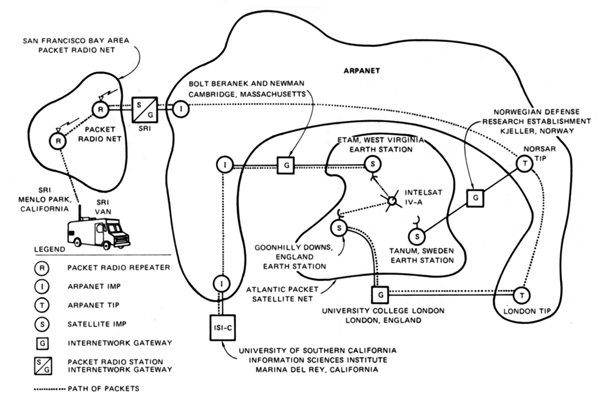
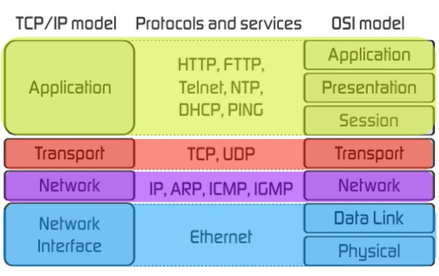

# Unix Networking

Learn the basics of Unix networking and how to make TCP connections.

<!-- slide-include ../../BANNER.md -->


## Computer networking

<!-- slide-front-matter class: center, middle -->



### OSI model

The [Open Systems Interconnection (OSI) model][osi] standardizes communications between computing system, allowing interoperability with standard protocols.

<p class='center'></p>

A layer serves the layer above it and is served by the layer below it.

### TCP/IP model

The [internet protocol suite][tcp-ip] is the conceptual model used on the Internet and similar computer networks.
It is commonly known as TCP/IP since the Transmission Control Protocol (TCP) and the Internet Protocol (IP) are its foundational protocols.

<p class='center'></p>

It was originally developed for [ARPANET][arpanet].

### OSI vs. TCP/IP

The OSI and TCP/IP models describe the same technologies, but categorize them a little differently.

<p class='center'></p>

### IP addressing

The [Internet Protocol (IP)][ip] is the principal communications protocol of the Internet.
It allows delivering packets from a source host to a destination host based solely on IP addresses.

Version 4 of the protocol (**IPv4**) uses a 32-bit address space typically represented in 4 dotted decimal notation,
with each octet containing a value between 0 and 255:

```
    10.199.0.5
```

Version 6 of the protocol (**IPv6**) has been developed recently because the world is running out of IPv4 addresses
(4 billion addresses is not enough in the [Internet of Things (IoT)][iot] world).

It uses a 128-bit address space typically represented as 8 groups of 4 hexadecimal digits:

```
    2001:0DB8:0000:CBAD:4321:0000:0000:1234
```

#### Private address space

TODO

### Ports

TODO


## References

* https://www.networkworld.com/article/2693416/unix-networking-basics-for-the-beginner.html
* https://www.networkworld.com/article/2697039/unix-top-networking-commands-and-what-they-tell-you.html


## TODO

* ifconfig
* netstat -tulpn

```
10.0.0.0-10.255.255.255 16777216
172.16.0.0-172.31.255.255 1048576
192.168.0.0-192.168.255.255 65536
```


[arpanet]: https://en.wikipedia.org/wiki/ARPANET
[iot]: https://en.wikipedia.org/wiki/Internet_of_things
[ip]: https://en.wikipedia.org/wiki/Internet_Protocol
[osi]: https://en.wikipedia.org/wiki/OSI_model
[tcp-ip]: https://en.wikipedia.org/wiki/Internet_protocol_suite
