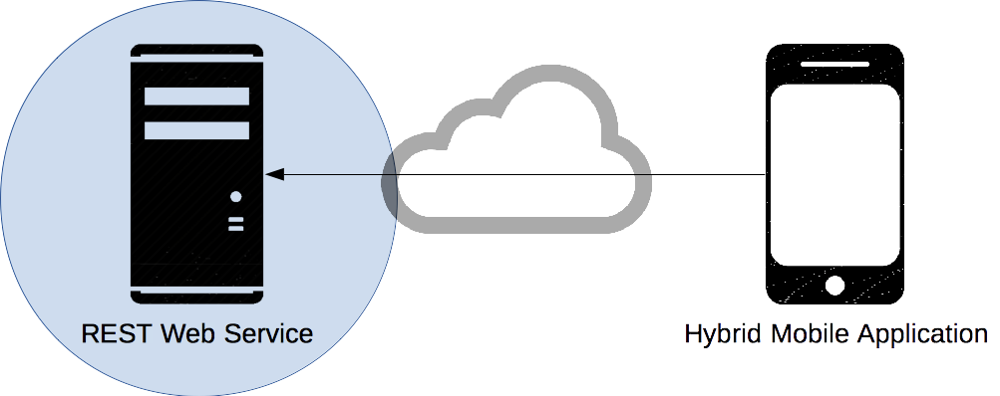
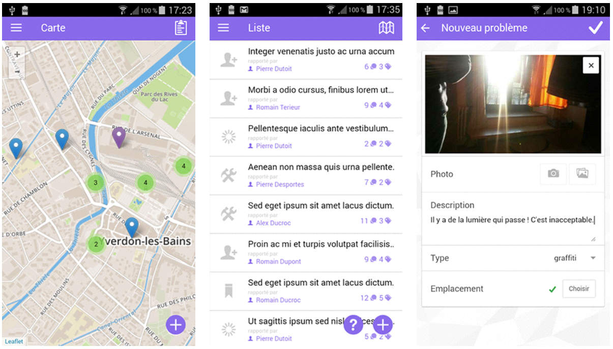
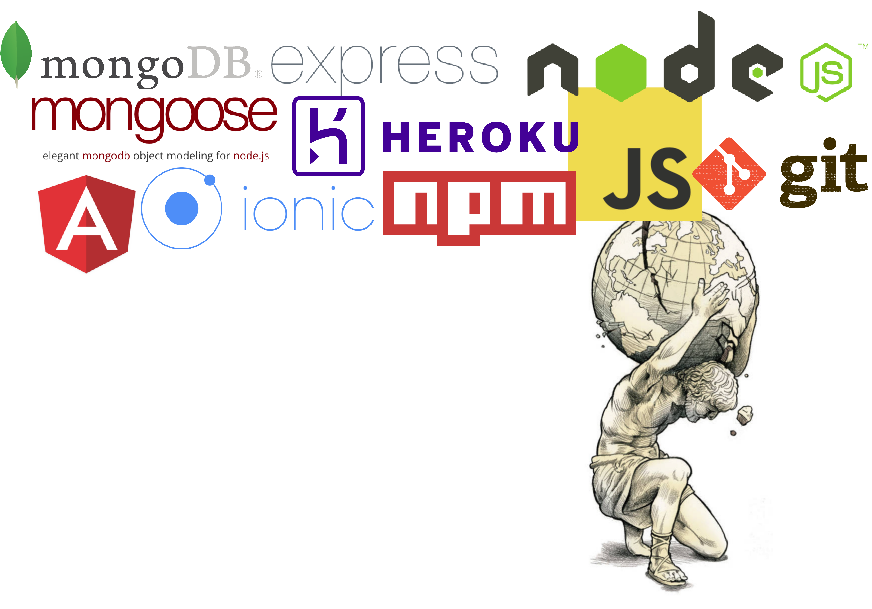
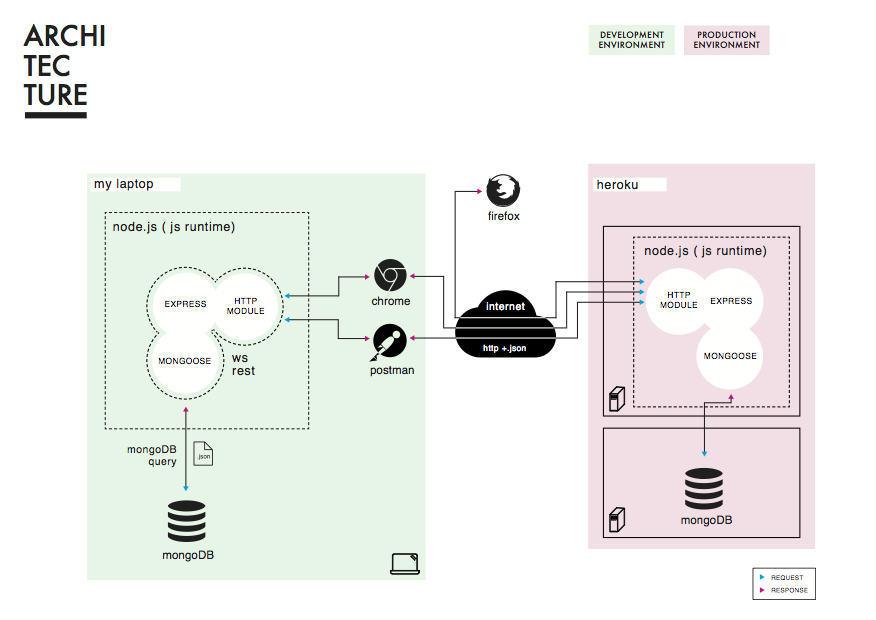
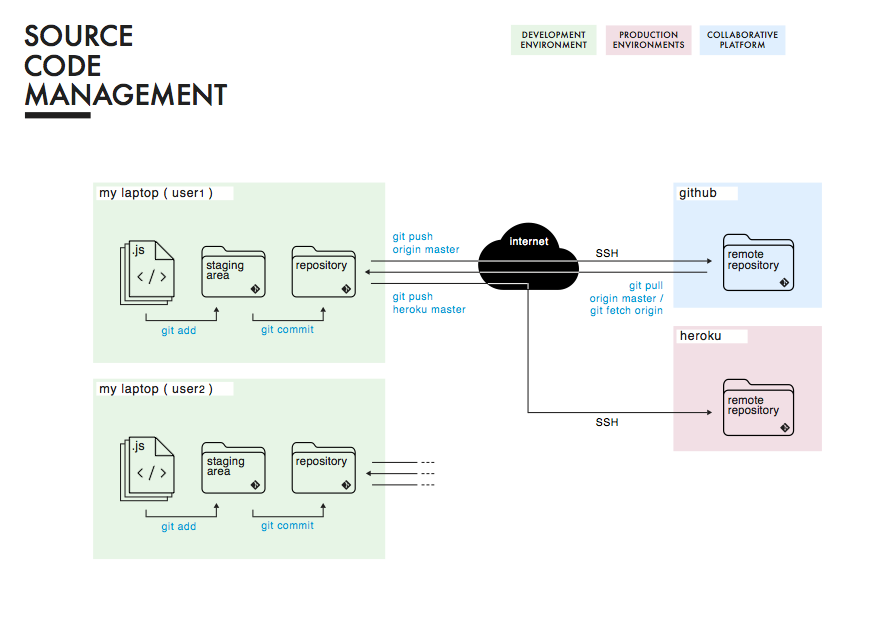

# COMEM+ Web Services Course

The goal of this course is to teach the generic concept of **web service**, focusing on **REST**ful APIs as one way to expose such a service.
You will:

* Learn the **core principles** of the REST architectural style
* Learn how to **implement** a RESTful API in JavaScript
* Learn how to **manage** your source code on a collaborative platform
* Learn how to **deploy** your RESTful API on a cloud application platform

<!-- START doctoc generated TOC please keep comment here to allow auto update -->
<!-- DON'T EDIT THIS SECTION, INSTEAD RE-RUN doctoc TO UPDATE -->

- [Theme](#theme)
  - [Citizen Engagement](#citizen-engagement)
- [This course](#this-course)
  - [Next course](#next-course)
  - [Webcasts](#webcasts)
  - [Technologies](#technologies)
  - [Architecture](#architecture)
  - [Source code management](#source-code-management)

<!-- END doctoc generated TOC please keep comment here to allow auto update -->

## Theme

### Citizen Engagement

## This course

In this course, you will *develop* and *deploy* a **REST web service backend** for Citizen Engagement.

In the following Mobile Applications course, you will develop a hybrid mobile application frontend to a Citizen Engagement web service.

### Next course

### Webcasts

Take a look at what was done in this course the previous years:

* https://www.youtube.com/watch?v=6s2SCx0db90&feature=youtu.be
* https://www.youtube.com/watch?v=ycZvdpfq_Qk&feature=youtu.be
* https://www.youtube.com/watch?v=wki0t178x2k&feature=youtu.be
* https://www.youtube.com/watch?v=Mu0KJCyIjf0

### Technologies

### Architecture

<!-- slide-front-matter class: image-header -->

### Source code management

<!-- slide-front-matter class: image-header -->

